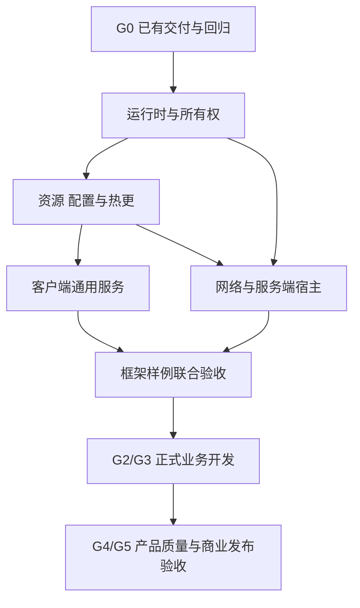

# 框架先行建设与业务接入专项设计

> 状态：现行施工策略；框架业务接入准入尚待联合验收
> 版本：1.0
> 更新日期：2026-09-23
> 适用范围：LiteFramework、LiteGame 通用壳、LiteSim/LiteNet 接缝、RoomServer 宿主、内容/工具与质量基础
> Owner：项目架构；客户端、服务端、UI/表现、内容与质量 Owner 承接各自交付，不表示已配置对应人数
> 依赖：现有 G0 交付，客户端/服务端总设计，UI/动画/热更专项，测试分层与可复现构建
> 输入：当前代码与施工证据、首个产品的已知技术约束、目标平台和最小验证场景
> 输出：业务可接入的框架版本、验证样例、接入说明、准入证据及明确的后置清单
> 状态约定：本文定义先后与准入，不表示目标接口已实现；本次仅更新文档，未重跑 Unity、Player 或联合测试。

## 1. 采用框架先行的施工方式

先完成一版可供业务接入的框架，以最小验证场景证明客户端、服务端、资源、UI、动画和更新可以协同运行，再集中开发武器、技能、背包、大厅等正式业务。

本阶段的完成目标是：新增业务主要编写业务规则、配置、页面和表现适配，不必反复改动启动、资源所有权、取消、内容更新、网络会话及错误恢复机制。接口和模块存在不构成完成，必须经过真实消费者与失败路径验证。

框架阶段允许需求分析、技术原型和最小契约样例；验证所需数据和已有灰盒规则继续使用。正式业务扩展在第 8 节准入通过后进入主体排期。复杂功能不因名义上属于框架就自动成为前置。

## 2. 文档职责与当前起点

- [客户端总设计](商业级通用客户端框架总设计.md)和[服务端总设计](商业级通用服务端框架总设计.md)继续裁决架构、安全与商业门禁；本文细化跨域施工先后和业务接入条件。
- [UI 总设计](../client/ui/UI框架总设计.md)、[动画专项](../client/animation/动画模块专项设计.md)、[热更专项](../client/content/热更与内容发布专项设计.md)继续定义各自 API、生命周期和失败语义，本文不复制第二套实现契约。
- [游戏业务总设计](../gameplay/游戏业务系统总设计.md)保留业务目标与阶段；[待办总览](../../待办总览.md)是项目顺序和完成状态的唯一总入口；[施工进度](../../施工进度/README.md)保存逐批证据。
- 本文不新增与 G0～G6、C/R/U 阶段竞争的编号。下文“五个施工包”只是已有任务的依赖组合，完成框架准入不等于 G2～G5 自动完成。

截至 2026-09-23 的文档/代码起点：

| 范围 | 已有依据 | 本阶段承接方式 |
| --- | --- | --- |
| G0 基础正确性与构建 | 待办与 C0/R0/U0/Sync-P0 记录已关闭 G0；包含各自构建/回归证据 | 保留回归，不从零重做；本次未复跑历史测试 |
| C1 Host/AppLifetime | [C1 记录](../../施工进度/客户端C1.md)记载 C1-①②③ 与现有 Host/Scope 原语交付 | 继续完整 Scope 树、服务接入、Procedure 取消、资源/配置与恢复，不能据首批交付关闭 C1 |
| 内容/Lua/UI/表现 | 已有加载、Lua 与通用壳基础；热更和动画目标已成文 | 完成所有权与真实资源接缝，样例验证取代接口存在性验收 |
| 网络/Sim | 已有状态同步和灰盒逻辑，可作样例消费者 | 先纯化宿主/会话与版本依赖，暂不扩完整玩法规则 |

后续状态以最新代码和证据更新；本文记录的起点不能用于反复安排已完成工作。

## 3. 框架与业务的分界

| 能力 | 框架先行范围 | 正式业务阶段 |
| --- | --- | --- |
| 运行时 | Host、Scope、阶段取消、逆序关闭、错误路由、分域时钟 | 产品流程中的业务前置条件与状态 |
| 内容与配置 | 资源租约、候选校验、ConfigSnapshot、版本固定、更新激活/恢复 | 武器/物品/任务等具体 schema、数值与内容 |
| Lua | Bridge 能力边界、生命周期、版本/候选验证、正式激活路径 | 页面逻辑、表现策略和非权威业务流程 |
| UI | 打开关闭、导航/返回、模态、输入、取消、缓存、绑定校验和基础文本接缝 | 背包、商城、大厅页面及其业务 ViewModel |
| Scene/Entity/Audio/VFX | 创建、绑定、池化、时钟、取消、停止和资源释放 | 关卡编排、业务触发、资源选择与具体表现 |
| 动画 | 首版 Profile/播放器/Animator 后端、Handle、打断、时间与复位 | 武器姿态、技能连段、受击策略和动作语义映射 |
| 客户端网络 | 连接状态、请求终态、版本准入、重连编排与 Transport 适配 | 业务命令、HUD 数据投影和界面反馈 |
| 服务端 | Host/RoomRuntime、命令/输出、Session、隔离、背压、安全准入和排空 | Weapon/Action/Status、计分、胜负与具体结算规则 |
| 持久化 | 必要的存储端口、迁移/事务/幂等约束、故障夹具与一个持久化样例 | 库存/订单/公会模型、完整索引与业务事务 |
| 工具与诊断 | 构建/生成/资源校验、日志版本关联、最小状态面板 | 大型策划工具、完整运营后台、特定制作工作流 |

框架只抽取已有消费者能证明的共性。业务规则保留清晰入口，不提前建立万能业务管理器、万能消息或无限泛化的配置层。Sim 继续不依赖 Unity、Lua、资源服务或 IO；对局只读配置通过明确上下文传入。

## 4. 五个施工包及依赖

图中是接缝依赖；网络纯规则和客户端服务适配可在输入契约稳定后并行，最终集成仍依赖资源/配置版本契约。没有新增团队人数或工期承诺。

| 施工包 | 对应现有阶段 | 必交付 | 退出条件 |
| --- | --- | --- | --- |
| 运行时与所有权 | G1 / C1 / R1 / U1 接缝 | 复用 Host 原语，补 Root/Account/Match/Scene/UI 树与服务归属；Procedure/任务取消、幂等关闭、失败清理、静态重置 | 初始化每一步失败与 Scope 退出结果确定，无旧任务/订阅残留 |
| 资源、配置与热更 | G1 / C1 | ContentService、AssetLease、ContentGeneration、不可变快照、Lua 候选、签名/能力校验、Host 下载、激活记录与恢复 | 真资源包可启动；更新失败保留允许版本；任一持久点中断可恢复 |
| 客户端通用服务 | U1＋必要 U2、C2 表现基础、动画首版 | UI 操作/导航/输入，Scene/Entity/Audio/VFX 所有权，最小角色动画后端和生产校验 | 真 Lua/Prefab/动画资源组合运行，取消、暂停、复用、卸载可验证 |
| 网络与服务端宿主 | R1＋R2 必需宿主/安全，C2 会话子集 | RoomCommand/Output、Match 生命周期、Session/Connection 分离、固定配置、准入/重连、多房间/背压/排空 | 纯运行时可测，真实连接样例可进出/重连；房间与配置不串用 |
| 框架联合验收 | 提前执行相关 G4/G5 基础检查 | 第 6 节五个样例、目标 Player、版本化产物、失败报告与接入说明 | 第 8 节准入项逐条有证据；剩余产品验收明确登记 |

每包内按契约 → 最小实现 → 真实消费者 → 故障验证交付。测试、日志和生成校验随批进入，联合验收负责组合验证，不把测试推迟到最后。

## 5. 必须先稳定的接缝

1. **Owner/Scope 与关闭顺序**：谁创建、谁取消、谁等待清理、谁释放资源明确；共享工作与单个调用者取消区分，不能把取消等待当作底层工作已停止。
2. **资源、快照与版本**：加载/缓存键绑定内容代次；对局固定配置；候选失败不修改当前可用版本。更新、安全与回退细节沿用热更专项。
3. **操作和播放结果**：成功、失败、取消、替换和 Owner 释放有明确终态；旧回调不能修改新实例。UI 输入恢复由协调器判断，动画不能决定业务事实。
4. **会话与房间端口**：Transport/编码/时钟与 RoomRuntime 分离；版本准入、断线恢复和命令身份有稳定约束。没有真实登录业务时也不能省略运行时的票据验证接口与非法票据测试。
5. **存储与幂等**：持久化成功的确认点、重复请求键和重启恢复规则先确定；具体库存/奖励模型不在此冻结。只做 fake 存储不能证明重启恢复。
6. **可测与可诊断**：时间、加载、网络和失败源可注入；日志和错误码关联版本、更新事务、Scope、会话和房间。诊断不记录凭据。

契约冻结表示消费者与测试共同使用受控版本，不表示以后禁止演进。变更需同时迁移实现、消费者、生成物和回归；公开稳定包及长期兼容承诺仍按 G6 验证后提供。

## 6. 五个最小验证样例

样例进入现有测试/示例场景管理，默认使用受控测试资源与配置。可以复用现有灰盒移动与同步代码；不要求为验证框架先实现完整技能、武器或背包。框架不能反向引用测试场景路径、页面 ID、测试表和假身份服务。

| 样例 | 贯通链路 | 必测失败 | 范围限制 |
| --- | --- | --- | --- |
| 启动与内容 | 内置引导 → 验签/下载 → 配置/Lua → 关键页面 → 健康确认 | 断网、损坏/缺文件、配置/Lua 校验失败、激活中终止进程、确认写盘失败 | 两个受控版本即可；不要求真实活动或商城 |
| UI 生命周期 | 普通页＋模态弹窗＋列表 → 打开/关闭/快速替换 → 复用/环境重建 | 取消加载、迟到回调、初始化失败、输入锁恢复、池中旧 Lua 引用 | 使用固定测试数据；不开发完整背包业务 |
| 场景与表现 | 真资源场景 → 测试角色 → 动画/特效/音效 → 卸载 | 世界/UI 暂停、动画打断、重复归还、加载后 Owner 已退出、卸载中仍有租约 | 用显式样例指令驱动动作，不把动画完成作为玩法判定 |
| 联机宿主 | 两个真实客户端 → 测试房间 → 已有移动/快照 → 断线重连 → 离场 | 错版本/非法票据、会话失效、慢连接、多房间隔离、drain | 使用至少两个独立房间验证隔离；8 人真实玩法容量仍留产品验收 |
| 持久化与幂等 | 简单测试命令 → 实际持久化确认 → 重复请求/故障 → 进程恢复 | 提交前后失败、重复提交、响应丢失、重启恢复、迁移失败 | 验证选定存储适配与契约；不声称覆盖支付/库存全部业务语义 |

身份签发可用隔离测试发行者，但真实网络链应经过与运行时一致的验证器。假身份/存储/网络只用于明确标注的测试配置；生产配置缺真实依赖时拒绝启动或拒绝相应功能，不能悄悄退回 fake。

样例保留为长期回归资产，业务阶段增加真实消费者后可扩展覆盖。日志标记、资源/脚本版本、执行入口和预期清理基线随样例交付。

## 7. 框架阶段后置事项

- 完整武器/技能/状态/背包/任务/大厅/商城等业务功能，以及完整账号、库存、奖励、支付和社交语义。
- 任意 Lua 局部无感更新、C# 热补丁、复杂动画混合/IK/自制图编辑器、尚无消费者的专用后端。
- 完整运营后台、自动化大规模灰度平台、与当前样例无关的数据库万能层或复杂工作流引擎。
- 未确定的额外平台、提前微服务化、通用包品牌化与长期版本承诺、第二项目全适配。

后置不意味着省略必需接缝或安全底线：首次远程激活前要有签名/能力验证与恢复；网络宿主要有票据/限流等已声明保护；资源和异步工作必须可追溯释放。基础内容回退、持久化故障与发布冒烟属于框架准入，真实产品灰度、业务容量和长期稳定性仍在 G4/G5 完成。

## 8. 正式业务开发准入

以下是一次框架交付的准入清单，不新增 G 关口，也不取代 G1 的退出条件。每项在施工记录中标 `未开始 / 进行中 / 已完成（证据）/ 阻塞（原因）`，本文件不预先打勾。

| 准入项 | 验收要求 | 证据类型 |
| --- | --- | --- |
| 可构建与真实启动 | 目标 Player 从实际资源包进入样例健康入口，关键服务不依赖 Editor；正常启动和错误恢复分别验证 | BuildProfile、构建产物/版本、Player 日志 |
| 生命周期收敛 | 初始化失败、Scope 退出、重复关闭/取消有确定结果，旧异步/回调不写回新实例 | L1＋Unity 真实生命周期/故障用例 |
| 资源与缓存稳定 | UI/Scene/Entity/动画反复循环后活动 Handle、实例、订阅回到预期基线；驻留缓存有上限 | 循环记录、租约/对象计数、内存趋势 |
| 更新与配置可靠 | 候选 Lua/配置失败不部分发布，激活中断可恢复允许版本；玩法快照固定 | 两版本更新场景、持久点中断报告 |
| UI 与表现可组合 | 模态/输入、导航、列表、动画/音效/VFX 在真资源场景中正常且可取消复位 | L2 PlayMode/Player 样例 |
| 联机宿主闭环 | 入房、同步、重连、离场、两房间隔离和关闭排空通过；错版本/非法身份明确拒绝 | 纯运行时与真实传输/客户端联合记录 |
| 持久化契约有效 | 重复请求、提交边界与进程恢复经过实际存储验证；不重复确认或丢失已确认记录 | 隔离存储集成与重启报告 |
| 可诊断 | 一次注入失败可关联 Build/内容、事务、会话/房间并定位阶段 | 受控日志/错误码/诊断产物 |
| 可扩展 | 新增样例页面、配置条目或表现策略走既定扩展点，无需业务绕过底层所有权 | 接入示例及依赖检查 |
| 状态可审计 | 接口、当前能力、已知限制、后置项与回归入口齐全 | 当前设计、施工记录、交付清单 |

进入正式业务开发要求上述必需项均有可复现证据；不凭接口数量或一次编辑器运行判断完成。非本期产品能力在范围冻结时明确排除，不能在验收失败后改名为“可选”来绕过准入。

框架准入通过只证明可以稳定接业务。真实武器/技能语义、账号库存结算、目标业务负载、完整设备升级矩阵与商业发布仍按 G2～G5 验收；样例容量不能宣称商业容量已达标。

## 9. 测试层级与预算

层级与执行入口沿用[测试开发框架总设计](../quality/测试开发框架总设计.md)。不为本策略新建第二套测试分类。

| 层级 | 本阶段覆盖 |
| --- | --- |
| L0 | 依赖方向、生成/构建配置、资源/模块引用、测试与生产依赖隔离 |
| L1 | Scope/操作/版本策略、候选状态、纯 RoomRuntime、取消/代次和错误规则 |
| L2 EditMode/PlayMode | 资产校验、真 Lua/UI/动画/场景、资源租约与生命周期；EditMode 不替代实际渲染循环 |
| L3 | 房间/网络/存储进程集成、幂等与恢复；无头环境不替代 Unity 视觉验证 |
| Player/适用 L4 | 实际资源包、文件系统中断恢复、目标平台构建/运行与循环内存基线 |

每个样例显式限制下载并发/重试、等待时限、缓存/池容量、房间/消息队列容量和失败尝试数。资源循环次数、网络条件、设备和初始缓存状态随执行配置记录；稳定计数回基线、无持续增长和无无界等待是准入要求。

性能按样例实测建立初始基线，业务阶段按目标负载更新预算。不能把“只有两个客户端流畅”推广为八人战斗合格，也不能等到全部玩法完成后才发现框架自身每帧分配或关闭泄漏。

## 10. 与 G0～G6 的对应

| 总体关口 | 框架先行阶段承接 | 准入后仍需完成 |
| --- | --- | --- |
| G0 | 复用已交付构建/正确性与回归 | 持续维护，不重置完成状态 |
| G1 | 完整生命周期、所有权、内容事务与 RoomRuntime；已交付 C1 首批继续向后接 | 不以局部原语替代全关口验收 |
| G2 | 提前建设 R2 必需宿主/安全、C2 会话与表现基础、必要 U2，以及最小联机样例 | 正式武器/动作/状态/局内包和 8 人可玩切片 |
| G3 | 提前明确身份/数据端口与最小持久化样例 | 真实 Auth/Profile/库存/结算业务及闭环 |
| G4/G5 | 前置日志、基本内容安全、构建门禁、样例性能和故障恢复 | 业务 SLO、完整平台/容量、灰度与商业发布联合验收 |
| G6 | 当前先分依赖与逻辑边界 | 真实业务和第二消费者验证后的包提取与兼容承诺 |

原总体路径继续有效：框架准备阶段提取后续关口中的必要基础能力，不提前关闭对应整关口。正式业务开发在框架准入后按 P1/P2/P3 等消费者顺序推进，完整产品验收不减少。

## 11. 当前开工顺序与并行边界

当前优先承接 C1 已完成部分，按以下依赖推进：完整 Scope 树/Procedure 取消 → AssetLease/共享加载与取消 → ConfigSnapshot/Lua 候选与版本 → 启动更新和恢复。R1 纯运行时可在 room-command/restore 契约确定后并行；U1 在 lease/scope 接缝可用后集成。

随后接通通用 UI/Scene/Entity/Audio/VFX、首版动画和 C2 会话/R2 宿主，再运行五个最小样例的联合验收。纯规则、静态校验与夹具可以先行；涉及共享协议、schema、版本字段、资源 API 或生成文件的修改指定统一接缝 Owner，避免各自改出不兼容版本。

多人工作按文件与接口所有权切分；此处的并行说明是任务依赖，不代表自动委派或已有人员。单人按上述顺序推进，环境阻塞时做不依赖该环境的纯规则或校验，不能用重复等待代替进展。

## 12. 交付、业务接入与维护

框架交付应包含可构建代码、五个样例及测试数据、实际资源/更新产物、接入说明、准入证据、预算、错误恢复说明和已知限制。记录代码/内容版本，不能把临时文件或本地手工操作当作可复现能力。

业务开始后优先使用配置、Driver/策略、ViewModel、命令处理器等窄扩展点。确实发现框架能力缺口时，先用最小消费者说明问题并补回归，再进行受控演进；避免每个业务模块自建资源加载、计时器、事件或重连体系。

本文新增施工策略，不归档仍承担领域职责的设计，也不创建空的完成报告。待办总览保存实际队列和阶段状态，各施工记录保留原证据；业务准入结果在实际联合验收后登记，不因本文成文而宣告完成。
