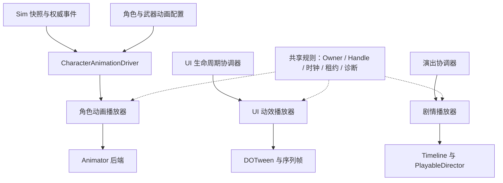

# 动画模块专项设计

> 状态：现行专项设计；目标运行时尚未实现
> 版本：1.1
> 更新日期：2026-09-23
> 适用范围：角色骨骼动画、UI 动效、非对局演出及其时钟、资源、生命周期与生产验证
> Owner：客户端表现；客户端架构负责 Scope/内容契约，UI、玩法与工具 Owner 负责各自接入
> 依赖：分域时钟、内容服务与 AssetLease、作用域取消、Sim 公共快照/事件、角色资源与配置生成链
> 实施状态：第 2 节是代码核查基线；其余为目标契约。本文类型与目录建议不表示已有 API 或已完成交付。

## 1. 定位与设计裁决

采用“共享时钟、资源和生命周期规则，按角色、UI、演出提供领域播放器”的结构。业务通过表现适配层发出语义请求，播放器管理视觉播放与引擎对象。扩展点集中在动画配置、播放后端和明确的表现策略。

- 跨域 Scope、内容服务、关闭顺序遵循[客户端总设计](../../architecture/商业级通用客户端框架总设计.md)，动画模块不另建资源加载器或作用域系统。
- 玩法合法性、动作阶段、伤害和位移遵循[角色状态与动作专项](../../gameplay/角色状态与动作专项设计.md)及[动作与特效专项](../../gameplay/动作与特效专项设计.md)。Sim 不依赖动画播放器或 Unity。
- UI 打开/关闭、输入、导航、实例/展示作用域遵循[UI 总设计](../ui/UI框架总设计.md)。本文定义动画完成、取消和属性恢复的接缝，不改写页面状态机。
- Timeline 制作、整数帧导出与数值字段单源由[动作与特效专项](../../gameplay/动作与特效专项设计.md#5-timeline-编辑与导出从-ui-工具专项迁入)维护；本文只定义播放端和表现编排边界。
- 施工依赖以[项目待办总览](../../../待办总览.md)为准；测试层级与完成定义以[测试开发框架总设计](../../quality/测试开发框架总设计.md)为准。

| 待裁决问题 | 当前目标选择 |
| --- | --- |
| 是否统一为一个 AnimationManager 和万能 Play API | 共享必要的结果、所有权和诊断规则；角色、UI、演出保留各自领域接口 |
| 首版角色后端 | Animator Controller / BlendTree 制作，AnimatorControllerPlayable 承载，手动 PlayableGraph 统一驱动 |
| 是否立即自建动画状态机编辑器或复杂混合系统 | 先验证一个完整角色；直接 Clip 混合、IK 和专用后端按明确消费者扩展 |
| 动画结束是否决定业务完成 | 只表示视觉播放结束；业务结果由 Sim、UseCase 或 UI 协调器决定 |
| 现有 GameTimeline 是否升级为通用动画系统 | 保留定时回调职责；不承诺姿态混合、状态重建或权威动作执行 |
| 当前 SetUpdate(true) 是否等于 UIClock | 不等价；必须由 UI 动效适配层明确接入项目 UIClock |
| 是否允许任意状态机回退、补播事件 | 精确采样是后端能力；进度校正默认不重放一次性副作用 |

## 2. Current：2026-09-22 核查基线

> **状态更新（2026-09-25，[施工记录](../../施工进度/客户端表现基础.md)）**：§15 首个批次"基础契约与 UI 接缝"的**纯规则半部已交付**——`AnimationId`/`AnimationChannel`/`AnimationHandle`（三分量身份）/终态表、`AnimationProfile`（登记校验 + 回退深度/成环）、`CharacterAnimationPlayer`（通道仲裁/终态恰好一次/迟到装载不抢通道/有界保留/§9 释放序）、`IAnimationBackend` 能力面，落在 `Assets/LiteFramework/Scripts/Core/Animation/`（**零引擎依赖**）。L1 550/550（含 31 例契约用例）。**UI 接缝半部已交付（2026-09-25）**：转场策略的播放终态与复位契约（`MotionOutcome`/`MotionPlayback`，含 §2 登记缺陷的修复——实测本仓 DOTween 的 `Kill(true)` 不复位、`OnKill` 根本不触发）。**Animator 后端/Driver 首段与真角色模型已交付（同日第二批，[施工记录](../../施工进度/客户端表现基础.md)）**：`AnimatorAnimationBackend`（AnimatorControllerPlayable + Manual PlayableGraph）、`CharacterLocomotionDriver`（视图速度三态）、CombatGirlsCharacterPack 真角色视图 prefab（模型只用该包；Avatar 主源 `Humanoid_F.fbx`）与收集组，`ProcedureBattle` 真实消费——按 §13 末句，**上半身混合/真对局动作对齐/8 人基线未过前不宣布动画模块完成**。资产核查再修正：`Assets/CombatGirlsCharacterPack/`（RifleGirl 模型 + `Rifle_Controller` + Idle/Walk/Run/Hit/Die/Reload/Aim 全套动画 FBX）已入库为角色资源主源，下表 Kazuko/Animation 条目降为补充素材。

本节来自本地代码和文档核对，没有运行 Unity 动画场景或 Player 验收。后续实现变化须同步本节，不将以下快照作为永久缺陷清单。

| 范围 | 当前事实 | 需要补足 |
| --- | --- | --- |
| [IGameClock](../../../../Assets/LiteFramework/Scripts/Core/Clock/IGameClock.cs)、[GameClock](../../../../Assets/LiteFramework/Scripts/Core/Clock/GameClock.cs) | 已有 WorldClock/UIClock、Paused、TimeScale、ScaledDelta；GameClock 裁剪单帧 delta，注释约定 Unity Time.timeScale 保持 1 | 动画后端统一驱动；不能把裁剪后的累计 Now 当作网络动作权威时间 |
| [TimelineRunner](../../../../Assets/LiteFramework/Scripts/Core/Clock/TimelineRunner.cs) | 已有按注入时钟执行回调的 GameTimeline；向后 Seek 不回退已执行动作游标 | 明确定时回调工具与姿态播放、Sim 动作轨的职责边界 |
| [UiFx](../../../../Assets/LiteGame/Runtime/Shell/UI/Anim/UiFx.cs) | 已有 DOTween 原语，使用 SetUpdate(true) 与 KillOnDisable | UIClock 驱动、Owner/代次、属性恢复；“唯一 DOTween 入口”的注释与转场代码不符 |
| [Strategies](../../../../Assets/LiteGame/Runtime/Shell/UI/Strategies.cs) | **已修（2026-09-25）**：ToTask 区分终态（OnComplete→Completed；OnKill 只兜底不覆盖）；复位改为 `Complete()`+`Kill(false)`——实测原 `Kill(true)` 不复位且不回调；壳层感知页面回收主动取消 | 输入由协调器裁决已随 U1 交付 |
| [AnimatedImage](../../../../Assets/LiteGame/Runtime/Shell/UI/Widgets/AnimatedImage.cs) | 已有序列帧，Update 直接读取 Time.unscaledDeltaTime | 接入 UIClock，统一停播、复位与单一更新入口 |
| [SimCombatRuntime](../../../../Assets/LiteSim/Core/Scripts/SimCombatRuntime.cs) | ActionRuntime 已有 ActionId/StartFrame/Phase/CastToken；公共动作摘要为前三项 | Driver 消费已公开事实；不能假定内部 CastToken 已复制给远端 |
| 角色与演出播放器 | 当前自有表现代码以 VFX 等基础服务为主；**Controller/Clip 资产已存在**（`Assets/Animator/Kazuko.controller`、`Assets/Animation/{Aim,Reload,Shoot}`，2026-09-25 修正原"未发现"结论）；**CombatGirlsCharacterPack 已入库为角色资源主源（2026-09-25 资源指令：模型只用该包）**——RifleGirl 全身模型 + `Rifle_Controller`（Idle/Walk/Run/Hit/Die/Reload/Aim 全套）+ `Humanoid_F.fbx` 主 Avatar，真角色视图 prefab 已接入对局 | Profile、Driver、播放器、后端、真实资产与验收场景均待建设（**基础契约与后端/Driver 首段已交付 2026-09-25**，见上方状态更新） |

已有 VFX 的句柄和异步请求登记方式可以参考；动画仍需自身的实例代次、通道和资源所有权。UI 或 VFX 已能运行不能作为角色动画已实现的证据。

## 3. 分层、输入输出与代码归属



| 层 | 输入 | 输出与职责 | 扩展点 |
| --- | --- | --- | --- |
| CharacterAnimationDriver | 快照、权威事件、明确允许的本地预测反馈、当前呈现帧 | 将角色语义解析为参数与播放请求；不改 Sim | 不同角色类型的适配策略 |
| Profile/Resolver | 动画 ID、角色/武器配置、可用后端能力 | 已验证的状态/资源/通道/混合方案 | 新角色和武器主要扩展配置 |
| 角色播放器 | 已解析请求、参数、Owner 状态、时钟输入 | Handle、终态、通道占用、后端控制、播放诊断 | 小型仲裁策略与能力接口 |
| 引擎后端 | 已接受的状态切换、参数与采样命令 | 姿态、引擎对象释放、受控表现标记 | Animator；后续直接 Clip 混合等 |
| 表现编排层 | 已去重的表现事件与视觉标记 | 调用 VFX、Audio、镜头等独立服务 | 受控事件处理器 |
| UI/剧情播放器 | 各自协调器的播放意图与绑定对象 | 领域播放结果、视觉更新、停止清理 | UiFx 原语、转场策略、Timeline 绑定 |

角色播放器随角色表现实例创建。全局注册/更新服务只负责更新次序、预算和观测，不保存所有角色的业务状态机。每个 Graph、Tween 和绑定资源都必须能追溯到 Owner。

目标目录按职责组织，名称可在实现时与项目规范对齐：

```text
Assets/LiteFramework/Scripts/Unity/Animation/
    Runtime/          通用角色播放契约、结果、所有权接缝和调度
    Backends/         Animator 后端及以后确需的其他实现
    Diagnostics/      无业务依赖的播放观测
Assets/LiteSim/View/Animation/
    Drivers/          Sim 到角色动画的适配
    Profiles/         角色、武器的配置解析与覆盖规则
Assets/LiteGame/Runtime/Shell/UI/Anim/
    UiFx 与 UIClock/Owner 适配
Assets/LiteGame/Runtime/Shell/Cinematic/
    有演出消费者后增加的领域播放器与绑定
Assets/LiteGame/Editor/Animation/
    Profile、Controller、资源引用与预览校验
```

所有 Unity 类型留在 Unity/View/Shell 层。纯规则可以单独抽取测试，但不能为了接口共享把 Animator、AnimationClip、DOTween 或 UniTask 引入 Sim/Core。先建立文件与依赖边界，实际复用稳定后再提取程序集和包。

## 4. 动画定义与配置单源

`AnimationProfile` 是只读定义，播放实例另存当前位置、层权重、Handle 和结束状态。制作端可以使用 ScriptableObject，运行时消费校验后的数据，不在共享资产上存角色状态。

| 配置 | 约束 |
| --- | --- |
| AnimationId | 稳定语义 ID；Idle/Reload/Death 等枚举或常量由游戏层定义，框架只处理类型化 ID |
| BackendBinding | Controller 状态完整路径/层，或后续 Clip 资源键；统一校验和生成 Hash |
| Parameters | 明确 ID、类型、范围及默认值；不得到处散写参数字符串 |
| Channel | 配置使用已声明通道，Mask/层次与冲突关系显式 |
| Blend | 淡入淡出、层权重、循环、允许速度范围；零/负/非有限值按字段规则校验 |
| TimePolicy | 自由播放、动作阶段对齐或显式采样；不把不支持的能力静默降级 |
| VisualMarkers | 受控标记 ID、时点和循环策略；不存伤害/扣弹/玩法回调 |
| Fallback | 缺失定义或资源时拒绝、回退或保持已有姿态的明确策略；限制回退深度，禁止环 |

角色变体采用基础 Profile 加受限覆盖槽位。武器覆盖持枪姿态或上半身动作，不复制完整状态机；覆盖顺序固定并由工具展示最终解析结果，避免深层配置继承。

`tb_action_num` 等玩法表继续决定前摇、生效、后摇和冷却。动画只定义如何适配这些阶段，例如调整片段速度、阶段位置映射或持有姿态。动画时长不反向覆盖玩法时长。参与一局的配置与内容版本由对局上下文固定，不在播放中替换底层定义。

## 5. 播放接口与结果契约

以下是目标 API 形态，不是当前可调用代码；具体类型需随首个消费者收敛。接口避免暴露后端的 Tween、Animator 和 PlayableGraph 给业务。

```csharp
public interface IAnimationPlayer
{
    AnimationStartResult Play(in AnimationRequest request);
    bool Stop(AnimationHandle handle, AnimationStopReason reason);
    bool TryGetState(AnimationHandle handle, out AnimationPlaybackState state);
}
```

- Owner 在创建播放器时绑定。`AnimationRequest` 包含 AnimationId、目标通道、受约束的混合选项和开始位置；业务不能传任意资源路径绕过 Profile。
- `AnimationStartResult` 区分接受与拒绝。拒绝返回 InvalidDefinition、UnsupportedCapability、CapacityExceeded、OwnerUnavailable 等可诊断原因，不改变现有播放。
- 接受后立即分配 Handle；即使资源随后加载失败，该 Handle 也必须得到唯一终态。默认预加载常用动作集；运行时加载路径仍需有界、可取消。
- `AnimationHandle` 至少能验证播放器身份、Owner 代次与请求身份。旧 Handle 不能停止复用对象的新播放，重复 Stop 不重复通知。
- 连续参数更新、受控状态校正与精确时间采样按实际需要提供独立接口。通用 Play 不承诺任意 Animator 状态图 Seek 或历史恢复。
- 结束订阅属于 Owner；可提供低频 await 适配，但每帧参数更新不创建 Task、闭包或字符串。
- 终态记录采用有界保留；过期后 TryGetState 返回未找到，不能把所有已完成 Handle 永久留在全局表里。

| 终态 | 含义 |
| --- | --- |
| Completed | 满足定义的视觉结束条件，或经过同一终态流程的即时/关闭动画策略 |
| Interrupted | 被接受的新播放或表现接管替换 |
| Cancelled | 调用方主动取消 |
| OwnerDisposed | 所属角色、展示作用域或场景结束 |
| Failed | 已接受请求在加载、绑定或后端执行中失败；带稳定错误码 |

一个已接受请求只产生一次终态，回调重入不能让旧请求再次结束或写回新实例。循环播放不会自然 Completed。OnKill 不是完成信号；正常完成后自动 Kill 也不能把 Completed 覆盖为 Cancelled。

Completed 的判定方式必须写入定义：一次性受控状态到达结束边界、序列完成或外部明确结束。不得笼统地以 Animator.normalizedTime >= 1 推断所有 BlendTree、循环或过渡完成。Gameplay 不等待这个终态推进事实。

生命周期取消不依赖播放时钟。用于发现卡死的超时使用独立单调时间源，并明确主动暂停是否计入超时；正常暂停不能被误判失败，Scope 释放也不能因暂停无限等待。

## 6. 通道仲裁与单一写入责任

角色首版按消费者设置基础移动、上半身动作、全身动作通道；瞄准附加层在垂直切片需要时加入。通道之间的 Mask、覆盖和混合关系由 Profile 固定。

业务优先级由 Sim/Driver 解释；播放器只解决视觉通道归属。死亡到达后，Driver 撤销换弹表现并请求全身死亡，播放器不自行判断角色是否还允许换弹或扣弹。

- 首版每通道最多一个待提交请求和一个当前逻辑播放，不默认建立动作队列；淡入淡出的旧姿态仍可短暂存在，由同一后端管理并计入预算。
- 请求先验证定义、能力和资源，再原子提交到目标通道。提交前失败保持原播放；多通道请求必须整体取得所需通道，不能只占一半。
- 替换加载中的请求必须终止旧待提交 Handle；迟到加载结果只释放自己的资源，不抢回通道。
- 多次快速打断的混合尾部必须有固定上限和确定截断策略，不能无限累积过渡状态。
- 骨骼分层允许由同一后端组合多个姿态；禁止多个无协调系统各自写同一 Animator 或 Transform。
- UI 的布局、拖拽与转场不能竞争同一属性。优先使用布局外层/动效内层结构；确需共享属性时按显式所有权交接。
- Timeline 接管角色时，由协调器暂停或替换原播放器的输出；结束后根据当前业务状态重建姿态，不恢复已经过期的旧动作。

## 7. 时钟、更新次序与网络进度

| 场景 | 时间依据 | 处理方式 |
| --- | --- | --- |
| 环境与自由角色循环 | IWorldClock | 后端消费已缩放的 ScaledDelta，不再次乘世界 TimeScale |
| UI 转场、滚动数字、序列帧 | IUIClock | 由 UI 动效适配层消费其暂停、变速和 delta |
| 联机动作 | 当前呈现帧、权威 StartFrame/Phase 与玩法时长 | Driver 计算目标阶段进度，后端执行受控校正 |
| 非对局演出 | 演出配置声明的时钟 | Director 由唯一驱动器推进，停止和快进遵守表现标记策略 |

概念上的更新次序为：更新分域时钟 → 读取快照/插值/预测的呈现状态 → Driver 解析参数与目标进度 → 提交播放/取消 → 后端计算姿态 → 挂点/表现事件处理。实际 PlayerLoop 和 LateUpdate 接缝在真实角色用例验证；由框架确定唯一入口，不能一边组件 Update、一边集中 Tick。

自由播放可以累计 WorldClock；联机动作不能用裁剪后的 GameClock.Now 推断权威进度。固定时长动作可从“呈现帧减 StartFrame”映射到阶段位置；远端使用插值呈现帧，本地明确区分预测移动与权威动作。中途改变动作速率或暂停阶段时，需由玩法契约提供可重建的权威时间信息，不能只靠动画侧猜测。

首版角色后端用 AnimatorControllerPlayable 承载控制器，PlayableGraph 采用 Manual 更新。控制器参数、层权重、播放和采样集中在后端，Graph Evaluate 只由一个驱动器调用。动作本身的播放速度与时钟缩放分别有明确归属，避免重复缩放。零 delta 时仍须处理停止、销毁和必要的显式姿态校正。

SetUpdate(true) 只声明 Tween 独立于 Unity timeScale，不会读取项目的 UIClock。UI 适配器应登记顶层 Tween/Sequence 并按 UIClock 手动驱动；采用实例级推进前核对本地 DOTween API 并验证 Sequence 行为。若使用全局 DOTween.ManualUpdate，必须限定统一更新域，不能让 World 和 UI 各调用一次驱动同一批 Tween；父 Sequence 与子 Tween 也不能分别推进。

## 8. 表现事件、恢复与 Root Motion

动画标记只传递受控视觉通知，例如脚步、弹壳或模型挂点切换。表现编排层把它们路由到 VFX、Audio、相机等服务，骨骼后端不直接引用这些服务，更不能调用 Sim 扣血或改变库存。

- 伤害、生效窗口、弹药提交、取消资格由 Sim 整数帧规则产生。修改动画长度、禁用动画或降低动画更新频率不能改变这些事实。
- 持续表现从当前快照重建；一次性效果按稳定事件键去重，遵守现有 silenceUntilFrame 和恢复规则。脚步等循环标记还需定义循环次数、跨帧和落后处理策略。
- Seek、重连和和解默认只恢复姿态与持续效果，不补播越过的全部音效、粒子。编辑预览若允许补播，必须是显式模式。
- 事件键包含足以区分实体复用和动作实例的信息。可用现有公共动作摘要建立受约束的本地识别；不能假定 CastToken 为公共字段。若现有信息无法消除碰撞，先明确协议新增字段，再补 CopyTo、序列化、差分、checksum 与重连测试。
- 本地即时开火反馈与权威确认必须有合并规则，不能先预测播放一次、收到确认又重复播放一次。
- 去重缓存按帧窗口和容量淘汰；容量不足必须计数诊断，不能无限保存历史事件或静默影响玩法处理。

联机角色的权威根节点由 Sim/预测呈现控制，动画默认不通过 Root Motion 或 OnAnimatorMove 回写根位移。确需动画驱动位移时，把曲线导出为经过验证的玩法数据，由 Sim 执行；视觉子节点可做有限补偿并在结束/回收时复位。非权威演出的 Root Motion 需要显式授权与独占绑定。

联机位移来源、烘焙数据、受阻处理、滑步与测试的细化方案见[联机动画与根位移专项设计](联机动画与根位移专项设计.md)；该文目前为草案，不改变本文已实现范围。

## 9. 资源、Owner 与池化

Owner 复用框架既有作用域契约：角色播放器属于实体表现生命周期，UI 动效属于展示作用域，剧情属于演出/场景作用域。AssetLease 来自统一内容服务，动画模块不持有无法追踪的裸加载结果。

- 常用 Controller/Clip/Profile 集合在角色准备阶段加载和校验。等待资源时可保留已存在的姿态或使用配置化回退；动画加载失败不阻塞 Sim。
- 播放集合、在途加载和共享资源持有者均有清晰引用关系。资源最少持有至使用它的 Graph/Tween/演出绑定解除之后，不能在对象仍引用资产时提前释放租约。
- 销毁顺序：使 Owner 代次失效并停止接受请求 → 取消加载/播放并确定终态 → 撤销更新和标记订阅 → 销毁引擎对象/解除绑定 → 释放租约。
- 无法取消的底层加载仍须在完成时检查代次；迟到结果释放自己的租约，不能回写已回收对象。
- 池化区分展示期、实例驻留期。隐藏/禁用必须停止展示期播放；需要保留的预热资源由实例驻留期明确持有，在淘汰时释放。
- 复用时重置参数、层权重、播放状态、标记游标、视觉偏移、临时 Mask/绑定和 UI 属性基准。只 Kill Tween 或只 SetActive(false) 不构成完整复位。
- Profile 或内容更新先校验候选版本，再发布给新的 Owner；现存对局/播放持有一致版本，不把全局缓存先清空后重新加载。发布身份、ContentGeneration、激活与恢复遵循[热更与内容发布专项设计](../content/热更与内容发布专项设计.md)，加载/缓存键包含代次；后端尚不能证明多版本并存时采用完整释放后的安全窗口切换。

## 10. UI 与剧情接入

UI 保留 UiFx 原语和转场策略。新增适配层管理 UIClock、顶层 Tween、结束原因和属性恢复，原语专注视觉效果。迁移期可以保留内部返回 Tween 的旧调用，但页面业务不应继续增加直接操纵 Tween 的依赖。

播放终态与 UI 操作结果分层映射：正常播放对应 Completed；主动跳过可先不创建播放并由 UI 返回 Skipped；超时先取消和清理播放再由 UI 返回 TimedOut；OwnerDisposed 对应失效展示的取消。Interrupted 不自动代表页面成功，必须由当前 UI 操作判定是替换、取消还是失败。UI 总设计定义的结果枚举保持有效，不用底层播放枚举直接替换。

UI 协调器决定页面存在性、输入锁、射线阻断与焦点。动画正常完成、取消或失败后，协调器根据当前操作和展示代次处理收尾；过期 OnComplete 不能重新打开已关闭页面的交互。缩短/关闭动画仍经过同一操作和终态流程。恢复属性时还需验证当前写入权，旧动画不能把新动画的值重置掉。

AnimatedImage 与 Tween 使用同一 UIClock 语义，禁用/隐藏/复用时有确定停播和复位行为。高频变化由 C# 更新，不通过每帧 Lua 请求驱动动画。

非对局演出可使用 Timeline/PlayableDirector，拥有明确绑定表、时钟、资源租约和停止路径。快进/跳过只能通过演出协调器提交剧情结果，不能依赖动画事件把所有越过的业务回调再执行一遍。对局内的权威动作继续执行导出的 Sim 指令，表现序列只负责显示，遵循动作专项的制作和导出契约。

## 11. 编辑器校验与诊断

首批工具围绕实际 Profile 和角色资产建设，不先制作完整自定义状态机编辑器。

必需校验包括：动画 ID 唯一性、资源键有效性、Controller 状态/层/参数类型、Avatar/Mask 适配、覆盖顺序、循环与结束条件、合法时长/速度、预期 Root Motion、后端能力、标记白名单、回退环及跨通道冲突。每类规则至少有一个会失败的负例。

预览允许切换角色/武器、显示解析后的 Profile、模拟 World/UI 暂停和变速、查看阶段映射。预览成功不替代运行时取消、池化和联机恢复测试。

播放诊断至少显示 Owner/代次、Handle、AnimationId、通道、定义版本、后端、当前状态/目标进度、时钟、在途加载和最近终态。模块统计接入现有 IModuleStats；对解析、Graph 计算、标记、取消与清理设置可采样的性能观测点，稳定帧不持续分配日志字符串。

## 12. 容量与性能预算

下表是首版约束和待实测指标，不是已经达成的性能结论。绝对毫秒/内存目标在 G2 用目标 Player、角色资源和 8 人场景建立基线后，写入性能配置与验收产物。

| 项目 | 首版约束/测量口径 | 超限处理 |
| --- | --- | --- |
| 通道请求 | 每通道一个待提交、一个当前逻辑播放；无默认无界队列 | 按替换策略结束旧请求，或在接受前明确拒绝 |
| 混合与 Graph | 明确每角色状态/节点/过渡尾部上限，反复打断后节点数稳定 | 截断低优先级混合尾部并计数，不影响业务事实 |
| 加载与资源 | 内容服务的并发/内存预算，按 Profile 集合统计租约 | 有界等待、回退或 Failed，不无限积压 |
| 标记与去重 | 固定帧窗口、缓存容量和单帧处理量 | 合并/丢弃可丢视觉事件并记录；不得丢玩法指令 |
| 稳定帧分配 | 框架自有参数更新、调度与去重路径目标 0 B GC/frame | Profiler 定位；引擎/第三方开销单独归因 |
| CPU 与可见性 | 记录不同可见人数、混合层数下的分位耗时 | 降低非关键姿态更新频率，事件与生命周期继续推进 |
| 清理 | 反复进出/池化后活动 Handle、Graph、Tween、租约回到预期基线 | 用持续增长判定失败；区分允许的驻留缓存 |

离屏剔除或降频不能让请求永久不结束。可恢复姿态根据绝对呈现位置采样；其他播放的逻辑进度、超时和 Owner 清理独立于渲染可见性，恢复可见后不集中补播副作用。

## 13. 测试与验收

| 层级 | 覆盖内容 | 必须验证的结果 |
| --- | --- | --- |
| L0 | 依赖方向、资产/定义静态检查、生成一致性 | Sim 无 Unity/动画依赖；非法 Profile 和玩法标记被拒绝 |
| L1 | Resolver、覆盖顺序、通道提交、Handle 代次、终态与事件去重的纯规则 | 失败不抢占；终态恰好一次；旧请求无写入权；容量受限 |
| L2 EditMode | 真实 Controller/Profile/Clip/Mask 引用及导出/校验负例 | 错误可定位到资产、字段和规则；目标后端能力吻合 |
| L2 PlayMode | 真 Animator Graph、UI Tween/Sequence、序列帧、Owner、租约与池化 | 单一驱动、分域暂停、取消复位、迟到加载和资源清理正确 |
| L3 | 无头联机、动作摘要/事件与重连数据集成 | 进度所需事实可重建；事件身份稳定；有无表现消费者不改变 Sim 结果 |
| L4 / Player | 目标设备长跑、IL2CPP、8 人表现负载、离屏/低帧率 | 性能基线达标，无持续资源增长或可见性引发的悬挂请求 |

真实 Unity 客户端的联机姿态、预测/确认不双播及重连表现由 L2 PlayMode 场景和 Player 联合验收，无头 L3 不替代视觉验证。首个角色至少覆盖待机、移动、瞄准、开火、换弹、受击、死亡及上半身混合。还必须验证以下故障与竞态：

1. 世界暂停而 UI 正常；UI 自身暂停后 Tween 和序列帧同时停止，恢复后不重复推进。
2. 换弹被死亡打断只有一次终态，Sim 结果不取决于动画是否播放。
3. 旧播放在对象回收后完成/加载返回，不影响新代次；重复 Stop 和回调重入安全。
4. 新请求缺资源或不支持能力时保持已有姿态；释放过程中不会新增 Graph。
5. 正常完成后自动 Kill 不改变结果；取消和关动画都能释放 UI 输入锁并正确复位。
6. 低帧率、重连和进度校正后姿态可恢复，越过的一次性标记不会成批补播。
7. 角色不可见时仍能取消/结束，恢复可见后跟随当前状态；Graph/租约反复循环不增长。

测试报告注明 Unity/后端版本、资产与内容版本、设备、场景、退出码和产物。没有真实角色与 Player 证据时，不以接口和单元测试齐全宣布动画模块完成。

## 14. 现有代码改造清单

| 位置 | 处理 | 保留与迁移边界 |
| --- | --- | --- |
| UiFx.cs | 增加 UIClock/Owner 适配，校正注释、取消结果与恢复策略 | 保留已用动效原语，分批迁移调用方 |
| UI/Strategies.cs | 区分 Complete/Kill；交互裁决交回 UI 协调器；校验回调代次 | 保留转场策略扩展点，配合 UI U1 实施 |
| AnimatedImage.cs | 使用 UIClock，统一停播/复位和更新入口 | 保留现有序列帧素材和组件制作方式 |
| Clock/TimelineRunner.cs | 澄清定时回调与 Seek 的能力边界 | 保留既有调度用途，不承担骨骼播放或 Sim 指令 |
| LiteFramework/Scripts/Unity/Animation | 新增播放运行时、Animator 后端、更新与诊断 | 先服务一个真实角色，不批量预造后端 |
| LiteSim/View/Animation | 新增 Driver、Profile 解析与动作对齐 | 消费公共快照/事件，不更改 Sim 判定或默认扩张协议 |
| 内容/Scope/游戏入口 | 接入租约、代次、更新顺序与逆序关闭 | 复用客户端 G1 成果，不增加第二套生命周期 |

## 15. 分阶段施工路径

所有批次当前均为待实施设计，不构成完成证据；总体先后受 G0～G6 主路径约束。

| 批次 | 依赖与归属 | 交付 | 退出条件 |
| --- | --- | --- | --- |
| 基础契约与 UI 接缝 | G1 / C1 / U1；分域时钟、Scope 与资源租约契约 | Owner/Handle/终态、UIClock 驱动、UI 取消复位、fake 后端与故障用例（**已交付 2026-09-25**：`Core/Animation` 契约 + L1 31 例；UI 接缝半部 `914fb19` + EditMode 5 例） | 分域暂停、重复停止、旧回调、迟到加载、清理全部可验证（**纯规则与 UI 转场面已可验证**；角色侧待角色垂直切片） |
| 角色垂直切片 | G2 / C2 表现；角色资源、玩法阶段与快照稳定 | 一个完整角色、Profile/Driver/Animator 后端、上半身混合和诊断 | 真资源联机动作对齐、打断、重连、池化和 8 人基线通过 |
| 制作与演出扩展 | 消费者出现后纳入总体队列 | Profile 工具、Timeline 表现消费、可选 Clip 混合/IK/降级 | 每项有实际消费者、兼容验证、预算和回归用例 |

首版不承诺任意 Animator 图倒放、通用动画脚本语言、自研图编辑器或跨引擎统一姿态接口。能力升级依据真实消费者和当前后端不能满足的测试场景，不以接口数量衡量扩展性。

## 16. 维护规则

本文是动画播放契约的单一专项入口。其他文档引用本文，不复制 Handle、终态、时钟和后端规则。修改播放语义时，同批更新消费者、校验与测试；新增公共协议字段必须走网络/Sim 全链契约。

本次新增文档沉淀动画设计讨论，关联的角色、动作、UI 文档仍各自负责原领域，没有被整篇吸收，不做归档。后续施工证据记入项目施工进度，并回写本文 Current 与待办状态。
