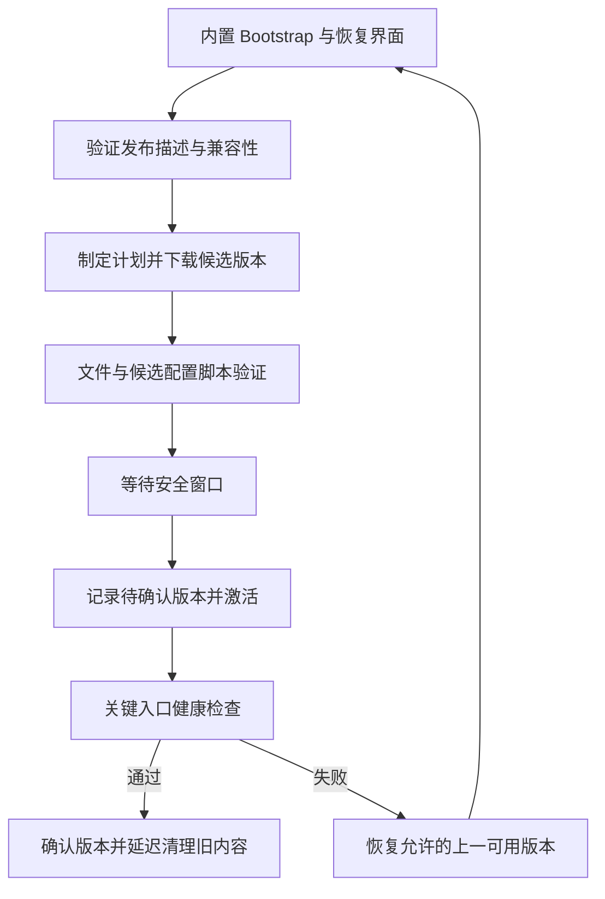

# 热更与内容发布专项设计

> 状态：现行专项设计；商业级更新事务与发布链尚待实施
> 版本：1.0
> 更新日期：2026-09-23
> 适用范围：资源、Lua、配置的交付与激活，客户端恢复、双端兼容、灰度撤回和发布验收
> Owner：客户端架构与发布工程；UI/Lua、配置、服务端与质量 Owner 共同负责各自接缝
> 依赖：ClientHost/Scope、ContentService/AssetLease、Luban 生成链、Lua Bridge、房间配置生命周期、构建与签名环境
> 状态约定：第 2 节是本地核查事实；其余是目标契约，不表示类型、服务或自动化已实现。本次为文档交付，未执行 Player 更新测试或部署。

## 1. 定位与冲突裁决

保留 YooAsset 与 xLua。先完成“可下载、可验证、启动或安全窗口激活、失败可恢复”的内容更新闭环，再按消费者扩展运行中生效能力。C# 热更不作为当前主线前置。

本文是热更范围、内容版本、Lua/配置发布事务与回退的专项入口。[客户端总设计](../../architecture/商业级通用客户端框架总设计.md)负责跨域架构，[服务端总设计](../../architecture/商业级通用服务端框架总设计.md)负责房间与部署，[UI 总设计](../ui/UI框架总设计.md)负责页面操作与输入，[数值专项](../../gameplay/玩法数值与Luban配置专项设计.md)负责 schema 和数值归属。相关主设计已同步以下裁决，不保留互相竞争的目标规则。

| 旧表述或当前行为 | 现行裁决 |
| --- | --- |
| 已有下载器、重载菜单即可视为具备线上热更 | 必须验证完整发布、激活、健康确认、恢复与撤回；开发工具不作为生产证据 |
| UI/Lua 默认同环境清缓存重填 | 首版正式发布在冷启动或安全窗口重建环境；同环境局部更新是后续受限能力 |
| 先清脚本/注册表，再重载；部分失败仍使用结果 | 先构建和验证候选集合；失败保留完整旧版本，不发布半套内容 |
| 所有确定性相关内容都不能通过配置发布 | 算法、指令语义、协议和安全代码走应用/服务端发布；已有 schema 和指令集内的数值可双端发布，仅新对局采用 |
| 全部配置与代码永久塞入一个 buildHash | 区分构建身份、协议/Sim 兼容、玩法数据、表现内容；迁移前保留旧严格握手，不能先放松检查 |
| 编译期摘要能证明当前热更数据一致 | 运行时从已验证候选快照建立数据身份；不能只上报 Player 内旧常量 |
| 原子切 Current 即代表更新成功 | 文件提交、运行时激活、健康确认各有状态；进程中断后必须从持久记录恢复 |
| 保留旧文件就可以任意回退 | 回退同时检查安全撤销、App/Bridge/schema/存档与服务端兼容，禁止回到不允许的版本 |
| HOTFIX_ENABLE 或插件存在等于 C# 热更完成 | 目标配置、生成/注入、IL2CPP、兼容和发布验收都必须有证据；未声明能力不能开放 |

本文细化原设计内容，未整篇替代任何现行文档；相关主文只保留边界与引用，不归档仍承担其他职责的文件。历史施工记录保留原证据，不能把本次文档更新写成实现完成。

## 2. Current：2026-09-23 核查事实

| 范围 | 当前实现与证据 | 距目标的差距 |
| --- | --- | --- |
| [AssetService](../../../../Assets/LiteGame/Runtime/Shell/Resource/AssetService.cs) | 已接入 EditorSimulate 与 Player Offline；不再是非 Editor 直接抛异常 | 主启动链未接入 Host 内容事务、版本恢复和签名发布 |
| Player/构建 | [C0 记录](../../../施工进度/客户端C0.md)记载 Windows/Android IL2CPP 构建、Windows Offline 冒烟和 CI 接线 | 历史结果不等于本次实测；Offline 就绪或错误 UI 可达均不是新内容健康确认 |
| [ProcedurePreload](../../../../Assets/LiteGame/Runtime/Main/Procedure/ProcedurePreload.cs)、[ProcedureError](../../../../Assets/LiteGame/Runtime/Main/Procedure/ProcedureError.cs) | 加载配置/Lua/注册表后进 Main；内置最小错误 UI 不依赖内容包 | 缺 Patch、事务恢复、分类重试和兼容更新引导 |
| [旧 YooAssetComponent](../../../../Assets/GameMain/Scripts/Resource/YooAssetComponent.cs) | 存在 Host/Web 与下载原型 | 未进入当前 LiteGame 主链；仅参考 API，不并行维护第二个正式更新器 |
| [资源返回与异步适配](../../../../Assets/LiteGame/Runtime/Shell/Resource/UniTaskAssetExtensions.cs) | AssetService 返回对象后 Release；适配器主要在等待前检查取消 | 需租约、共享加载、取消等待、代次与迟到结果释放 |
| [LuaPreloader](../../../../Assets/LiteGame/Runtime/Shell/Lua/LuaPreloader.cs) | 同步 require 依赖全量预载；重预载先 Clear 再逐项读入 | 需不可变候选脚本集合、依赖完整性和受控发布 |
| [LuaRegistryRefillService](../../../../Assets/LiteGame/Runtime/Shell/Lua/LuaRegistryRefillService.cs) | 先清缓存/注册表再填充，失败报告不阻止 ApplyStaleLogic | 可能部分发布；未具备事务回退，不能直接作为生产发布入口 |
| [DevReload](../../../../Assets/LiteGame/Editor/DevReload.cs) | Editor 菜单重建 env，已有 UI 清理改进 | 保持开发工具身份；生产更新需要额外候选验证、恢复与版本记录 |
| [ConfigService](../../../../Assets/LiteGame/Runtime/Shell/Resource/ConfigService.cs) | 手工表清单；先设置 _tables 后调用 ApplyCombatNumbers；已有表即跳过加载 | 发布失败可能留已加载状态；缺 Snapshot、完整校验与配置代次 |
| [CombatConfig](../../../../Assets/LiteSim/Core/Scripts/CombatConfig.cs) | 进程全局可变静态参数 | 新旧房间不能各自固定配置；应迁移至对局配置依赖 |
| [buildHash 生成器](../../../../scripts/gen-build-hash.py) | 编译期摘要涵盖 Sim/协议及配置目录；对所有输入含 .bytes 做换行归一化 | 表现与玩法耦合；二进制完整性应按原始字节；不能证明运行时新内容身份 |
| [CombatConfigDigest](../../../../Assets/LiteSim/Core/Scripts/CombatConfigDigest.cs) | 已按当前 8 项装载数值规范化计算 SHA-256 并截为 uint32；ServerHost 已使用 | 不再安排修复 GetHashCode；仍需扩展 schema/摘要覆盖与版本握手，短摘要不是签名或完整身份 |
| xLua/C# 更新 | [Standalone 设置](../../../../ProjectSettings/ProjectSettings.asset)有 HOTFIX_ENABLE；[GenConfig](../../../../Assets/LiteGame/Editor/GenConfig/GenConfig.cs)登记 Bridge 委托；manifest 未启用 HybridCLR | 宏不代表已交付 C# 热补丁；Bridge 新能力、裁剪和生成物属于 Player 兼容边界 |

## 3. 热更范围与生效策略

“支持下载”不等于“允许立即替换正在使用的数据”。每个发布项必须声明类别、依赖、平台策略与生效窗口，不能由调用方临时推断。

| 内容 | 当前目标范围 | 生效约束 |
| --- | --- | --- |
| 图片、音频、模型、动画、VFX、场景资源 | 支持内容发布 | 新实例/新场景采用；旧使用者保留旧资源租约 |
| UI Prefab、布局、文本和本地化 | 支持 | 已有组件/序列化结构与绑定契约兼容；页面重建或明确刷新策略生效 |
| Lua UI、表现、非权威流程 | 平台/渠道允许时支持 | 首版整套脚本及依赖在启动/安全窗口激活；不即时替换任意闭包 |
| 展示配置、入口、功能开关 | 支持受控配置 | 有 schema/权限/过期及默认行为；不把客户端开关当服务端资格或奖励事实 |
| 武器、动作、技能参数与已有指令组合 | 有条件支持双端数据发布 | 已有 schema/Sim 能力可解释，验证通过，新对局固定新快照；禁止局中修改 |
| 新 C# 类型、新 Bridge 能力、schema 变更 | 默认需要应用/服务端发布 | 只有已发布兼容能力明确覆盖的变更才能走内容路径；不是扩展名决定 |
| Sim 算法、protobuf 语义、安全验证、原生插件 | 不走本内容热更主线 | 版本化应用/服务端部署和兼容迁移 |
| DevReload、UIPatch、Lua 调试器、诊断执行脚本 | 开发专用 | 构建与资源收集同时隔离，不作为生产候选内容 |

首版生效策略为 `NextLaunch`、`SafeWindow`、`NextMatch`；`LiveRefresh` 仅允许已证明无状态/依赖隔离的展示配置，单独登记消费者。对局期间可下载候选资源，但不得替换 Match 使用的配置、Lua/表现依赖或资源代次。

平台与渠道维护 `UpdateCapabilityPolicy`，声明允许的数据/资源/脚本能力和禁止项。解释器、IL2CPP、AssetBundle 或 HybridCLR 的技术能力不自动等于商店允许范围；每次发版按届时官方政策与渠道配置核对，不能把调试或换扩展名作为规避方式。本文不承诺任意下载代码可通过审核。

## 4. 模块职责与目标目录

| 模块 | 输入 | 输出/职责 |
| --- | --- | --- |
| Bootstrap/PatchCoordinator | 内置策略、渠道、当前事务记录 | 启动恢复、更新状态机、安全窗口与错误 UI；不依赖待更新 Lua |
| ReleaseCatalog/CompatibilityPolicy | 已验签发布描述、Player 能力、服务端要求 | 接受/拒绝候选与稳定原因码、下载计划 |
| ContentService/YooAssetAdapter | 固定版本目录与加载请求 | 下载/加载/缓存、AssetLease、SceneLease、ContentScope |
| ContentGeneration | 同一 Release 的目录、脚本、配置与依赖 | 不可变内容身份及其所有者，固定版本加载入口 |
| LuaRuntime/ConfigSnapshotService | 已验证候选文件与能力契约 | 候选定义、正式环境/快照、健康结果与释放 |
| ActivationStore/RecoveryPolicy | 事务阶段、候选和确认版本 | 持久提交记录、恢复决定、回退/修复/升级路径 |
| ReleasePipeline | 受控源码、schema、资产与构建配置 | 不可变产物、签名描述、兼容矩阵、灰度与撤回记录 |

目录建议：在 `LiteGame/Runtime/Main` 增加启动编排，在 `Shell/Resource` 演进内容实现，在 `Shell/Lua` 保留 Lua 运行时；可复用协议/存储接口随消费者提取至 LiteFramework 的合适层。先分文件和依赖，不能让 Sim 引入 YooAsset、LuaEnv 或 Unity。旧 AssetService 可暂做兼容门面，所有权逐批迁移到注入服务。

## 5. 版本、兼容与摘要

沿用客户端总设计的版本元组，补足缺少的兼容维度；这些字段组成一份发布身份，不由每个模块各拼版本串。

| 维度 | 目标含义 |
| --- | --- |
| ReleaseId / ContentVersion | 一次不可变内容发布及其依赖闭包，不分别读取“最新 Lua/配置/Prefab” |
| AppVersion / BuildId | 安装包与构建证据身份；声明接受的 App 范围及平台 |
| AssetCompatibility | Unity/目标平台、资源构建与序列化能力范围；新组件类型必须已在 Player 中存在 |
| BridgeApiVersion / Capabilities | Lua 可使用的 C# 委托、类型、方法语义和 AOT 生成能力 |
| ProtocolVersion / SimVersion | 信封/协议与判定算法、布局、指令语义兼容 |
| ConfigSchema / GameplayDigest | 解析方式与该局全部玩法参数/动作指令的规范化身份 |
| CatalogDigest / ScriptDigest | 资源目录与脚本依赖集合的完整性身份 |
| SaveSchema | 本地持久数据兼容及回退约束 |

摘要分两层：文件完整性对实际原始字节计算完整 SHA-256；语义摘要对双端解析的玩法数据按同一规范计算。binary/JSON/Lua 生成物来自同一源，但文件摘要各不相同，不能逐字节互相比对。

规范化必须版本化：固定字段/表/id 排序、类型、字符串编码、整数宽度、浮点表示、缺省/缺失规则与 schema 标识；拒绝不允许的非有限值，规定负零等语义。二进制文件不做 CRLF 替换。文本归一化仅限明确声明的文本源码身份，不与下载文件完整性算法混用。

当前 buildHash 是代码/协议/表产物的严格构建门禁，不能直接删掉或放宽。迁移步骤：

1. 先增加统一版本描述、运行时玩法摘要和发布兼容测试，保留旧 BuildHash 校验。
2. 服务端/客户端按协议单源增加可演进字段及能力协商；不重用旧字段号或偷偷改变 uint32 configHash 语义。
3. 新 Join、房间初始化、重连、归档同时检查 Protocol/Sim/Gameplay 身份；至少携带完整摘要或服务端认可且与完整摘要绑定的不可变 ID。摘要是兼容依据，不是客户端可信证明或认证手段。
4. 兼容矩阵和双端测试通过后才允许表现内容独立发布、玩法数据供新房间采用；旧客户端仍按原严格规则路由或拒绝。

当前 CombatConfigDigest 的 32 位结果可保留在旧协议诊断路径，不作为完整发布身份或抗篡改依据。固定字节序和不同运行环境一致性属于摘要测试；不能继续依赖平台隐式整数转换语义。

## 6. 发布描述与信任边界

发布描述至少含 schemaVersion、releaseId、单调发布修订、目标平台/渠道、兼容维度、依赖、文件路径/长度/摘要、创建/到期策略、keyId/signature、激活策略与安全撤销信息。文件路径只能落在受控候选目录内，拒绝越界、重复、非法规范化路径和超预算长度/数量。

采用成熟签名实现和确定的签名字节编码；客户端只带信任公钥，私钥由受控发布签名环境持有。必须定义根信任、密钥轮换/撤销、元数据重放/过期、防版本混装和失去在线新鲜度信息时的策略；若采用 TUF 等更新框架，按所用版本完整实现其验证规则，不能只借用名称。

- HTTPS 与文件 Hash 不能替代发布者签名；签名正确也不代表内容兼容或业务正确。
- 先验证描述的结构/预算与签名，再依据可信描述计划下载；文件通过完整性校验后才进入资源/Lua 解析与执行。
- 反回退校验与运营回退分别处理：运营通过新的受信发布修订授权使用仍允许的旧内容，不接受攻击者重放旧清单。
- 缓存已知可用版本可按产品策略离线启动；无可信新鲜度时不得把“未能检查”当作“确定最新”。安全撤销与服务端准入要求仍可阻止联网对局。
- 客户端时钟回拨、长时间离线、密钥轮换失败和描述过期必须有测试与明确结果，不能仅依赖本地系统日期断言安全。

签名、路径约束、能力边界和基本恢复在首次远程激活前完成；G4 扩展观测与覆盖，不是首次加入这些措施的时间点。

## 7. 下载、候选校验与容量

只下载固定 Release 的不可变文件。YooAsset 负责其擅长的下载与加载实现，项目负责可信发布描述、事务代次与激活决策。不能把加载最新 manifest 直接视为更新已提交。

| 项目 | 约束与失败行为 |
| --- | --- |
| 下载并发/重试 | 按平台配置上限、超时、指数退避及可取消等待；区分暂态网络错误与签名/兼容错误 |
| 多源切换 | 各源必须提供同一摘要文件；记录源与失败阶段，不从不同 Release 拼包 |
| 断点续传 | 验证临时文件的 Release/长度/摘要归属；完成后全文件校验，不能只信已传字节计数 |
| 空间预检 | 计入候选、临时/解压峰值、保留版本及余量；不足时保留可用版本并提示清理/取消 |
| 清单/脚本容量 | 限制文件数、单文件/总字节、依赖深度和候选内存；同步 require 的依赖必须完整预载 |
| 候选校验 | schema、外键、资源键、Lua 导出/依赖、Prefab 绑定、Bridge 与版本兼容均通过 |
| 进度/取消 | 字节、阶段、速率、错误码可观测；取消等待不等于底层任务已停止，迟到结果不得激活 |

同一激活域只允许一个提交者。下载可以合并请求，取消单个等待者不取消其他所有者仍需要的共享任务。候选代次失效后，下层完成只做归属清理；更新器退出不留无限重试或无界队列。

## 8. 激活、健康确认与中断恢复

磁盘记录至少区分 `Confirmed`、`Candidate`、`PendingActivation` 和失败原因/尝试次数。状态记录与文件清单带完整性保护、序号和可诊断事务 ID。原子提交需由平台存储适配实现并测试写盘、中断、重命名和恢复，不能把普通覆盖写文件称为原子事务。

安全窗口要求：停止接受受影响的新操作，退出相关 Match/Scene/UI Scope，取消在途请求，解除旧 Lua 回调和资源引用。首版不具备版本并存证明时，释放旧运行时后使用候选重建；不能在存活 YooAsset 包上任意替换目录并声称旧资源仍安全。

| 中断/失败阶段 | 下一次启动的确定行为 |
| --- | --- |
| 下载或候选校验中 | Confirmed 不变；清理/恢复属于该候选的临时文件 |
| PendingActivation 已持久化、运行时尚未健康 | 根据记录尝试一次受控恢复或回退；次数有上限，禁止无限重启 |
| 正式配置/Lua/入口健康检查失败 | 标记候选不可用，从允许的 Confirmed 版本重建，不使用半成品 |
| 健康检查通过但确认记录写入失败 | 不声称已确认；下一次按 PendingActivation 恢复，不能提前清理旧版本 |
| Confirmed 已提交、旧目录未清理 | 继续新版本，延后清理无引用目录；不因多余旧文件回退 |

健康确认至少覆盖候选 ConfigSnapshot、Lua/main、全部必需注册表、关键 UI/入口及其资源。当前 Offline 初始化标记或 BootstrapError 可达只证明启动/恢复路径，不满足新内容健康要求。业务网络暂时不可达与内容初始化失败分别处理；Login/交易请求不得作为可能重复执行的内容探针。

启动健康与后续稳定性分层：短期启动检查负责确认；后续崩溃、Lua 错误率和严重资源失败由灰度监控决定停止扩量或撤回。用户正常杀进程、切后台不等同于确定崩溃，恢复策略以事务阶段和有界尝试为依据。

## 9. 内容代次、租约与缓存

ContentGeneration 持有固定资源目录、脚本集合、配置快照及依赖 ID。加载/缓存键至少包含资源类型、location 和 generation；旧 Scope 继续从自己的 generation 加载，不能查全局 Current 得到新资源。

- `AssetLease<T>` 持有底层句柄；实例、对象池或共享缓存明确持有它，最后使用者释放后才允许卸载相关依赖。
- Scene、UI、实体、VFX、Audio、动画资源统一进入所属 Scope；[动画专项](../animation/动画模块专项设计.md)与 UI 的 Owner/代次规则继续适用。
- 候选失败按所有权释放候选租约，不清空当前可用内容。旧版本保留策略与引用计数共同决定清理资格。
- 低内存先释放无引用缓存和多余池实例；不能为凑空间删除仍在使用的版本或唯一允许的恢复版本。
- Byte[]/string 的复制数据可在明确提取完成后释放源资产；Unity 对象的租约不能用“已经返回对象”代替。
- 多版本并存是需验证的后端能力，不是接口承诺即可成立。首版不能证明时限定冷启动/完整释放后的安全窗口切换。

## 10. Lua 发布与 Bridge 兼容

首版正式 Lua 更新选择整套脚本及依赖在启动/安全窗口激活。DevReload、同环境重填和 UIPatch 继续作为独立开发入口，不提供生产任意 DoString、任意模块路径或远程命令执行面。

候选阶段：从固定文件清单构建不可变脚本集合 → 检查依赖/语法/导出/Bridge 能力 → 在受控验证环境检查注册表 → 验证通过后等待激活。验证环境不得绑定正式全局 Bridge 注册表，不得打开 UI、订阅正式事件、发业务网络请求或写存档。候选校验不能宣称任意 Lua 顶层副作用可回滚。

正式激活：停止新请求 → 取消并等待旧展示/任务收尾 → 释放 LuaTable/LuaFunction、计时器、事件、Bridge 缓存和注册表 → 销毁旧 env → 用已验证集合创建正式 env/注册表 → 健康检查 → 放行。失败从保留版本重建；旧 Lua 对象不能进入新 env，候选 env 的 LuaTable 也不能跨环境复用。

- BridgeApiVersion/能力集合覆盖方法签名、语义、委托、IL2CPP/AOT 适配与裁剪保留；新 Lua 引用旧包不存在的能力必须在执行前拒绝。
- require 使用固定模块清单和数据参数，不拼接未经验证的 Lua 源码；模块名、路径归一化与重复键需校验。
- Bridge 白名单是能力设计，不自动构成沙箱；还需收口 CS/反射、文件/网络/系统库、动态加载与调试入口。签名脚本仍要有错误熔断、内存与执行预算；超时等待不能中断死循环，需验证所用 Lua VM 的指令计数/中断接缝。
- 运行状态恢复使用版本化、白名单 DTO；不序列化闭包、LuaTable 或整个 env。账户、库存与对局事实从对应权威服务重建。

同环境局部更新只在未来满足模块纯度、候选 require/cache 隔离、完整依赖闭包、无旧闭包/订阅串用、旧配置/资源同代持有及失败恢复测试后开放。已有页面保留旧逻辑时，也必须保留它的依赖版本；只切字典或清 UI/Content/Strategies 前缀不满足条件。

## 11. ConfigSnapshot 与双端发布

配置字段清单由 Luban/schema 生成。候选先解析与验证，再构造不可变 Snapshot；包括生成物、数据摘要和资源引用校验。所有失败均发生在发布 Current 和应用 Sim 参数之前，禁止先赋值 _tables 再做可能失败的关键验证。

表现配置与玩法配置按消费者区分身份，但仍由 Release 固定其相互依赖。Snapshot 带 schema、来源 Release、GameplayDigest 和定义集合；读取方固定快照，不能从可变全局字段逐项拼出混合版本。

Room/Match 创建时持有不可变玩法配置。Sim 消费不含 Unity/Luban 依赖的只读数值/定义，配置放在执行上下文而非每帧复制进状态快照；重放/归档记录可找回该配置的 ID 和完整摘要。迁移 CombatConfig 时所有系统与初始状态构造一起调整，不能保留一半静态读点。

双端发布顺序：服务端先具备候选 schema/Sim 能力与数据并验证 → 客户端兼容内容可获取 → 准入/匹配启用新版本 → 新房间固定新快照 → 旧房间排空后回收旧数据。旧客户端路由至仍支持的房间或明确要求更新；重连必须回到原房间配置，不能静默升级该局。

数据更改不能新增当前 Sim 不认识的指令或改变协议字段解释。schema/算法更新走独立应用/服务端升级和迁移；安全紧急下线旧房间由运营/服务端流程决定，不靠客户端局中换表纠正。

## 12. 回退、存档与错误恢复

回退前检查目标未被安全撤销、与 App/Bridge/SaveSchema 兼容、必需文件可用，以及服务端是否仍接受该版本。没有合法回退目标时进入内置恢复/应用升级入口，不无限回退到更旧版本。

存档采用事务写、备份和明确迁移策略；不可逆迁移会限制可回退范围。可回退内容须能读取已提交存档，或有受控备份恢复与用户数据处理策略。回退内容不回滚服务器库存、支付、订单和结算，不补播会重复提交事实的初始化操作。

| 错误类别 | 处理 |
| --- | --- |
| 暂态网络/CDN | 有界重试/切源、保留下载进度、允许取消 |
| 候选损坏/解析失败 | 隔离该候选、保留旧版本、按策略修复或撤回 |
| App/Bridge/schema 不兼容 | 不激活，提示应用更新或等待兼容版本 |
| 签名/撤销/描述非法 | 拒绝候选并记录；不通过反复重试或忽略验证绕过 |
| 空间/内存不足 | 清无引用受控缓存或取消更新，不能破坏可用/恢复版本 |
| 激活/健康失败 | 回退允许版本或进入恢复态；记录阶段、事务与错误码 |

ErrorRecovery 保留内置 UI，提供适用的重试、回退、修复缓存、诊断导出、升级和退出；离线运行仅在产品与版本策略允许时提供。错误界面自身不能依赖故障候选的字体、Lua 或 Prefab。

## 13. 构建、灰度与发布证据

发布流水线必须落实 BuildProfile 的平台、后端、宏、资源模式、渠道和签名，比较期望值与实际生效值；不能只存在 JSON 字段。生成步骤、依赖锁定、资源收集与裁剪结果进入产物。

1. 冻结源码/schema/资产与工具链，生成 Lua Bridge、配置、协议和摘要。
2. 验证资源/模块清单、兼容矩阵、开发内容排除与预算，执行对应测试。
3. 构建 Player/Server 与内容产物，签名并记录可追溯身份。
4. 上传不可变目录并验证所有文件可获取；最后发布渠道描述，禁止部分文件未就绪先切入口。
5. 固定分组进行内部/小比例/扩量发布，以下载、激活、启动、Lua 错误与资源失败指标设停止条件。
6. 撤回通过受信新修订与服务端准入协调；保留支持窗口内客户端、旧房间和回退仍需要的内容。

产物至少包含版本/依赖清单、构建实际配置、签名元数据、文件与玩法摘要、兼容矩阵、测试与故障恢复结果、符号/日志映射、发布/撤回记录。生产私钥和凭据不进入仓库或客户端。桌面/移动渠道分开验收；HOTFIX_ENABLE、LuaPanda、UIPatch 等按声明能力纳入排除或审计门禁。

## 14. 必须补足与必须重构

| 优先级/归属 | 工作 | 完成判据 |
| --- | --- | --- |
| G1 前置：版本与策略 | 补 Release/能力/生效窗口契约和兼容拒绝码 | 同一内容闭包可验证；不支持更新执行前拒绝 |
| G1：AssetService/异步适配 | 重构为可注入内容服务、租约、共享加载、取消/代次和后端适配 | 旧实例不被提前卸载；取消与迟到结果不发布新版本 |
| G1：ConfigService | 重构生成清单、候选验证与不可变 Snapshot | 失败不改变 Current；跨表与数值负例通过 |
| G1：LuaPreloader/Refill | 重构脚本集合、候选注册表和正式激活路径 | 注册失败不部分上线；旧引用全部可追溯清理 |
| G1：启动/恢复 | 补 PatchCoordinator、事务存储、内置恢复与 Host 更新 | 下载到确认各阶段中断后结果确定，上一可用版本能恢复 |
| G1→G2：CombatConfig/版本握手 | 重构对局配置，分离代码/玩法/表现身份并迁移协议 | 新旧房间隔离，Join/重连/归档一致 |
| 首次远程激活前 | 补签名、信任、路径/预算和 Lua 能力约束 | 不可信、不兼容或超预算候选不可执行 |
| G4/G5：发布工程 | 补灰度、撤回、真机矩阵、长期观测与故障演练 | 发布与回退均有实际产物及指标证据 |

保留 YooAsset、xLua、现有 Offline 路径、Luban 同源生成、内置错误入口和已实现规范化摘要。旧下载原型可提供 API 参考，不独立扩成另一套系统。HybridCLR 或 xLua C# 方法热补丁仅在明确消费者出现后另行设计程序集、生成/注入、AOT、平台、生命周期和回退，不进入本轮必要重构。

## 15. 预算、观测与性能

每个平台配置下载并发/重试、候选文件/脚本总量、内存和磁盘余量、历史保留数量/期限、健康检查时限与最大失败尝试。没有目标包规模与设备数据时不虚构固定毫秒或成功率；G1 用故障夹具证明有界，G2/G4 用真实包与设备设基线。

观测至少记录 Release/Build/Gameplay 身份、当前/候选/确认代次、事务阶段、源、下载字节、耗时、错误码、激活/回退次数和租约计数。日志关联更新事务与对局但不上传 token/密钥。后台/网络切换/低内存继续遵守取消和恢复契约；通知回调不得每帧分配大量字符串。

## 16. 测试矩阵与商业验收

| 层级 | 场景 | 必须结果 |
| --- | --- | --- |
| L0 | 构建配置、开发文件排除、生成一致性、发布清单/依赖静态检查 | 缺文件、重复路径、未声明能力或旧生成物阻断发布 |
| L1 | 版本策略、摘要、事务恢复表、取消/代次、纯快照验证 | 顺序/并发/失败结果确定；binary 原始字节与语义摘要分离 |
| L2 EditMode | 实际资源/Lua/Prefab/schema/Bridge 校验负例 | 拒绝可定位到版本、资产、模块与字段 |
| L2 PlayMode | 真 LuaEnv/YooAsset、租约与 UI/场景/池化、安全窗口 | 不混用版本、旧回调无效、清理回基线；候选无业务副作用 |
| L3 | 无头房间、双端配置/握手/重连/归档和发布服务协议 | 新旧局配置隔离、错版本拒绝、版本路由和撤回可验证 |
| Player/L4 | 实际平台文件系统、IL2CPP、杀进程、弱网/低存储、升级/回退 | 可恢复可回退；性能与保留预算满足目标设备基线 |

最低故障矩阵：每个事务持久点前后终止进程；描述重放/篡改/过期；文件截断和缺失；下载/加载取消与迟到回调；Lua 语法/依赖/导出错误及预算耗尽；配置外键/非法数值；不兼容 Bridge/Prefab/schema；旧资源仍在池中时清缓存；内容激活失败、确认写盘失败；重连遇版本更新；存档已迁移后请求回退。

发布候选需要同时证明正常启动与故障恢复；“出现 BootstrapError 也算冒烟通过”仅可用于恢复能力用例，正常发布成功用例必须进入定义的业务健康入口。无头 L3 不替代真 Lua/资源与视觉验证。至少执行一次真实发布、灰度停止和撤回演练，报告带设备/版本/产物/退出码。

## 17. 与总体施工路径的映射

- G0：复用现有 C0 的构建/Offline/错误 UI 交付；核对宏、渠道和实际配置，区分旧冒烟证据与未来内容健康门禁，不重复实施已完成子批。
- G1/C1/U1：优先完成版本与生效契约、资源租约、候选 Lua/配置、激活记录及恢复；Host 下载随该批接入。首个远程候选必须验签与能力校验。
- G1→G2/R1/R2：对局配置依赖、握手、重连与归档一起迁移，允许受控双端数据发布；保持旧协议严格检查直到新链验收。
- G4/G5：补齐发布控制面、密钥轮换/撤销、灰度监控、真机升级与演练；首次发布前所有必需门禁完成。
- 后续：有明确价值再做按需分包、局部 Lua 更新或 C# 热补丁；每项单独给出兼容、回退、平台与资源预算。

总体排序与状态写入[待办总览](../../../待办总览.md)，施工证据写入[进度索引](../../../施工进度/README.md)。本文新增的是设计与冲突裁决，不能据此勾选实现、测试或发布完成。
