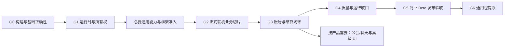

# 项目总体施工路径与待办总览

> 状态：现行项目施工入口
> 版本：3.5
> 更新日期：2026-09-26
> 适用范围：LiteFramework、LiteSim、LiteNet、RoomServer、LiteGame、UI、配置/内容、Meta、工具、测试与发布
> Owner：项目架构；每条施工线由对应领域 Owner 承接，角色不等于已配置人数
> 当前主关口：G1 运行时与所有权；采用框架先行、准入后正式业务的施工方式。G0 已于 2026-09-23 关闭，C1 与 R1 主体已于 2026-09-24 交付、C2 批①②、表现壳生命周期/动画基础契约、热更批(三)~(九)（含 IL2CPP 验证关闭）、VFX 治理、真角色模型接入与动画后端首段（CombatGirlsCharacterPack）、**U2 首批导航/模态/本地化/反馈面与 PlayMode 验证载体**已于 2026-09-25 交付；**2026-09-26 交付**：Join 票据验签接缝（M0-d，接入真实准入路径）、单进程多房间路由与动态建房、优雅关闭排空（第 2–3 步）与跨房间过载隔离、per-form 缓存策略列（U2-⑧）（余项见 §2.1/§2.2/§7/§8），不据局部完成宣布整项目完成

## 1. 本文件怎样使用

本文回答整个项目“现在在哪、先做什么、哪些能并行、做到什么程度才能继续”。领域契约仍由 `Docs/design/` 中的主设计裁决，施工证据保存在 [施工进度](施工进度/README.md)，执行命令与环境限制保存在手册。本文不复制第二套协议、状态机或 API。

- **项目关口 G0～G6** 管跨领域集成与验收；客户端 C0～C5、服务端 R0～R4、UI U0～U4、业务 S0/P1～P8 保留原编号，通过第 4 节映射，不互相取代。
- **同步契约 P0** 指已经交付的快照分层/输入面/和解批次，以下可简称 Sync-P0；它不是“所有 P0 缺陷清零”，也不等于服务端 R0 完成。业务阶段 P1/P2 也不表示全项目严重等级。
- 状态使用 `未开始 / 进行中 / 已完成（附证据）/ 阻塞（附原因）`。等待上游依赖是正常排期，不自动标成阻塞；功能有代码但缺集成验收时不能标已完成。
- 基线来自既有代码、提交与施工记录；2026-09-23 完成 G0 联合核证：R0/U0 交付后复跑 L1 407、L2 EditMode 36/36、L3 8 与 Unity 编译零错误，Player 构建/冒烟沿用 C0 记录与 CI 接线。历史结果注明来源；本次未重跑真机、24h 长稳或全量发布矩阵。
- 若旧设计的 Current 描述已落后于代码，按最新实现与证据判断现状；目标契约与验收仍有效。下个相关实现批次同步修正该领域 Current，不能重新安排已完成工作。
- 日期与工期不作为依赖。领域旧估算基于不同人员假设，不能相加成项目承诺；拆出可验证批次后按实际人力排期。
- 本次框架先行策略更新依据现行记录和代码入口；未重跑上述历史测试，未将文档或原语交付记为框架联合准入通过。

## 2. 当前基线与剩余缺口

### 2.1 已有交付和可复用基础

| 范围 | 2026-09-22 当前事实 | 证据及边界 |
| --- | --- | --- |
| C0-① 依赖治理 | 已完成该子批次：manifest/lock 入库，YooAsset/Luban 内嵌包，移除未用本地路径依赖，工具链与还原/依赖扫描脚本 | 提交 `bde6f15`；[客户端 C0 施工记录](施工进度/客户端C0.md)。不代表 Windows/移动端 IL2CPP 构建、Offline 启动或 CI 接线完成 |
| C0-②～④ 构建与 Offline | [客户端 C0 记录](施工进度/客户端C0.md)记载 Windows/Android IL2CPP 构建、Offline/最小错误 UI、CI 接线与 Windows 冒烟 | 属已有交付证据，不重新列为从零施工；Host 更新、候选健康确认与回退仍归 G1。本次未重跑构建 |
| 服务端 R0 正确性止血 | 已完成该批次：有理数 60Hz 时钟与虚拟时钟注入、PendingInputRing 定容环、finite/向量/形状边界与入包上限、可信 ACK ledger、CombatConfigDigest 规范化摘要 | 代码 `2ffbaef`，记录 `4a35ed6`；[服务端 R0 施工记录](施工进度/服务端R0.md)。SessionManager 容量清理已随 R1 交付；Transport pending bytes、票据安全与多房间仍归 R2 |
| 服务端 R1 RoomRuntime 纯化与重连闭环 | 已完成该批次：Runtime/Application 分层（R11 纪律扫描把守）、RoomCommand/RoomOutput、Match 状态机全表、Session/席位分离、Restoring 恢复门闩 + RoomClient 完整重连状态机（§9.3）、票据房间绑定 | 代码 `dd6d335`；[服务端 R1 施工记录](施工进度/服务端R1.md)。多房间/宿主/Worker Mailbox/安全仍归 R2；结算信封与归档归 R3 |
| 服务端多房间与排空（R2 前置交付） | **已交付（2026-09-26）**：单进程多房间——roomId → 独立 `RoomInstance`、按会话路由、动态建房受 `max_rooms` 约束、配置驱动房间模板；两房间隔离 11 例假传输＋5 例真实传输（席位互不可见/断线不牵连/快照不串房）；**优雅关闭排空第 2–3 步**（`BeginDrain` 拒新 Join、`DrainDeadlineMs` 限时收尾、`DrainTimeout` 归档语义、`Console.CancelKeyPress` 常驻入口）13 例；**跨房间过载隔离** 4 例 | 代码 `3a2b867`+`8cb9f56`；[服务端多房间施工记录](施工进度/服务端多房间.md)。L1 778/L3 90 核证。固定 Worker Pool 与有界 Mailbox、房间销毁后清理、排空第 4–5 步（依赖 M0-c）仍归 R2；玩法数值仍进程级共享（配置层显式拒绝按房间覆盖）；"信号→排空→退出"进程级链路待真实终端手验 |
| 同步契约 P0 | 已完成该批次：定型 Weapon/Action/Status/MatchBag/Match 状态；公共/比赛/本人私有快照；输入字段和 action_seq；CopyTo/checksum/差分重组/广播重连承载 | 代码 `3839dac`，记录 `9a047ec`、补记 `c396e6d`；[同步契约 P0 施工记录](施工进度/同步契约P0.md)。运行态和传输存在不等于玩法系统已实现 |
| 同步校验口径 | 线上和解使用公共可重建口径；完整状态 checksum 留给基线/重放/归档。比赛和本人私有面当前随快照全量携带 | 上述 P0 记录及 [SimChecksum](../Assets/LiteSim/Core/Scripts/SimChecksum.cs)。后续新增状态保持公共/私有边界，不能恢复为客户端比较不可重建的全量状态 |
| 框架底座 | LiteFramework 的 DI、事件、时钟、Scheduler、StageMachine/HSM、FileSys、日志、池和主线程派发已有基础 | 可复用；Host/Scope/统一取消/关闭、持久化与诊断仍需补齐，不能只凭接口存在验收 |
| Sim/联机 | 固定槽位、快照/回滚、hitscan、命令/事件、KCP/protobuf、权威房间、AOI/回溯及重连协议已有实现 | 当前主线是服务器权威状态同步；客户端重连恢复与多房间隔离/排空（第 2–3 步）已交付核证（[R1](施工进度/服务端R1.md)/[多房间](施工进度/服务端多房间.md)）；安全（重连票据 CSPRNG/远端限流）、排空第 4–5 步与 Worker Pool 仍归 R2；完整 Match 生命周期按 P1/P2 推进 |
| UI/表现 | UI 壳、绑定/控件、Lua 桥、转场、SafeArea、VFX/Audio/Entity 等基础已有；**表现壳生命周期已收敛（2026-09-25）**：Scene 迟到加载代次检查、Entity 实体作用域/关闭面/重复归还、Audio 分域时钟、池释放面、**VFX 关闭释放面/真取消/迟到不复活（同日收敛——四类齐备）**（[记录](施工进度/客户端表现基础.md)） | [UI 总设计核查与后续记录](design/client/ui/UI框架总设计.md#2-current2026-09-21-核查基线)及 UI-U0 记录区分已修问题与 U1 剩余项；VFX 治理已收口，余项见表现基础记录（Animator 后端归 G2） |
| 动画播放 | 分域时钟、轻量回调时间轴、UI Tween/序列帧已有基础；**基础契约与 UI 接缝已交付（2026-09-25）**：AnimationId/Channel/Handle（三分量身份）/终态、Profile Resolver、通道仲裁与有界保留（`Core/Animation`，L1 31 例）；转场播放终态与复位契约（`MotionOutcome`/`MotionPlayback`，修 Kill(true) 不复位 + OnKill 不触发）。**后端/Driver 首段与真角色模型已接入（同日，[记录](施工进度/客户端表现基础.md)）**：`AnimatorAnimationBackend`（AnimatorControllerPlayable + Manual Graph，未知绑定显性 Failed）、`CharacterLocomotionDriver`（视图速度三档 Idle/Walk/Run）、CombatGirlsCharacterPack 真角色视图 prefab + 收集组（模型只用该包；缺包克隆回灰盒） | [动画专项](design/client/animation/动画模块专项设计.md)已定义目标；**余 G2 垂直切片**：上半身混合、真对局动作对齐/打断/重连与 8 人基线——按 §13 末句不以接口与单测齐全宣布动画模块完成 |
| C1 运行时与内容事务 | [客户端 C1 记录](施工进度/客户端C1.md)记载 C1-①～⑩：Host/AppLifetime/统一取消链、Scope 原语与树用例、IContentService/AssetLease/共享加载/代次/YooAsset 租约适配、ConfigService 快照化、激活事务与 Patch 流程；L1 505 全量/EditMode 51/Player 冒烟（真标记）核证 | 余项归后续线：U1 租约消费者、C2 Account/Match 作用域与 ErrorRecovery 执行器、热更批 Host 下载/验签/远程健康检查；不据此关闭 G1 |
| C2 会话子集与通用表现壳 | [客户端 C2 记录](施工进度/客户端C2.md)记载批次①②：BattleClient/BattleContext、Match/Battle 流程与 Account/Match Scope、断线自动重连与恢复 ACK、地图构造单源；LiteSim.View 的 SimView（镜像/远端插值/本地和解衰减/事件静默门）、EntityViewMap 池、相机档位、PlayerController 输入采集与三个门、帧事件逻辑帧交付接缝；附带 PrefabLeaseCache 租约缓存、Audio StopAll/Shutdown 释放面、DOTween Manual 轨接 UIClock；L1 519/EditMode 97/Player 构建+冒烟核证 | 余项：HUD（U2）、Login/Lobby/Result 与 MetaClient（批③，归 G3）、角色动画余部（上半身混合/真对局动作对齐/8 人基线——**后端/Driver 首段与真角色模型已交付 2026-09-25**，[记录](施工进度/客户端表现基础.md)）、VFX/音效事件接线（C4）；不据此关闭 C2 |
| 客户端表现基础与动画契约 | [客户端表现基础记录](施工进度/客户端表现基础.md)：Scene 迟到加载代次检查（修真实回写缺陷）、Entity 实体作用域/关闭面/重复归还幂等、Audio 分域时钟（修"永不暂停"缺陷）、GameObjectPool 释放面；动画基础契约（AnimationId/Handle 三分量身份/终态/Profile Resolver/通道仲裁/有界保留，Core 零引擎依赖）；动画 UI 接缝（转场播放终态与复位契约，修 `Kill(true)` 不复位 + `OnKill` 不触发）；另修 player-smoke 裸词标记的假通过；L1 550/EditMode 112/Player 构建+冒烟核证 | 余项：G2 垂直切片动画余部（上半身混合、真对局动作对齐/打断/重连、8 人基线）、SceneScope、UiFx 原语取消复位（随调用方迁移）；按《动画专项》§13 末句不以接口与单测齐全宣布动画模块完成（VFX 治理与 Animator 后端/Driver 首段+真角色模型已于 2026-09-25 交付，见上节记录） |
| 热更与发布 | Offline、Lua 预载/开发重载、规范化配置短摘要已有；**热更批(一)~(九)已交付（2026-09-24~25）**：[记录](施工进度/热更内容校验.md)——发布身份/签名校验/激活事务、候选校验内核（文件/空间端口、失败分类、逐文件摘要复算、下载计划多源轮转）、`PatchCoordinator` 状态机与健康聚合、主链接线（`PatchRunner` 在 `ProcedurePatch` 生效）、Lua 受控沙箱与动态验证、反回退基线、**真实下载**（`HttpCandidateFetcher` + 本地真实 HTTP 用例，实测修掉 4xx 分类不可达真缺陷）、**受信公钥库**（`TrustedKeyStore`，未登记/已撤销→候选被拒）、**健康探针族**（候选配置/入口文件/入口资源/Bridge 能力）、**IL2CPP 密码学验证**（Windows x64 Player 实测 RSA-OK，#9 关闭）；审查修复批补候选事务先于下载落盘 + 临时文件回收（§8 表行 1）。L1 713 / EditMode 162 核证 | [热更专项](design/client/content/热更与内容发布专项设计.md)定义范围与冲突裁决；**仍待施工**：信任锚点 provisioning（装配面已完整——`TrustedKeyStore.AsResolver()` + 探针族已接线，零内置锚点 → 候选一律被拒，fail-closed 保持）、移动端磁盘余量与 Android IL2CPP 后端（真机矩阵）、断点续传（Range 续取）/原子写盘中断矩阵（G4 真机）；**不据此宣称热更链可用** |
| 配置与测试 | Luban 双端产物、buildHash、LiteTesting、L1/L3 执行、L2 EditMode（**225/225**，2026-09-26 复核）与 **PlayMode**（12/12，同一门禁）已有 | Player/L4、容量与故障测试仍需建设 |
| Meta 服务宿主 | **宿主骨架已交付（2026-09-25）**：[记录](施工进度/Meta服务宿主.md)——Generic Host + Options 范围校验 `ValidateOnStart` + `/live` `/ready` `/metrics` + 优雅关闭与 drain + 入站上限；`FrameworkReference` 零 NuGet 接入；L1 18/L3 6 例。含三处静默失效缺陷（`ValidateOnStart` 未生效、配置源不绑定、入站上限未落地）的实测修正。**M0-d Join 票据验证接缝已交付（2026-09-26，`f510904`）**：`IJoinTicketValidator` + `HmacJoinTicketValidator` + 非法票据矩阵（过期/篡改/重放/密钥轮换/受众/房间/哈希），并接入 `ServerHost.HandleJoin` 真实准入路径——装配后非空 token 不再构成准入理由；票据验证先于建房（垃圾票据打不同房号不会撑大房间表） | Auth/Lobby/Profile 业务、Mongo/Redis、Settlement Outbox、Join Ticket 签发（Auth 端）归 G3；**持久化样例（M0-c）仍未交付**；重连票据 CSPRNG 与远端限流归 R2 |

最近的同步 P0 记录记载 L1 381 项、L3 8 项、EditMode 30/30 通过及 Unity 编译零错误；这些是该提交的历史证据，不是永久测试数量或当前发布结论。G0 关闭时的最新核证（2026-09-23，U0 批后复跑）：L1 407、L2 EditMode 36/36、L3 8、Unity 编译零错误——数量同样是当时证据，不设成永久基线。后续验收按场景覆盖、退出码和关联产物判断。

### 2.2 不能漏掉的剩余前置

| 前置 | 当前核对结果 | 所属关口 |
| --- | --- | --- |
| Player/更新入口 | [AssetService](../Assets/LiteGame/Runtime/Shell/Resource/AssetService.cs) 已有 Offline；BuildProfile/构建/冒烟见 C0 记录；Host 与恢复尚未进入正式主链 | G0 ✅（C0 冒烟 + CI 接线）；G1 补内容事务，不能用错误 UI 可达证明新版本健康 |
| 服务端精确节拍 | 已核证通过：虚拟 10 分钟精确 36,000 tick、30/60/120Hz 参数化零漂移（[ServerLoop](../RoomServer/ServerLoop.cs) 有理数锚点 + 时钟注入） | G0 ✅（[R0 记录](施工进度/服务端R0.md)）；实钟形态只保证锚点正确 + 追赶有界 |
| 输入边界 | 已核证通过：[InputGate](../RoomServer/InputGate.cs) PendingInputRing + finite/向量/形状边界，8 人同帧/环换代/模糊包用例绿 | G0 ✅（[R0 记录](施工进度/服务端R0.md)）；向量语义校验仍归 Sim 层 |
| ACK 与版本摘要 | 已核证通过：[Room](../RoomServer/Room.cs) 发送 ledger/单调 ACK 四道闸；[ServerHost](../RoomServer/ServerHost.cs) CombatConfigDigest（SHA-256 截取 uint32，跨文化稳定） | G0 ✅（[R0 记录](施工进度/服务端R0.md)）；G1→G2 补完整玩法身份与内容兼容，不把短摘要当签名或完整版本 |
| 身份与房间 | Join 已接票据验签接缝（**M0-d 2026-09-26**：`IJoinTicketValidator` + `HmacJoinTicketValidator` 接入 `ServerHost.HandleJoin` 真实准入路径，过期/篡改/重放/密钥轮换/受众/房间/哈希非法票据矩阵核证，且票据验证先于建房）——"只校验非空 token"已终结；[ReconnectService](../RoomServer/ReconnectService.cs) 重连票据仍是可预测串 | R2 剩余：重连票据 CSPRNG、远端限流与安全信封；公开接入前必须通过，原型不得视为可公网运营 |
| UI 基本正确性 | U1 已交付（2026-09-24）：操作合流/取消/类型化结果（UI-03）、租约/缓存预算/销毁/Shutdown（UI-05/06）、统一排序/输入锁/转场取消复位（UI-09）、真资源包 Player 页面打开（EditMode 69/69 + 冒烟 `[UI] main open`，[施工记录](施工进度/UI-U1.md)）。**U2 已交付（2026-09-25）**：[记录](施工进度/UI-U2.md)——单写者导航/队列上限/等待超时/排队期取消（修 LIFO 真实缺陷）、模态栈与射线遮蔽、真实消费者接线、UiFx 中断复位；LText 本地化（服务层 48 例 + 控件/Lua 面）、DialogService（合并/互斥组/优先级）、FeedbackService 统一反馈面（System 层 form）。**per-form 缓存策略列已交付（2026-09-26，U2-⑧）**：`UICacheStrategy`（Lru 默认/Resident 不淘汰/DestroyOnClose 关即销毁）壳消费面（表列配置接线未做，生产页面暂全默认 LRU）。**余项**：字体/SafeArea（U2-⑤b）、打字机（⑤d）、焦点（⑦）、HUD 随消费者 | G1/U1 ✅；U2 主体已交付，余项见左栏 |
| UI 视觉单一来源 | **U2-⑥c 越权返工（2026-09-25 裁决）**：`FeedbackService` 运行时自建 Canvas/Image/Text 拼装反馈面，且自设 `sortingOrder=30000` 另开通排序道；**同一反馈语义已存在第二条实现**——`Assets/UI/Widgets/Toast.prefab`（25 件模板之一）与 `Toast.cs` 早已存在且 `UIBindIndex.ShowToast`/Lua 面在用。**属复发**：`UIDemoPage` 已走过「代码构建 → 模板 prefab 实例化」同一改造（`:11-12`，2026-09-14）。裁决与判据入 [UI总设计 §6.1/§6.2/§7、§1.1](design/client/ui/UI框架总设计.md)、[制作规范 §2/§8](design/client/ui/UI制作规范.md) | U2；**已收口（2026-09-25 反馈面归位批）**：FeedbackService 拆自建视觉改走 System 层 form、Loading 模板新建（`Widgets/Loading.prefab`）、`Toast.cs` 多条并存改造（承载容器排布 + 上限淘汰）、`VisualConstructionScanner` 违规扫描用例（正/负例）落地；19 件模板按构建器重建（观感差异待人工过目） |
| 真实客户端闭环 | [ProcedureMain](../Assets/LiteGame/Runtime/Main/Procedure/ProcedureMain.cs) 已接真实主页面（真 prefab+真 Lua+租约，U1-④）；C2 批①②已交付（2026-09-25：BattleClient/BattleContext、Match/Battle 流程与 Account/Match Scope、断线重连与恢复、离场无 Match 残留；SimView/相机/远端插值与和解衰减/事件静默门/输入采集与三个门——[记录](施工进度/客户端C2.md)）；**HUD 与 Login/Lobby/Result 仍缺**，未构成完整登录到结算 | G1～G3：C2 批③ + U2 |
| 业务消费者 | Weapon/Action/Status/MatchInventory 的协议与状态已预留，正式业务、账号/Profile、聊天/公会仍需实现 | G2/G3 与扩展支线 |

旧业务/同步设计中“尚未增加分层状态”的描述按 Sync-P0 的证据更新理解；服务端时钟、输入与 ACK 问题已按 R0 记录逐项核证收口（2026-09-23）。扩展玩法协议前不再有 G0 级正确性阻塞；不回滚已经交付的修复。

## 3. 全项目施工主线

主线采用[框架先行建设与业务接入专项设计](design/architecture/框架先行建设与业务接入专项设计.md)：复用构建基线 → 完成运行时/所有权与必要通用能力 → 最小样例联合验收/业务准入 → 正式联机玩法 → 账号与结算闭环 → 商业质量与发布 → 可移植复用。测试、诊断和生成校验随每批交付，不等待最后统一补。

箭头表示集成验收依赖。框架准入提取 G2 的必要 C2/U2/R2 基础能力、G3 的数据端口/最小持久化样例以及 G4/G5 的基本质量检查；不是新增 G 关口，也不表示这些产品关口提前完成。Meta 契约可提前准备，真实库存结算仍在业务阶段验收；诊断随基础建设，G4 收口全链覆盖。

当前执行指针：**C1 与 U1 主体已交付（2026-09-24）——运行时/所有权/内容事务 + UI 操作与所有权（租约/取消/Shutdown/排序/转场复位）；R1 纯化已交付（重连闭环收口，见[服务端 R1 记录](施工进度/服务端R1.md)）；C2 批①②已交付（2026-09-25，[客户端 C2 记录](施工进度/客户端C2.md)：会话与对局上下文 + SimView/相机/远端插值与和解衰减/事件静默门/输入采集与三个门；附带通用表现壳所有权与 DOTween Manual 轨接 UIClock）。** 另有表现壳生命周期与动画基础契约/UI 接缝已交付（[记录](施工进度/客户端表现基础.md)）。**热更批(三)~(九)与 IL2CPP 验证已交付（2026-09-25，[记录](施工进度/热更内容校验.md)）：候选校验内核→编排→主链接线→Lua 沙箱→反回退→真实下载/公钥库/探针族；端到端装配已接通（2026-09-25 装配批），余信任锚点 provisioning（零内置锚点，fail-closed 保持）。U2 首批导航/模态/本地化/反馈面与 PlayMode 验证载体已交付（[记录](施工进度/UI-U2.md)）。2026-09-26 交付：M0-d 票据验签接缝（接入真实准入路径）、单进程多房间路由/动态建房、优雅关闭排空第 2–3 步、跨房间过载隔离（[服务端多房间](施工进度/服务端多房间.md)）、per-form 缓存策略列（U2-⑧）。** 下一步：包②信任锚点 provisioning、C2 批③（Login/Lobby/Result 归 G3）与 HUD（U2）、**G2 动画垂直切片余部（上半身混合/真对局动作对齐/8 人基线——后端/Driver 首段与真角色已交付）**、Meta M0-c 持久化接缝（框架准入唯一未交付前置件）与 R2 剩余（固定 Worker Pool/有界 Mailbox、重连票据 CSPRNG、远端限流）；随后完成必要通用服务与网络宿主，用五个最小样例通过框架准入，再扩正式业务。C0/U0/Sync-P0/R0/C1/U1 回归持续维护。

### 3.1 正式业务开发准入

先建与后置范围、五个施工包、五个最小样例和准入清单统一见[框架先行专项](design/architecture/框架先行建设与业务接入专项设计.md)。框架准备允许需求分析、技术原型和复用灰盒消费者；武器/技能/背包/大厅等正式业务主体在准入通过后进入排期。准入要求真实 Player、资源/Lua、场景/表现、两客户端/多房间、实际持久化故障与恢复证据，不靠接口存在或 fake 全绿放行。

## 4. 项目关口与领域阶段映射

| 关口 | 客户端/内容 | 服务端/网络 | Sim/业务/表现 | UI/工具/质量 | 当前状态 |
| --- | --- | --- | --- | --- | --- |
| G0 构建与基础正确性 | C0 交付回归与证据 | R0 当前实现核证/余项 | 复用已完成 Sync-P0，业务 S0 缺项按消费者补齐 | U0 交付回归；还原/生成/L1/L2/L3 与 Player 冒烟 | 已完成（2026-09-23 关闭：四线核证与回归全绿） |
| G1 运行时与所有权 | C1：Host/Scope/内容事务/租约 | R1：RoomRuntime、Session、重连状态；C2 网络适配可预研 | 配置快照、UseCase/模型接口、生命周期夹具 | U1；Shutdown/取消/故障注入 | 进行中（C1/R1/U1 交付；U2 首批导航/模态/本地化/反馈面与 PlayMode 载体交付；联合验收待完成） |
| G2 联机可玩切片 | C2 批①②已交付（BattleClient/BattleContext/流程/Match Scope + SimView/相机/输入与三个门，2026-09-25）；**真角色模型接入与动画后端首段已交付**（CombatGirlsCharacterPack）；HUD 待 U2 | R1 已核证；R2 多房间/排空 2–3 步/票据接缝已前置交付（2026-09-26），余 Worker Pool/安全信封/M0-c | P1 武器战斗、P2 Action、P3 局内包；M11 表现接线 | U2 余部（HUD/字体/焦点）；导航/弹窗/本地化首批已交付 2026-09-25 | 未开始（客户端可见可玩链路与真角色动画首段已就位） |
| G3 账号与结算闭环 | 完成 C2 Login/Lobby/Match/Battle/Result | 完成 R2，R3 Auth/Lobby/Profile/Outbox/Archive | P4 局外包/Loadout，P5 房间；MatchStartSnapshot/RewardDelta | U2 大厅/背包/错误恢复；L3 数据集成 | 未开始 |
| G4 质量与运维收口 | C3 + C4 基础设施 | R4 可观测、部署与故障演练 | P8 集成压测、M12 归档/复查接线 | U3 性能/资产门禁/制作；设备矩阵、L4 harness | 未开始（基础日志/CI 可复用） |
| G5 商业 Beta | C4 退出条件 | R4 与服务端 Beta 门槛 | 8 人/弱网/重连/幂等/长稳联合验收 | 全部发布证据、安装升级/回滚 | 未开始 |
| G6 通用化 | C5 LiteClient 包与 Sample | 稳定服务端边界的包/宿主提取 | 玩法保留为消费者，核心不泄漏本游戏表/ID | LiteTesting 包化、兼容矩阵、第二项目验证 | 未开始 |

表中关口状态是整体状态：前置完成其中的基础任务不关闭该关口。框架准入通过后继续 G2/G3 正式业务，G4/G5 仍需真实产品负载与商业证据。

分支 E：业务 P6/P7 公会/聊天、UI U4 高级能力、完整运营后台按消费者进入排期，不是首个战斗框架 Beta 的默认前置。若产品版本承诺其中任何功能，它必须加入该版本 G5 验收清单。

## 5. 各关口的施工包与退出条件

### G0：完成可构建、可启动与基础正确性

**Owner：客户端构建、服务端运行时、UI、质量；三条实现线可并行。**

> **状态：已关闭（2026-09-23）**——退出条件逐项达成：干净环境还原与构建链见 C0 记录（Windows/Android IL2CPP + Player 冒烟 + CI 接线）；R0 正确性回归复跑通过（L1 405→407 / L3 8 / Unity 零错误）；U0 真 Lua 页面首开/关闭/复用、列表与清理用例复跑通过（L2 EditMode 36/36）；公共回归（Sync-P0 契约用例）全绿。以下条目保留为验收口径与回归维护清单。

1. **客户端 C0 交付回归**：复用已记录的 Windows/Android IL2CPP、BuildProfile、Offline、最小错误 UI 与 CI 接线；核对当前产物和实际配置，遗留项按记录处理。Host 下载、正式 Patch/恢复 UI 与健康确认进入 G1，不重做已有子批。
2. **服务端 R0 核证与余项**：当前代码已有有理数时钟、输入环/finite、ACK ledger 和规范化配置摘要；逐项核对测试/集成证据及剩余边界，不重建已实现路径。完整版本维度与运行时玩法身份随热更/双端接缝迁移，不由当前短 configHash 代替。
3. **UI U0 回归**：保留[已交付记录](施工进度/UI-U0.md)中的 self/复用/全关/列表/环境重建用例；资源租约、完整取消、Shutdown 与输入仲裁由 U1 承接。
4. **公共回归**：Sync-P0 的布局、公共/私有 checksum、广播对象归属、重连承载和 action_seq 用例保留；新字段仍同步更新生成/序列化/重组/布局/基线。

**退出条件：**干净环境按受控依赖说明还原并构建目标 Player，实际资源包能到达内置可恢复入口；R0 正确性回归通过；UI 真 Lua 页面首开/关闭/复用、列表和清理通过。各线可按自己的已验收前置进入 G1，项目 G0 只有全部必需项通过才关闭。

### G1：统一生命周期、所有权与可测试运行时

**Owner：客户端架构/内容、服务端运行时、UI、质量；客户端 C1 与服务端 R1 并行，UI U1 对接资源租约。**

- 客户端：ClientHost/AppLifetime、Root/Account/Match/Scene/UI Scope、统一取消/逆序关闭/静态重置；ContentService Host 模式下载/校验/激活/回滚、AssetLease；ConfigSnapshot 与设置保存。
- 内容与热更：按[热更专项](design/client/content/热更与内容发布专项设计.md)先冻结 Release/Bridge/版本兼容与生效窗口，补租约/ContentGeneration、候选 Lua/ConfigSnapshot、持久激活记录和恢复；Host 下载随同批接入。首次远程激活前完成签名、路径/容量与脚本能力校验。
- 基础服务与表现壳：事件订阅、Scheduler/时钟、池和主线程派发遵守所属 Scope；Scene 句柄/切场、Entity/VFX 异步生成与回收、Audio 总线/全局停止统一取消与释放。验证迟到生成、切场失败、禁用/销毁和重复归还，避免只修 UI 而其他壳仍持裸资源。
- UI：统一打开/关闭操作、共享加载、调用方取消与页面取消、实例/展示双作用域、缓存预算/淘汰、Shutdown、排序、转场取消复位和模态输入；实际资源包生命周期可验证。
- 动画基础接缝：按[动画专项](design/client/animation/动画模块专项设计.md)冻结 Owner/Handle/终态与分域时钟规则，和 UI U1 同批接入 Tween/序列帧的 UIClock、取消复位及迟到回调保护；复用 C1 的 Scope/AssetLease，不新增独立资源生命周期。
- 服务端：RoomRuntime 移除 Socket/系统时钟/IO/编码依赖；RoomCommand/RoomOutput；Match 状态机、Connection/PlayerSession 分离；服务端与客户端会话层有完整重连恢复状态机。
- 质量：fake clock/loader/transport、端口租约、进程/网络损伤夹具按场景建设；初始化每一步失败、取消、重复关闭都有可重现路径。

**退出条件：**RoomRuntime 在无 Socket、无 Sleep、无文件的测试中完成一局与重连；客户端启动中断可进入确定错误态；资源/页面/Scene/Match 循环后引用和订阅回基线；环境重建不使用旧 Lua 对象。C1 的内容版本/激活事务不能由 UI 自己实现第二份。

### G2：完成联机可玩垂直切片与房间宿主

**Owner：Sim/网络、客户端表现、服务端 Host、UI；先 2～4 人，再扩到 8 人。**

本关口的 C2 会话/表现、必要 U2 和 R2 宿主/安全按框架先行专项提前用样例验证；以下正式玩法扩展在框架准入后实施。样例两客户端/两房间通过不等于本关口 8 人可玩与容量验收完成。

- P1：WeaponSystem、弹药/弹匣、换弹/切枪、hitscan/回溯、伤害/死亡/延迟复活/KDA/比分；CharacterState 与输入上下文门/逻辑帧消费门一致。
- P2/P3：在 P1 规则稳定后推进冲刺/AOE/护盾、主动作槽/中断/状态；局内 12 格、拾取/使用/丢弃、可靠命令去重与 RewardDelta。两线共享 Sim 状态/系统顺序和协议文件时分批合入，不重叠改写。
- Luban/Timeline：tb_weapon/tb_action/tb_action_num/tb_item/tb_status 按消费者落表；字段单源、整数帧导出、双端玩法语义摘要一致，对局中固定配置快照。按热更专项拆分文件完整性与玩法身份，迁移 CombatConfig 全局读点及 Join/重连/归档；旧 buildHash 检查保留到新链验收。时间轴细节遵循动作专项。
- 客户端 C2 子集：BattleContext、RoomClient/BattleClient、Input→网络→权威快照→预测/和解→SimView/相机/VFX/Audio/HUD；进入、断线、恢复、结束、离场均有流程与 Scope。
- 角色动画切片：按[动画专项](design/client/animation/动画模块专项设计.md)建设 Profile/CharacterAnimationDriver/Animator 后端，完成待机、移动、瞄准、开火、换弹、受击、死亡和上半身混合；验证权威进度、打断、池化、重连去重与 8 人表现基线。
- UI U2 子集：高频 C# HudModel、导航/确认/Loading/Error、焦点/平台返回、本地化与安全区；HUD 不以每帧 Lua 调用传输数据。
- R2：Generic Host、配置/Health/drain、安全 Ticket/信封/远端地址限流、真实 RoomRegistry、固定 Worker Pool 与有界 Mailbox；两个 roomId 必须对应独立运行态。

**退出条件：**真实 Unity 客户端完成可结束、可重连、可退出的联机对局，公共/本人私有状态和事件去重正确；8 人目标切片完成，慢连接不拖累其他房间，安全/隔离测试通过。受控测试可先用 fake Meta 凭证服务，但不能据此宣告 G3 的账号与资产事实成立，也不能延后公开接入必需安全。

### G3：完成真实账号、大厅、库存与可靠结算

**Owner：Meta/数据、服务端战斗接缝、客户端流程/UI；依赖 R2 安全边界与可结束对局。**

身份/存储端口、事务/幂等约束及实际存储最小样例可在框架准入前建设；真实账号、库存、奖励与结算语义仍由本关口验收。

- 首版一个 Meta Host 内拆 Auth/Lobby/Profile 模块，HTTPS/JSON 接口和错误码统一；不一开始拆成多个运营微服务。
- 游客/产品需要的身份、Session、房间创建/加入/分配、短期 Join Ticket；完整 Login→Lobby→Match→Battle→Result。
- P4：局外 40 格库存、堆叠/移动/拆分/装备、revision CAS、Loadout/Reservation；Mongo 事务/唯一索引/幂等 ledger，Redis 仅按总设计承担缓存或短时状态。
- 边界 DTO：MatchStartSnapshot 固定进局装备/配置事实；RoomServer 只输出受验证的 RewardDelta，不直接改 Profile 数据库。
- 持久化 Settlement Outbox、Match Archive、重试与恢复；返回成功之前定义清楚持久化确认点，重复结算不重复发奖，进程重启不丢已确认结算。
- 客户端接 MetaClient、库存/Loadout 模型与真实页面，统一错误/重试和请求取消；UI 不直接发裸协议或保存权威资产。

**退出条件：**真实 Player 能完成登录、选装、入房、对局、结算、回大厅并查询持久化结果；超时/重复/并发/重启测试无重复扣除或发奖，退出账号无上一账号数据残留。P4/P5 是业务范围，R3 的持久化与运行边界同时满足才关闭本关口。

### G4：把诊断、安全、性能与运维补成系统能力

**Owner：客户端平台/质量、服务端运维/安全、工具；基础措施前置，完整覆盖在此验收。**

- C3：SaveService 版本迁移/备份、SecureStorage、Lua 能力/预算完善、密钥轮换/撤销、结构化日志/崩溃/Metrics/RemoteConfig/隐私策略；前后台/低内存/网络切换/音频中断。基础签名、脚本约束和候选恢复已在首次远程激活前落实，本阶段扩展覆盖与运维。
- R4：OpenTelemetry、指标/追踪/Dashboard/告警、live/ready/metrics、容量配置、容器部署、实例注册/调度、优雅排空、备份恢复/灰度/回滚。
- U3：ProfilerMarker 和页面分段耗时、Lua/控件分配、窗口复用/缓存预算、Canvas/图集实测、绑定生成/样式/本地化/资产校验进 CI。工具改造服务真实页面，不阻塞此前的 P0 修复。
- 测试：元数据/Scope 清理、HTTP/数据库集成与故障夹具、网络损伤、覆盖率/变异按风险推进；Player harness、设备矩阵、内存趋势/性能预算、长跑与产物收集。
- 归档/复查：matchId/seed/代码与配置摘要/输入历史/最终校验/结算关联，定位首个分歧与异常，不把回放结果当在线事实。

**退出条件：**关键故障能复现、恢复并关联版本/请求/对局；预算与目标容量有实测结果，CI/运行监控能发现回归；具备执行 G5 全套发布门禁的工具和环境。身份、安全和幂等不是此时才首次补做。

### G5：通过商业 Beta 联合发布门禁

**Owner：项目集成、客户端/服务端负责人、质量/运维；客户端 C4 与服务端 R4 同时验收。**

- 战斗功能局按 3 分钟/目标比分规则结束；集成压测按业务 P8 至少 5 分钟场景执行，发布长稳另跑 24 小时，三者不可互相替代。
- 150ms RTT、10% 丢包/乱序下收敛，重连网络恢复后 5 秒内恢复公共/比赛/本人私有状态与历史，不重复伤害/事件/结算。
- 验证多房间、慢连接、过载、drain、票据篡改/过期/重放、非法输入；可靠命令/结算重试 100 次只执行一次。
- 客户端资源/Scene/Match/UI 循环、安装升级、内容/配置/存档迁移、低内存/后台恢复；服务器备份恢复与 Outbox 重启恢复。按热更专项验证各持久点杀进程、Lua/配置失败、旧资源持有、灰度停止及撤回；新内容须到业务健康入口，错误 UI 仅证明恢复路径。
- 目标设备帧时/内存、服务器目标容量下 tick p99/余量及全链 SLO 以客户端/服务端/UI 主设计为准；未记录设备/容量的“性能通过”无效。
- 产物关联 Player/Server、符号、版本/配置/内容清单、测试报告、Profiler/长稳记录、SBOM/许可证、灰度/回滚步骤和发布记录。客户端要求最近两个正式版本升级回归；首发无历史正式版时明确记为不适用，并保留合成升级样本，不能伪造历史覆盖。

**退出条件：**版本范围内所有发布硬门禁均有可追溯产物，无已知 P0 阻塞；失败项有修复和重新验证结果，不能用跳过/重试掩盖。具体发布动作另按当时授权执行，更新文档不代表允许部署。

### G6：提取可复用框架包并验证第二项目

**Owner：框架维护者；依赖真实消费者证明边界稳定，首个产品闭环优先。**

- 客户端按 C5 提取 LiteClient.* / UPM / asmdef，服务端按稳定的 Runtime/Application/Host/Transport 边界拆包；保留 Sim/Core 无 Unity/Lua/IO。
- LiteTesting.Core 与 Unity 适配包版本化；Sample、SemVer、CHANGELOG、兼容矩阵、升级/弃用政策、许可/SBOM 齐全。
- 建立 Minimal/Network Sample 和第二个最小工程：不复制 LiteGame 业务表/路径/UI id，不依赖个人插件目录；框架发布独立构建、测试和还原。
- Core/LiteNet/Sim 的提前解耦可以随 G1/G2 做，公开包边界和稳定版本承诺在验证后发布，不以先拆大量项目代替运行质量。

**退出条件：**第二项目可独立还原、接入、构建并完成最小联网/生命周期测试，升级有说明和兼容证据。

## 6. 可并行工作与共享修改边界

| 工作组合 | 可并行内容 | 必须等待的接口/验收 |
| --- | --- | --- |
| G0 客户端 / 服务端 / UI | C0 构建与资源模式、R0 纯 .NET 正确性、U0 页面和列表 | UI 真资源验收等 Offline 包；首次集成前确认数据/资源接口 |
| G1 客户端 / 服务端 | ClientHost/Content 与 RoomRuntime 纯化 | UI U1 依赖 AssetLease；重连双方先冻结恢复序和取消语义 |
| G2 武器 / 表现 / Host | 武器规则、SimView/输入/灰盒场景、R2 Host/房间安全 | 表现消费已冻结快照；新增字段先更新全链契约；不能先实现未批准权威行为 |
| G2 Action / 局内包 | 各自系统与局部规则测试、表和资源准备 | 同一 SimWorldState/协议/系统顺序/生成物集中协调，不同时各自重生另一份产物 |
| G3 Meta / UI / 运维准备 | API/夹具、页面模型、数据库/健康检查环境 | 持久化结算等可结束对局及边界 DTO；不能以 fake 服务验收正式数据链 |
| 全程质量 / 工具 | 测试夹具、诊断、资产/表校验、基线记录 | 新工具先有消费者；G0/G1 不等待完整编辑器编排器 |

单人执行默认按第 7 节一项一项完成；多人则按文件和接口所有权切分。并行表是施工拆分说明，不代表自动委派执行。资源/协议/配置 schema/公共 Scope API 是集成边界，每次变更必须同时更新消费者与相关测试。

## 7. 下一轮可直接开工的队列

框架先行范围与准入见第 3.1 节。已有 C1-①②③ 与 R1 保留其交付证据，后续从完整作用域/资源接缝继续，不重新安排从零建设。

| 默认顺序 | 施工包 | 前置 | 完成后交付 |
| --- | --- | --- | --- |
| 1 | C1/R1/U1 接缝与完整 Scope 树（**C1/R1 段已交付 2026-09-24**：统一取消链/租约/共享加载/代次/事务；U1 接缝待 U1 批） | G0 关闭；复用 C1 首批 | Scope/Procedure 取消、loader/lease、room-command/restore 与 Release/生效窗口契约及失败夹具 |
| 2 | C1 内容所有权与更新事务（**C1 段已交付 2026-09-24**：AssetLease/共享加载/ConfigSnapshot/Lua 候选/代次/激活记录与恢复；Host 下载/签名与深度候选验证移热更批） | Scope/兼容契约稳定 | AssetLease/共享加载、ConfigSnapshot/Lua 候选、内容代次、Host 下载/签名、激活记录与恢复 |
| 3 | R1 RoomRuntime 与会话纯化 | 命令/恢复契约稳定，可与 2 并行 | 无 Socket/Sleep/文件的运行时、Match/Session 分离、固定配置与重连状态机（**已交付 2026-09-24**，[服务端 R1 记录](施工进度/服务端R1.md)：L1 484/L3 9/Unity 0 错/R11 纪律零违规） |
| 4 | U1 与客户端通用表现（**U1 段已交付 2026-09-24**：操作/取消/租约/缓存/Shutdown/排序/转场复位/Player 页面锚点；**Scene/Entity/Audio/VFX 生命周期、动画基础契约与 UI 接缝已交付 2026-09-25**，[记录](施工进度/客户端表现基础.md)——Scene 迟到加载代次、Entity 作用域/关闭面、Audio 分域时钟、池释放面；动画 Owner/Handle/终态/Profile/通道仲裁；转场播放终态与复位契约（修 Kill(true) 不复位 + OnKill 不触发）。**VFX 治理已交付 2026-09-25**：关闭释放面/真取消/迟到不复活——表现壳四类生命周期齐备（[记录](施工进度/客户端表现基础.md)）。**Animator 后端/Driver 首段与真角色模型接入已交付 2026-09-25**：CombatGirlsCharacterPack 真角色视图（模型只用该包）+ 移动三态驱动。**U2 首批导航/模态/本地化/反馈面与 PlayMode 载体已交付同日**（[记录](施工进度/UI-U2.md)）。余：**G2 垂直切片动画余部**——上半身混合、真对局动作对齐/8 人基线；U2-⑤b/⑤d/⑦（字体/SafeArea、打字机、焦点）随消费者） | 租约和作用域可用 | UI 操作/导航/输入/缓存/Shutdown；Scene/Entity/Audio/VFX 生命周期；动画首版与真资源样例 |
| 5 | C2 会话/R2 必需宿主与数据接缝（**C2 批①②已交付 2026-09-25**：[记录](施工进度/客户端C2.md)——BattleClient/BattleContext、Match/Battle 流程与 Scope、断线重连恢复、地图单源 + SimView/相机/输入与三个门 + 通用表现壳所有权；HUD 归 U2，Login/Lobby/Result 归 G3。**Meta 宿主骨架已交付 2026-09-25**：[记录](施工进度/Meta服务宿主.md)——Generic Host + Options 范围校验 + `/live` `/ready` `/metrics` + 优雅关闭与 drain，零 NuGet 接入。**R2 前置四块已交付 2026-09-26**：M0-d 票据验签接缝接入真实准入路径（[Meta 服务宿主](施工进度/Meta服务宿主.md)）、单进程多房间路由与动态建房、优雅关闭排空第 2–3 步、跨房间过载隔离（[服务端多房间](施工进度/服务端多房间.md)）；持久化样例（M0-c）仍未交付） | R1 与版本契约可集成 | 准入/重连、多房间/背压/排空，身份/存储端口、实际持久化幂等样例 |
| 6 | 框架联合验收与业务准入 | 以上必需能力及样例就绪 | 五个样例、Player、故障/恢复、预算与接入证据；通过后进入正式业务 |
| 7 | G2/G3 正式业务 | 框架准入通过 | 武器/Action/状态/背包/大厅等按领域路线开发，继续产品关口验收 |

C0/R0/U0/Sync-P0 与 C1 已交付测试随相关批次维护。多人按接口/文件所有权并行，单人优先完成关键依赖；不因建设框架而提前制作无消费者的万能层或大型编辑器。

## 8. 产品扩展支线与明确后置项

- **公会 P6、聊天 P7**：G3 的身份、授权、Meta/WS 契约稳定后可并行开发；Chat 以受控 GuildChannelAuthorizer/成员变化事件解耦公会业务，补权限、过滤、限流、lastSeq 补推、CAS/审计和 UI 列表。首个战斗服 Beta 不默认含完整社交和运营后台。
- **UI U4**：Grid/变高列表、深链、RTL/复杂复数、跨页特效预算、完整编排器/UIPatch 按消费者启动；U2 必需本地化、基础 Back/Modal 和正确列表不后置。
- **帧同步备选**：只保留策略接口和独立预案，当前不开发与状态同步并行的第二条联机主线。
- **玩法后置**：语音、交易/拍卖、随机词条、附件/耐久、复杂投射物/近战、技能树、跨服、公会商店、自动 MMR、大世界 AOI 按业务总设计的触发条件另立任务。
- **平台/微服务泛化**：未确定的额外平台、提前拆 Gate/Sim 微服务、自研 UI batcher、跨语言双向绑定、大规模自制编辑器不进入当前关键路径。

### 热更链未交付项（2026-09-25 登记，同日更新至批九/IL2CPP/审查修复批后状态）

已交付：发布身份/签名校验/激活事务（批一二）、候选校验内核（批三）、补丁编排与健康聚合（批四）、运行时适配与 FileSys 字节通道（批五）、主链接线（批六）、Lua 动态验证（批七）、反回退基线（批八）、真实下载/受信公钥/健康探针/Bridge 能力（批九）、候选事务时机修正与临时文件回收（审查修复批）、IL2CPP 密码学验证（#9 关闭）。
剩余各项**需要真机矩阵或真实信任根**，在完成前**不得宣称热更链可用**（详表见[施工记录](施工进度/热更内容校验.md)）：

| # | 待办 | 阻塞原因 |
|---|---|---|
| ~~1~~ | ~~接线 `PatchCoordinator` 到 `ProcedurePatch`~~ | **已完成 2026-09-25**（编排已在主链生效，三条端到端用例覆盖） |
| ~~2~~ | ~~真实下载适配~~ | **已完成 2026-09-25**：`HttpCandidateFetcher`（UnityWebRequest 全链路 + 本地真实 HTTP 用例，实测抓到两处替身测不出的缺陷）；CDN 生产环境与断点续传随 10/12 |
| 3 | 移动端磁盘余量探测 | 桌面已覆盖；**移动端返回 -1** → 预检 fail-closed 拒绝所有候选（刻意，但移动端不可发布）。`WriteProbeDiskSpaceProbe` 已备未装配，可作跨平台回退 |
| ~~4~~ | ~~Lua 候选动态验证~~ | **已完成 2026-09-25**：受控沙箱（独立 LuaEnv + fenv 白名单，回收 CS/io/os/越集 require） |
| ~~5~~ | ~~受信公钥分发~~ | **已完成 2026-09-25**：`TrustedKeyStore`（内置锚点 + 撤销清单；未登记/已撤销 → 候选被拒）；生产装配接线归 12 |
| ~~6~~ | ~~反回退基线~~ | **已完成 2026-09-25**：`ActivationRecord.ConfirmedRevision` |
| ~~7~~ | ~~完整性占位符核查~~ | **已核查 2026-09-25**：自引入即如此、非损坏、能力等价 → **不改**（改动会使既有记录失效） |
| ~~8~~ | ~~其余健康探针~~ | **已完成 2026-09-25**：候选配置/候选入口文件/入口资源可加载（经 `IContentService` 真实加载路径）/Lua 脚本 + Bridge 能力探针；生产装配聚合仍为空（归 12） |
| ~~9~~ | ~~IL2CPP 密码学验证~~ | **已完成 2026-09-25**：Windows x64 IL2CPP Player 实测 `[CryptoProbe] RSA-OK`（含篡改反例）；Android 后端未覆盖（真机矩阵，与 3 同批） |
| 10 | 断点续传与原子写盘中断矩阵 | Range 偏移续取未实现（`FileSys.AppendAllBytes` 已备；失败从 0 重下，临时文件已随失败收尾/启动恢复两处回收）；§8 杀进程/掉电、`CommitAtomic` fsync 语义属 G4 真机 |
| ~~11~~ | ~~Lua Bridge 能力检查~~ | **已完成 2026-09-25**：`BridgeCapabilitySet` 显式声明（非反射探测）+ `BridgeCapabilityHealthProbe` 执行前拒绝 |
| 12 | 端到端装配 | **装配已接通（2026-09-25 装配批）**：`GameModules` 已装 `TrustedKeyStore.AsResolver()` + `CompositeHealthCheck`（候选配置/Lua 探针，发布约定经 `ReleaseLayout` 单源）。**剩余是锚点 provisioning 而非代码缺口**：`ContentTrustAnchors` 零内置锚点 → 候选一律被拒（fail-closed 保持）；补齐 ＝ 发布流程生成密钥对 → 公钥入内置锚表 → 重新生成 → 随包发布，真实 CDN 通道随部署配置接入 |

## 9. 每个施工包的验收与进度维护

### 9.1 执行入口与覆盖层级

| 范围 | 当前入口/待建设能力 | 必需结果 |
| --- | --- | --- |
| 环境与 L0 | [restore-check.ps1](../scripts/restore-check.ps1)、[l0-dep-scan.ps1](../scripts/l0-dep-scan.ps1)；生成物/GUID 等按执行手册 | 缺件/规则违规明确失败；脚本存在不等于 CI 已接线 |
| L1 | `scripts/test.ps1 -Lane L1 -Profile PullRequest` | 纯规则/生命周期/状态与协议契约，含失败边界 |
| L2 | `scripts/test.ps1 -Lane L2 -Profile PullRequest`；经 Unity Pipeline | 当前 **EditMode + PlayMode 门禁**（2026-09-26 复核：EditMode **225/225**、PlayMode **12/12**，同一异步轮询入口）+ Player 构建/启动冒烟（CI 自托管 job 已接线）；L4 待接入 |
| L3 | `scripts/test.ps1 -Lane L3 -Profile PullRequest` | 真实网络/进程、弱网/重连；HTTP/数据库/Outbox 随实现加夹具 |
| Nightly/Release | 同一执行器对应 Profile；L4/Player harness 待接入独立发布链 | 长跑、目标设备、容量/故障、安装升级/回滚产物 |

现有脚本 Lane 为 L1/L2/L3/All；不能写不存在的 `-Lane L0/L4` 命令。`All` 只代表脚本当前已实现的范围，不代表所有商业门禁均已覆盖。Unity 操作遵循 [UNITY-GUIDE](../UNITY-GUIDE.md) 与 [L2 门禁脚本](../scripts/l2-unity-gate.ps1)；当前 CI 接线见版本化工作流。

### 9.2 完成定义

每个批次至少包含：

1. 正常、边界、失败、取消/幂等和清理路径；受影响层级的回归无新增失败。
2. 代码/配置/协议/生成物与调用方同步；新增状态更新 CopyTo/checksum/差分/重连/布局测试。
3. 队列、池、缓存、Session/Ticket/历史的容量、超时和释放路径明确；日志可定位请求/阶段/版本。
4. 施工记录列出提交或工作区状态、代码位置、执行命令、结果、环境、产物路径及剩余边界；“已完成”不能只附一句全绿。
5. 对应设计的 Current 与本文件状态索引同步；不能把目标描述当作验证证据，也不能用归档文档覆盖现行契约。

不要求每个小改动跑全部发布矩阵；按受影响层执行，关口退出时再跑联合验收。失败后补测有针对性，不能反复重试直到偶然通过。

### 9.3 记录位置

已有记录保留 [客户端C0](施工进度/客户端C0.md)、[客户端C1](施工进度/客户端C1.md)、[客户端C2](施工进度/客户端C2.md)、[客户端表现基础](施工进度/客户端表现基础.md)、[同步契约P0](施工进度/同步契约P0.md)、[UI-U0](施工进度/UI-U0.md)、[UI-U1](施工进度/UI-U1.md)、[UI-U2](施工进度/UI-U2.md)、[服务端R0](施工进度/服务端R0.md)、[服务端R1](施工进度/服务端R1.md)、[服务端多房间](施工进度/服务端多房间.md)、[热更内容校验](施工进度/热更内容校验.md)、[Meta服务宿主](施工进度/Meta服务宿主.md)、[框架先行](施工进度/框架先行.md)（跨领域五包/接缝/样例/准入的总载体）。后续批次真正施工后记录，不提前制造空的“完成报告”。

本文件只保存总体路径、关口状态和证据入口；逐日命令/日志/测试数量放施工记录或产物目录。这样更新总体路径不会反复覆盖执行历史。

## 10. 领域权威与执行资料

| 主题 | 唯一入口 |
| --- | --- |
| 框架先建范围、验证样例与正式业务准入 | [框架先行建设与业务接入专项设计](design/architecture/框架先行建设与业务接入专项设计.md) |
| 客户端架构、C0～C5、内容/Scope/发布 | [商业级通用客户端框架总设计](design/architecture/商业级通用客户端框架总设计.md) |
| 服务端 R0～R4、安全、多房间、Meta/运维 | [商业级通用服务端框架总设计](design/architecture/商业级通用服务端框架总设计.md) |
| 玩法 S0/P1～P8、武器/Action/背包/社交 | [游戏业务系统总设计](design/gameplay/游戏业务系统总设计.md) |
| 状态同步主线、协议/预测/和解/重连 | [状态同步专项设计](design/networking/状态同步专项设计.md) |
| 联机路线选择与非主线边界 | [联机同步策略选型](design/networking/联机同步策略选型.md)、[帧同步备选方案](design/networking/帧同步备选方案.md) |
| UI U0～U4、运行时/制作/API/工具 | [UI框架总设计](design/client/ui/UI框架总设计.md)及其三个配套文件 |
| 热更范围、版本兼容、候选内容、激活/恢复与灰度撤回 | [热更与内容发布专项设计](design/client/content/热更与内容发布专项设计.md) |
| 动画播放、时钟/句柄/资源、角色与演出后端 | [动画模块专项设计](design/client/animation/动画模块专项设计.md)（基础契约已交付，见 §2 状态更新） |
| 联机动作位移、根位移烘焙与滑步控制 | [联机动画与根位移专项设计](design/client/animation/联机动画与根位移专项设计.md)（v0.1 草案，未实现） |
| 灰盒 Demo 与 M11 表现消费者 | [联机战斗演示专项设计](design/gameplay/联机战斗演示专项设计.md)、[角色状态与动作专项设计](design/gameplay/角色状态与动作专项设计.md) |
| Action/Timeline/VFX 与数值生成 | [动作与特效专项设计](design/gameplay/动作与特效专项设计.md)、[玩法数值与Luban配置专项设计](design/gameplay/玩法数值与Luban配置专项设计.md) |
| L0～L4、分类/夹具/完成定义 | [测试开发框架总设计](design/quality/测试开发框架总设计.md) |
| CI/Unity 操作 | [CI 工作流](../.github/workflows/ci.yml)、[统一测试入口](../scripts/test.ps1)、[Unity 操作指南](../UNITY-GUIDE.md)、[L2 门禁脚本](../scripts/l2-unity-gate.ps1)、[Pipeline 本地补丁](UnityPipeline本地补丁.md) |
| 还原与工具链 | [环境恢复指南](环境恢复指南.md)、[toolchain.json](../scripts/toolchain.json) |
| 实施状态与历史 | [施工进度](施工进度/README.md)、[文档中心与归档入口](README.md) |

旧 M0～M16 施工稿只作追溯；领域仍沿用的 M11/M12 表示表现/归档范围，不另起一条与 G0～G6 竞争的项目排期。对多个领域的安排有冲突时，先满足其安全、生命周期和数据契约，再推进消费者集成。
