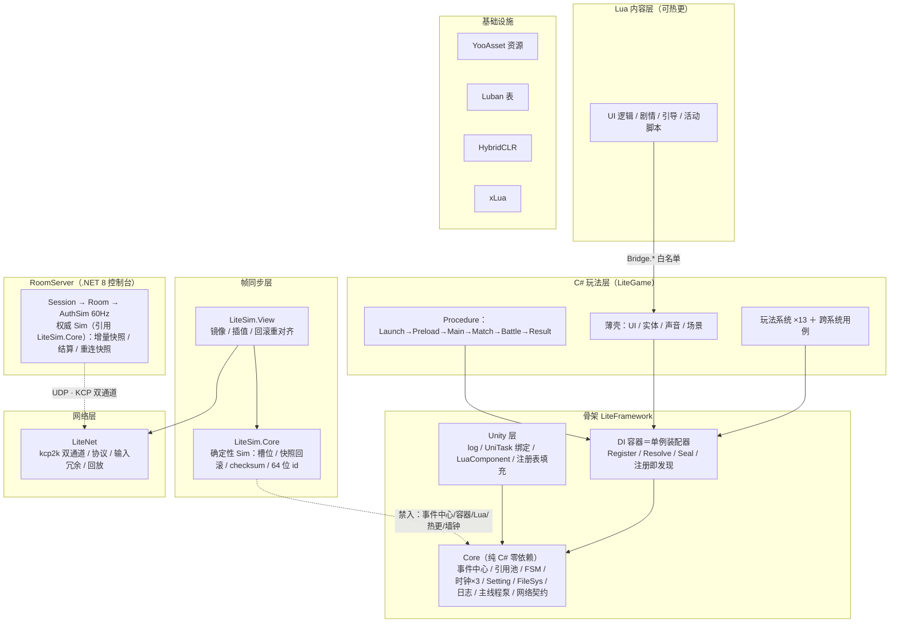

# 自研框架设计方案（轻量自研骨架 + Lua 逻辑注册表 / DI / xLua 内容驱动层）

> 制订日期：2026-09-05
> 前置：本地已有 EllanJiang GameFramework 全套源码（降级为参考实现）、方案 A 集成工程（YooAsset + AssetService 参考实现）、8 周学习路线、Luban 4.11 导表工具链（独立生成器 + luban_unity 运行时包已装，全链路在试验工程验证跑通）
> 一句话定位：**自研轻量骨架（参照 GF 骨架件的极简重写），套上 DI 与 Lua 逻辑注册表；玩法规则与框架机制留 C#，Lua 只承担内容驱动层（单界面逻辑 + 剧情/引导/活动等内容脚本），整体可热更。**

---

## 0. 设计目标与三条原则

1. **轻**：骨架轻量自研（八件 + 横切小工具约 1400 行，见 §1.1），重模块（资源/网络/下载/本地化等）不进框架，交给 YooAsset 或按需后补。
2. **松**：框架层不知道业务存在，业务层不感知资源方案。依赖关系全部显式化——单例服务走 DI 注入，多例对象的创建各归其位（C# 对象走对象池/`new`，Lua 逻辑对象走注册表查找，见 §2.1）。
3. **活**：频繁变的**内容**进 Lua（剧情/引导/活动/任务组装/单界面逻辑），玩法**规则**与框架机制留 C#——Lua 是可执行的内容层，不是第二门业务语言。

分层总览：



**程序集依赖铁律**（全图的骨架，箭头即引用方向）：

| 程序集 | 引用 | 禁止 |
| --- | --- | --- |
| `LiteFramework.Core` / `LiteSim.Core` / `LiteNet` | **零** | UnityEngine、一切第三方 |
| `LiteFramework.Unity` | Core + UniTask | 业务 |
| `LiteSim.View` | Sim.Core + Framework.Core + UniTask | — |
| `LiteGame.Runtime` | 骨架 + View + Net + Luban.Tables | Sim 内部实现细节 |
| `Server` | **LiteNet + LiteSim.Core** | 权威 Sim：60Hz Step + 增量快照广播（状态同步主路线）；帧同步预案下退为影子记账（见《帧同步实施方案（预案）》）；LiteFramework 不引用 |
| Lua | Bridge 白名单 | `CS.` 直引 |

**热更边界**：可热更 = Lua 内容层 + HybridCLR 业务程序集；**冻结** = Framework.Core / Sim.Core / LiteNet（Sim 与 Net 冻结是联机版本一致性红线，启动期校验构建 hash，见《状态同步实施方案》§1）。

**一条启动线**：`GameEntry(-1000)` → 组件注册 → `ProcedureLaunch`（装配 → `Seal`）→ `Preload`（YooAsset → 热更 → Lua tag 预载 → `main.lua` → 配置 → 注册表填充）→ `Main` → `Match` → `Battle`（FrameDriver 接管）→ `Result`。

**分工一句话**：装配归容器、驱动归 GameEntry、阶段归 Procedure、确定性归 Sim、传输归 LiteNet、内容热更归 Lua、资源归 YooAsset——每一层只认下层的接口，没有任何一层越界。

---

## 1. 骨架自研清单与取舍（核心决策）

分三类：**自研 / 砍掉 / 降级为薄壳服务**（框架唯一新增模块是 §4.2 的 LuaComponent）。

### 1.1 自研清单（职责、API 面与行数预算）

骨架不引用 GF 源码，参照其设计轻量重写（GF 全套源码降级为参考实现，卡壳时对照阅读）。**每件设行数预算，超预算先停下砍需求**——自研最大的风险不是写不出，是越写越大。

| 件 | 职责与 API 面 | 预算 |
| --- | --- | --- |
| 装配与驱动 | `GameEntry` 驱动各件 tick（事件/FSM/游戏时钟心跳）；服务唯一入口是 DI，骨架不设第二个服务定位器；各件暴露只读 stats 供开发 HUD 读取 | ~100 行 |
| 事件中心 | 泛型事件 + 参数 IReference 复用，**发布即移交所有权**（发布方 Acquire→填充→Publish，派发完成后中心统一回收，无订阅者路径同样回收）；`Subscribe<T>(handler)` 返回注销委托；**队列派发 / FireNow 二分**（防派发中改订阅集）；Debug 严格模式（未处理事件告警）；跨语言事件桥的基座（§4.3） | ~180 行 |
| 引用池 ReferencePool | 类型池化（静态类），Get/Release 带类型与重复校验；容量上限/裁剪/预热（§10 M0） | ~120 行 |
| 文件系统 FileSys | **静态门面豁免名单第三位**（现行封闭名单：Log / ReferencePool / FileSys / **AssetService（业务侧，方案 A 结论）**——新增须先登记）：路径门面 + 原子写 + JSON 双口径（便捷/显式 `TryReadJson`）+ 同步主路径/异步逃生口（float 版数值纪律下 Sim 不用文件）；越界校验 release 保留（外部输入属输入校验） | ~250 行 |
| 对象池（泛型实例池） | **自研 `ObjectPool<T>`**（2026-09-10 决策修订，原"直接用 UnityEngine.Pool.ObjectPool"作废）：Core 机制件，`Acquire/Release/Preload/Clear/Trim` + onGet/onRelease/onDestroy 三回调 + `maxIdle` 容量上限；池满策略钉死"归还即销毁不淘汰"（原推演结论保留：优先级淘汰 = 无消费者伪需求）；重复归还 Debug 抛（三宏并集，比官方 collectionCheck 只在 Editor 强）；统计原生接 `IModuleStats`（口径与 ReferencePool 一致）。**推翻理由**：官方池的 Debug 校验面/统计口径与 ReferencePool 两套、stats 要再包一层导致 API 面重复、装配不走 DI 纪律。**代价留痕**：~100 行自研代码自担 bug | ~100 行 |
| GameObject 池 | `GameObjectPool`（Unity 层适配，**包 Core `ObjectPool<T>` 做底层**，不自研第二套池逻辑）：prefab 维度池 + **加载竞态表**（加载中 Release → 完成回调立即回收）+ 池根 DontDestroyOnLoad 防切场景误伤；实体壳（M4）的实例管理底座。Unity 对象不进 Sim | ~80 行 |
| FSM + Procedure | 泛型状态机 + **泛型流程基类** `ProcedureBase<TOwner>`（框架只约束 `IProcedureOwner { Exception LastError }`，owner 实现由业务提供）；流程间传参走 **TOwner 具名对象**（业务 owner 字段——字符串键数据字典已删：零编译期检查 + 装箱 + 静默 cast 错误） | ~220 行 |
| 游戏时钟 IGameClock + 调度器 IScheduler + 序列执行 ITimelineRunner | **三件独立、各自 DI 单例**，玩法与解释器共用；**时钟语义**（暂停/时停/变速，世界与 UI 时钟分层，**单帧增量钳制 `MaxDelta=0.1s` 防 Hitch 尖峰**——实现回写）进 M0，**调度器**（动作点/定时注册、到期触发、可取消）与**序列执行**（有序步骤表推进，剧情与技能共用）M4 排位——**排期既分离，接口就不合并**，避免 M0 先产出半截接口。时钟是唯一时间真相源，经 `ScaledDelta` 供后两件消费；后两件构造注入 `IGameClock`（这是 DI 在本框架少有的真实用武之地）。底层封装 UniTask（§7.7 时间原语收口） | ~250 行（三件合计） |

> **两个时钟实例怎么注册进 DI**：容器无 keyed registration、且重复注册抛异常（M0 §10），同一接口注册两个实例必然冲突。用**空标记子接口**区分——`IWorldClock : IGameClock`、`IUIClock : IGameClock`。零 API 膨胀，注入时一眼看出用的是哪个时钟，拿混即编译错误。不要为此引入命名注册。
| SettingService | 内存字典 + JSON 文件持久化（Newtonsoft.Json），仅存玩家偏好（音量/画质/语言）。**机制在 Core**（存储引擎 + `Setting<T>` 强类型封装）；**具体设置清单（键/默认值/范围）属业务件**（`LiteGame.GameSettings`） | ~80 行 |
| 墙钟 IWallClock | **第三时间域（真实时间）**：网络超时 / 断线重试间隔 / 每日刷新 / 真实倒计时。**不可暂停、不可变速**（这是它独立成件的理由——塞进 IGameClock 会逼出一个恒 1 的 TimeScale 和假的 Paused）。Core 默认实现 `SystemWallClock`（DateTime.UtcNow 直通）；联机后换 `ServerWallClock`（服务器时间下发 + offset 推算，实现在 LiteNet/玩法层，M9+）。**禁止进入 Sim 层**——对局内判定用墙钟 = 确定性死亡；断线倒计时是 UI/流程层的事 | ~30 行 |
| 日志门面 Log | 静态 Info/Warning/Error/Fatal + ILogHelper 可换实现（默认 UnityEngine.Debug）；最近 32 条环形缓冲 + 错误计数供 HUD；发布只出 Warning 以上；Lua 侧 `log.*` 经白名单进 Log（§4.3）。框架与业务禁止散落 `Debug.Log` | ~100 行 |
| 文件系统 FileSys | **本地持久化门面（静态）**：persistentDataPath 路径管理、原子写（临时文件 + 替换）、ReadJson/WriteJson 快捷（复用 §5.4-6）、Exists/Delete/目录枚举；Setting/存档/日志 helper 的共同底座，业务存档亦走它。**不是** GF 式归档虚拟文件系统（海量小文件打包——那个回补口保留）；同步 API（文件皆小，单线程约定） | ~120 行 |

八件合计约 1150 行，横切小工具（SubscriptionBag / SafeCall / ITickable / **MainThreadDispatcher** / UniTask 适配扩展 / IModuleStats / DevReload，见实施手册"贯穿性配置与横切小工具"）合计约 290 行——总计约 1450 行，这就是"轻量"的度量衡。对照 GF 同模块动辄数千行，砍掉的是版本兼容、扩展点与防御性代码，留的是核心机制；零 GC 数据结构（复用链表、多值字典）随事件中心/FSM 一并自研，不单独成件。横切小工具按**先行提炼**规划：它们的第 2 个消费者在设计里就已白纸黑字，不等它出现再抽。

**验收口径**：行数只是软约束（可被"写密"绕过），硬验收是**公开 API 面不超本清单所列**——API 膨胀才是骨架变胖的真实先行指标。

IGameClock 的三个设计决策在 M4 实现前定死：变步长 vs 固定步长（默认固定步长——v3 理由更新：联机后逻辑确定性由 Sim 的 FrameDriver 保证，GameClock 不再承载逻辑正确性；保留固定步长是因为它与 Sim 的 `dt = 1/60` **同构**，将来战斗判定迁移进 Sim 阻力最小）；与骨架 tick 的先后顺序（默认时钟先于玩法更新）；世界时钟与 UI 时钟是否分层（默认分层，UI 不受时停影响）。三层排位：时钟语义进 M0（底座），调度器与序列执行在 M4 排位（**v3 注：联机形态下技能/Buff 判定迁入 Sim，ITimelineRunner 的消费者剩剧情/引导与单机表现**，见《状态同步实施方案》§3.9；M5 的解释器仍压在它上面）——**排期分离则接口分离**，三件各自成件、各自 `ITickable`，由 GameEntry 按 `Clock → Scheduler → TimelineRunner` 顺序驱动。

### 1.2 整层砍掉

| 模块 | 替代方案 |
| --- | --- |
| 数据表 DataTable（连简化版也不留） | **Luban 4.11**：生成的强类型 `Tables`/`TbXxx` 就是带主键索引的表（见 §5），自研 DataTable 整块工作量取消 |
| 资源管理 + 文件系统 + 版本列表（GF 最重的一坨） | **YooAsset 3.0.x**（沿用你方案 A 的结论：`AssetService` 静态门面） |
| 下载管理器 Download | YooAsset 内置热更下载 |
| WebRequest | 用到时给 `UnityWebRequest` 包 20 行薄封装，不值得一个模块 |
| 网络管理器 Network | **实现**不进框架，独立成插件（协议层不依赖框架）；**契约**已落骨架（`INetworkService`，见《M0实施指导》§11，仅 30 行挂点） |
| 本地化 Localization | 出海前不存在；后补成 Lua 层查表即可 |
| 任务池 TaskPool | GF 全库三个消费者（Download / WebRequest / Resource 加载任务）已被 YooAsset / UniTask / AssetService 全部替代，无剩余场景；真出现批量后台作业需求，自研或 vendor 均为独立小件 |
| Debugger 面板 | **自写迷你开发 HUD（开发期专属）**：FPS/内存走 Unity 原生 Stats，骨架各件暴露只读 stats 接口供 HUD 读取；Editor 常开、打包剥离（独立 Development-only asmdef）。GF/UGF 的 Debugger 读的是 GF 运行时类型，骨架自研后无从绑定，不引入。与 LuaPanda 组成 C#/Lua 双侧调试组合拳 |

### 1.3 降级为"薄壳服务"（不进框架核心，进 DI）

| 原模块 | 薄壳化后只剩 |
| --- | --- |
| UI | 栈管理 + 层级组（Depth 分配 + **组级批量暂停**）+ prefab 实例化 + 七态生命周期转发给 Lua（含 **OnCover/OnReveal** 被遮盖语义，GF UIManager 同款；**单界面逻辑在 Lua，行业同款**） |
| 实体 | 池化 GameObject + 生命周期容器（实体逻辑回 C# 玩法系统，不再转发 Lua）；**加载竞态表**（异步加载中收到 Hide → 记入集合，加载完成立即回收，GF EntitiesToReleaseOnLoad 同款）；GF 实体树/父子关系不保留——挂载类玩法直接用 Transform 层级，由玩法系统自持 |
| 声音 | **组 + 代理模型**：一组 N 个代理轮转（并发播放通道，同组音效可叠加）、组音量/静音、同优先级不被替换（GF SoundManager 同款） |
| 场景 | 场景加载/卸载/激活 + 进度（UniTask 签名，底层 YooAsset）；切换决策归 Procedure，壳只提供机制。业务禁止裸调 `AssetService.LoadSceneAsync` |

**理由**：这三块在原 GF 里代码量大、且每个项目都要重写一遍。把它们从"框架模块"降级为"DI 注册的普通服务"，框架核心就稳定不动了，换项目只换壳和 Lua。

**壳只做机制，不做策略**：栈/槽位/池化/播放通道是机制，留在壳里；层级策略、转场动画、出栈拦截、红点、SafeArea/多分辨率适配等一切**策略**做成策略接口 + 默认实现，Lua 可经 Lua 逻辑注册表覆盖替换（`Strategies.<策略名>`，§4.4）。策略一旦写死在 C# 壳里，要么出包，要么服务桥被迫持续堆接口、膨胀成第二张热更面——这条纪律 M3 之后必被挑战，先立住。

**移动适配的刘海屏红线（2026-09-13 补）**：SafeArea 策略必须覆盖**刘海屏 / 挖孔屏 / 异形屏**——运行期唯一事实源是 `Screen.safeArea`（横竖屏切换、分屏自动更新），UI 画布经 SafeArea 接收器驱动 CanvasScaler 偏移（M4 UI 壳交付）；Android 侧出包时决策 `renderInCutout`（默认 shortEdges，挖孔区不放交互），iOS 交由 safeArea 天然覆盖——出包检查单加"异形屏真机过一遍四角"一项。**豁免**：DevHUD 等仅电脑测试用的自绘层不做适配。

**壳的驱动**：薄壳实现 ITickable，由 GameEntry 统一驱动（不用各组件自己的 Update）——心跳顺序即时钟/壳的装配顺序；壳的 Tick 吃真实帧间隔（UI 转场/栈推进不受时停影响，与"世界/UI 时钟分层"决策呼应）。

**通用组件层归属声明**：虚拟列表、红点、转场等通用组件**属于壳（C# 机制层）**——性能敏感、结构稳定、不随内容变，Lua 不直接操作其内部实现。壳只暴露**数据驱动口子**：虚拟列表给数据源与渲染项注册、红点给规则注册、转场给策略注入（均经 Lua 逻辑注册表或绑定面）。

**控件库预建定案（2026-09-13，用户推翻"按需生长"）**：通用控件以**预建库**形态交付（M4c 批次，清单见《M4实施指导》§2.10：虚拟列表 / 页签 / 多态按钮 / 进度环 / 计数文本 / 红点树 / Toast 等 20 余件 + UIWidget 基座）；归属纪律不变——控件是壳机制层的可复用组件，Lua 经数据口子/受控 API 消费，不碰内部实现。**绑定工具只是加速开发**：BindCodeGen 把 prefab 节点暴露成名字索引、免查找接线，控件库**不依赖绑定标记亦可代码使用**——两者正交，控件先行、绑定锦上添花。

---

## 2. Lua 逻辑注册表（Registry）

### 2.1 职责边界（三种创建/获取方式，各归其位）

- **DI 容器**：管理**单例服务**（唯一的、活一辈子的：数据服务、Lua 桥、战斗管理器…），核心是"注入"。
- **C# 多例对象**（实体、Buff、流程实例…）：交还传统手段——对象池与直接 `new`，由 C# 玩法系统自持。其中**需要查表组装的**（Buff、技能实例、任务进度这类"创建 = 查表 + 组装参数 + 选池化或新建"的对象），创建点**收敛到工厂**：工厂本身是 DI 单例（进容器），产品是多例（不进容器）。调用方注入工厂、只说"要什么"，创建逻辑（读表、组装、池化选择）只写一遍——这是业界在"散落 new"与"过度封装"之间的标准中间态。真正的内部零件（数据结构、临时对象）仍然直接 `new`，**不要为它们建工厂**。
- **Lua 逻辑注册表**：管理**定义在 Lua 的逻辑对象**（单界面逻辑表、内容入口、策略覆盖）的按名查找，核心是"名字 → 已适配的 C# 接口"。Lua 逻辑表 per-type 共享行为、实例状态由 C# 壳持有（xLua LuaBehaviour 同款），不需要逐次创建。
- 注册表本身是一个 DI 单例服务；注册表三件套（TbUIForm/TbContentEntry/TbStrategy）是它的填充数据源。

**多例对象的回收责任（"各归其位"的代价，补记）**：框架**不提供统一的多例生命周期管理器**——那等价于作用域容器，与 §8.3 的取舍冲突。代价是多例对象**没有任何框架机制兜底**，回收责任全在玩法系统。补三样便宜的防御件：

| 件 | 内容 | 参照 |
| --- | --- | --- |
| **`SubscriptionBag` 升级为资源袋** | 除注销委托外，顺带收集 `IDisposable`（句柄、租借缓冲、定时器 id），`Dispose()` 一次全清 | UniRx `CompositeDisposable`、Rx.NET 同款——工程内已有 `Assets/Plugins/UniRx/Scripts/Disposables/CompositeDisposable.cs`，直接对齐即可 |
| **实体池 Debug 追踪** | 活跃集合 + HUD 显示"活跃 / 未回收"，泄漏一眼可见 | 自研 `ReferencePool` 已有同款（`Using` 集合 + `GetAllInfos()`），复制到实体池即可；GF Debugger 面板同思路 |
| **实体生命周期状态机** | `Spawning / Alive / Dying / Dead / Recycling` | **无行业强共识，非必做**：GF 的 `EntityLogic` 只有 `OnInit/OnShow/OnHide/OnRecycle` 回调、没有状态枚举，靠回调在大量项目里也活得很好。仅在确有"逻辑已死但表现还在"的中间态时再加，否则一个 bool 足够。**不要为了架构完整而提前加** |

**三条危险点**（多例缺框架兜底的直接后果）：

1. **事件订阅悬垂**：对象已回池、委托还在通道里 → 派发打到复用该内存的新实体上，表现为"偶尔有个怪莫名掉血"，极难复现。防线是 §7.3 红线 + 资源袋，但**靠人遵守，框架无强制手段**。
2. **跨系统引用失效**：一律用 **id 不用引用**（联机下是硬要求，见《状态同步实施方案》§3.1 槽位数组）。
3. **挂载型对象无回收触发点**：Buff 挂在角色上，角色回池时谁清 Buff 当前无答案；漏了不报错，只表现为缓慢内存增长。

### 2.2 为什么它对 xLua 至关重要

注册表的填充面是 **Luban 注册表三件套**（`TbUIForm` / `TbContentEntry` / `TbStrategy`，一表一实体、校验规则各异：UI 表的 Lua路径/Prefab 必填、策略表全部可空，见 §5.2）：C# 在配置加载后读表统一填充，`Fill` API **不导出给 Lua**——Lua 侧零样板，桥面保持最小。填充对象三类：**单界面逻辑表**（定义在 Lua，热更后编译期不存在）、**内容入口**（剧情/引导/活动的解释器入口映射）、**策略覆盖**（壳的层级/转场策略，留空即用 C# 默认）：

- 策划/程序在 Excel 加一行（Id / Lua路径 / Prefab / 层级 / 策略引用…）→ gen.bat → 热更生效，**新增内容不出包**
- **启动期统一拉取并校验**：读表后逐行 require 对应 Lua 模块、校验路径存在性并包好 C# 适配器——定义模块在启动期全部执行一遍（几十个纯定义模块体的开销，换错误 100% 提前，是好交易）
- **Get 路径零 IO 零 require，纯查缓存**：填充完成即全部就绪，运行期取逻辑表 = 字典查找
- 未注册名 Get 直接报错，**不开约定兜底后门**——显式性是这个设计的卖点

**两项加固**（注册表最容易漏的两类错误，都是"表与 Lua 对不上"）：

1. **key 生成常量，消灭字符串**：gen.bat 后置一步产出 `LuaKeys.g.cs`（`public const string UIMain = "UIMain";`），C# 侧一律 `Get(LuaKeys.UIMain)`——拼错从运行时异常变成编译错误。与 Luban 已生成强类型表是同一个思路，只是延伸到注册表 key 这一环。
2. **双向校验**：当前只校验"表里声明的都能 require 到"，**反过来也要查**——Lua 实际注册了但表里没有 → 拼错或残留，`Log.Warning`。两侧对着查才能抓住"表里写 `UIMain`、lua 里写成 `UIMian`"这类经典错误：单向校验下它只表现为 `Get` 抛异常，看不出到底是拼错还是漏配，查一次要半天。

**新增类别的扩张清单**（`ILuaRegistry<T>` 泛型设计的目的地——每个新类别 = 一个新的闭泛型实例，容器按闭泛型类型天然隔离，机制零改动）：①定义消费接口（如 `INpcHandler`）②Luban 加注册表表（`TbNpcHandler`）③gen.bat 自动扩展强类型表与 `LuaKeys` ④`ProcedurePreload` 填充段加一行读表 + `Fill` ⑤DI 注册 `RegisterInstance<ILuaRegistry<INpcHandler>>(new LuaRegistry<INpcHandler>())`。**自动白拿**：重复 Fill 抛 / Get 未命中抛（含路径约定提示）/ 双向校验。**禁止的扩张方式**：往单例大表加 key 前缀（`"ui:Main"`）——省一张表，丢掉全部类型安全，Get 回来要 cast。

```csharp
public interface ILuaRegistry<T> {
    void Fill(string name, T impl);   // C# 读注册表三件套后调用，不导出给 Lua
    T Get(string name);               // C# 壳/解释器调用；启动期已统一填充，纯查缓存
    bool Has(string name);
}

public interface IUIFormLogic {          // C# 与 Lua 逻辑对象的统一接口
    void OnInit(object bindData);
    void OnShow(object userData);
    void OnUpdate(float realDelta);
    void OnPause(bool paused);
    void OnCover();                      // 被其他窗体遮盖（可见但非顶层）：停红点/动画等局部刷新
    void OnReveal();                     // 遮盖解除
    void OnHide();
}
```

### 2.3 注册期与解析期

约定两个阶段防止半初始化问题：**填充期**（ProcedurePreload 尾部：配置加载完成后，C# 读注册表三件套统一拉取、校验并填充）只许 Fill；**解析期**（进入 ProcedureMain 之后）只许 Get。填充在进 Main 前一次性完成，"半初始化"窗口由**流程顺序契约**保证——机制化断言（LuaRegistryTiming / AllowRefill 豁免窗口）已于 2026-09-10 决策删除，降级为流程结构纪律（见《M1实施指导》§1 决策记录）。

**运行期热更的增量填充（合法重入之二）**：除 Editor 的 `DevReload.All()` 外，运行期热更同样需要重填——新版本可能新增界面、改内容入口、换策略覆盖。按**填充对象分两类处理**：

| 类别 | 对象 | 随时可替换？ | 说明 |
| --- | --- | --- | --- |
| **A 无状态** | 内容入口、策略覆盖 | ✅ 是 | 无实例状态，重新 Fill 即可。但壳若缓存了策略引用，需靠 `Generation` 变化主动丢弃缓存 |
| **B 有实例状态** | 单界面逻辑表 | ⚠️ 仅当该界面未打开 | 已打开的界面换代码会造成"一半旧一半新"。标记待更新，等 `OnHide` 后再替换 |

```csharp
public interface ILuaRegistry<T> {
    void Fill(string name, T impl);
    T Get(string name);
    bool Has(string name);
    int Generation { get; }        // 每次批量填充 +1：壳据此丢弃缓存的策略/适配器引用
}
```

**执行要点**：

1. **不重建 LuaEnv**——重建会让所有已持有的 `LuaTable` 失效，等价于重启。只重新 require 变更模块。
2. **旧 `LuaTable` 必须显式 `Dispose`**，否则跨语言引用泄漏（§7.3）。
3. **安全窗口**：批量重填由流程显式触发（如回到主城 / 战斗结束的检查点），不在任意时刻执行。
4. **一致性承诺是"最终一致"不是"瞬间一致"**：热更完成后到下次安全窗口之间，新旧代码可能短暂并存。文档与 HUD 都要如实反映，不要假装瞬时切换。
5. 重填失败项按 §3.4 降级策略处理，不影响其他项。

Editor 开发重载沿用同一套机制，只是由 `DevReload.All()` 触发。

**热更的三层边界（原则）**：

| 层 | 热更时机 | 说明 |
| --- | --- | --- |
| **Lua 内容** | **运行期**（增量填充，本节机制） | 界面逻辑/内容入口/策略——频繁变的内容层 |
| **C# 结构** | **启动期**（HybridCLR，进 Main 前加载完成） | HybridCLR 的运行期热更 = 回域重载 = 软重启（静态丢失、MonoBehaviour 重建、断线）——运行期内容更新已全部由 Lua 层承接，C# 运行期热更**没有需求方**，不做 |
| **注册表机制** | **永不**（`LiteFramework.Core` 冻结名单） | 它只是带校验的 Dictionary 包装——**机制冻结、内容热更**：热更的是表里装的 Lua 模块，不是装它们的容器 |

---

## 3. 依赖注入容器（DI）

### 3.1 决策：手写轻量容器（约 400 行），不引入 Zenject/VContainer

理由：你要"自己的框架"，DI 是理解成本最低、收益最高的自研件；Zenject 太重且黑盒；VContainer 是好库（1.19.0、仍在维护）但引入它等于引入第二套生命周期体系（§8.3）。自研够用即可，**克制功能**是关键。

### 3.2 定位与功能清单

**容器的定位一句话：单例服务的构造装配器（composition root 工具），不是 IoC 框架。** 只做三件事——把服务的构造关系集中到一处装配、让依赖显式可见（看构造函数即知）、让装配错误在解析时点当场报出（未注册 / 循环依赖含依赖链 / 构造抛真因；原 `Validate()` 全量预检已于 2026-09-10 决策删除，见《M1实施指导》§1）。VContainer 的另一半能力（EntryPoint、作用域、属性注入）在本框架里分别由 `GameEntry`/`ITickable`、`Procedure`、对象池承担——**"不像 VContainer"是设计目标，不是缺陷**；定位写清之后，它就"像"一个明确的小东西，而不是半个大东西。

```csharp
public interface IServiceContainer {
    void Register<TInterface, TImpl>() where TImpl : TInterface;      // 仅单例；首次 Resolve 时构造
    void RegisterInstance<TInterface>(TInterface instance);          // 骨架件 / Component 桥接注册
    void RegisterFactory<TInterface>(Func<IServiceContainer, TInterface> factory);  // 延迟构造；工厂须纯构造（M0 §10）
    T Resolve<T>();                                                   // 构造函数注入，缓存单例
    void Seal();                                                      // 装配密封：此后一切 Register* 抛（ProcedureLaunch 装配末尾调用）
    IReadOnlyList<ITickable> Tickables { get; }                       // 注册即发现；注册顺序 = 驱动顺序
    IReadOnlyList<IModuleStats> Stats { get; }                      // 同上，开发 HUD 数据源
}
```

- **构造函数注入**：`Resolve` 时反射找最长构造函数，递归解析参数。
- **注册即发现（向 VContainer 学精神、不学形态）**：`RegisterInstance` 时与工厂产物**首次构造后**，自动识别 `ITickable`/`IModuleStats` 收进只读列表，`GameEntry` 驱动时直接枚举。消灭两件事：①"注册与收集两步重复"的体力活 ②**漏收集的静默 bug**——手工收集漏一个，服务就永不 Tick，不报错只是悄悄不工作，机制化后此类错误不再可能。**顺序仍然显式**：注册顺序写在装配处一行行排下来（Clock → Scheduler → TimelineRunner → FSM → 各壳）。学的是 EntryPoint 的**自动化**，不学它的**形态**：不接管 PlayerLoop、不引入 `IStartable`/`OnInit`/`OnDispose` 回调家族——那是与 `Procedure` 形成第二套时序体系的入口。**此特性之后容器封顶**：装配器，不驱动、不管阶段、不碰多例。
- **重复注册抛异常**：注册时查重——静默覆盖迟早踩。
- **循环依赖**：解析栈检测，直接抛，报错带依赖链（`A → B → C → A`）。
- **不做**：属性注入、自动程序集扫描、循环依赖自动解、AOP、线程安全（约定主线程）、keyed registration（**同接口多实例用空标记子接口表达——两个时钟本来就是两个服务，身份由接口表达，这不是绕路是正解**）、Transient/作用域生命周期（§8.3：唯一需要作用域的战斗上下文被确定性纪律排除在容器外）、**Resolve 时机门禁**（见 §3.3——防线是未注册异常 + 流程顺序，不需要运行时开关）。
- **反射与 IL2CPP**：所有注册用显式泛型（不扫描），构造函数反射在 AOT 下可用；`link.xml` 保留服务实现类即可。

### 3.3 与自研骨架的接法（对外只有一套体系）

- **骨架自研即合流**：没有 GameFrameworkEntry/GetModule，不存在双服务定位器——机制件（事件中心/游戏时钟/FSM）是独立类，由骨架装配层驱动；业务与 Lua 的唯一体系就是 DI + 注册表。
- `GameEntry` 持有根容器；Unity 组件**不进** DI（它们是 MonoBehaviour 生命周期），组件 Awake 时把壳服务（UI 壳等）`RegisterInstance` 进容器。
- **解析时序契约（无运行时开关）**：组件 Awake 只许 `RegisterInstance`、禁止 `Resolve`；一切解析发生在 `ProcedureLaunch` 装配 DI 之后。防线有三层，**不需要 `AllowResolve` 这类运行时门禁**：①装配完成前的解析，未注册的依赖直接抛（90% 的时机错误天然暴露）②装配末尾必跑 `Seal()`——注册面从此冻结、密封后一切注册违例当场抛 ③流程顺序契约（`DefaultExecutionOrder(-1000)` + 启动顺序）。曾被考虑的 `AllowResolve` 开关已砍——它防不住真正的风险场景（`RegisterInstance` 之间的 Awake 顺序，它一概不拦），它防的"依赖恰好齐但解析太早"即使发生拿到的也是正确实例、无害，而它自己却是全框架唯一"忘了置 true 就全线炸"的开关。
- **容器不静态暴露解析，装配权显式传递**：`GameEntry` 只提供 `RegisterInstance` 静态入口供组件注册自持的壳服务，**不提供 `Resolve`**。装配权经构造注入传给 `ProcedureLaunch`（唯一受信装配点：注册业务服务 → `Seal()`）。**密封用标志实现而不是置 null**——容器实例由 GameEntry 全程持有（驱动要枚举 `Tickables`），密封封的是注册面，不是容器生命周期。**静态解析入口 = 服务定位器后门**——它让依赖从哪来变得不可追踪，DI 的核心收益（看构造函数即知依赖）直接归零。运行期散落的解析调用没有运行时开关能拦（那又是服务定位器的路），所以必须在物理上封死静态入口。
- 启动顺序契约：`GameEntry`（驱动骨架与薄壳的 ITickable）→ 其他 Component Awake（只注册）→ `ProcedureLaunch` 装配 DI 并完成解析 → `ProcedurePreload`（YooAsset 初始化/热更 → 全量预载 Lua → 执行 `main.lua` → 配置加载 → **C# 读表填充并校验**，见 §2.3）→ `ProcedureMain`。

- **收口模式与判据**：字符串/魔法值**跨越编译单元边界被另一方查找或匹配**时，必须收口到类型安全层；只在单一模块内部使用的字符串（日志、显示文案、模块自持路径）**不收**。三个已落地的先例：①Fsm 字符串数据字典 → TOwner 具名字段（框架只约束 `IProcedureOwner.LastError`，业务字段在业务 owner）②SettingService 裸 key → 业务具名 `Setting<T>` 清单（默认值/钳制单源，`GameSettings`）③注册表 key → `LuaKeys` 生成常量。同病未清的挂账：AssetService 资源 location 字符串（M2 收口——路径进 Luban 表消费经强类型表）、`SimWorldState.Custom[32]` 字节缓冲（§3.8 SoA 触发条件挂账）。

### 3.4 启动失败判定（一律 fail-fast，不做带病启动）

上面这条链路每一步都可能失败，但文档此前只写"校验"，没写**校验不通过之后怎么办**。不定这条，实现时必然各写各的。

**总原则：启动期一律 fail-fast，任何失败都阻止进 `ProcedureMain`，不做"带病启动"。**

理由三条：

1. **帧同步下版本一致是硬要求**——热更降级意味着不同客户端可能跑着不同版本的逻辑与内容，帧同步必然发散。降级在单机时代是可用性优化，在这里是**正确性事故**。
2. 基础层失败后继续跑会产出大量次生错误，把根因淹掉，排查成本翻倍。
3. 内容项失败看似影响面小，但"能进游戏但某个界面打不开"比"进不去游戏"更难定位——前者会被当成偶发 bug 零星上报，后者是明确的启动失败、现场完整。

| 环节 | 判定 | 行为 |
| --- | --- | --- |
| YooAsset 初始化 | **致命** | 阻止进 Main，错误提示 + 退出 |
| 热更下载失败（网络） | **致命** | 提示重试。**不用本地旧版本续跑**——版本不一致会让不同客户端逻辑分叉，帧同步直接崩 |
| 热更下载失败（磁盘写入） | **致命** | 提示"存储空间不足" |
| 强制更新（版本不兼容） | **致命** | 提示更新，不放行 |
| **Lua 全量预载** | **致命** | 同步 loader 缺任一文件都会运行时炸，不能带缺口进 Main |
| `main.lua` 执行 | **致命** | 同上 |
| 配置加载 | **致命** | 表是玩法基础，缺表等于玩法不存在 |
| **注册表单项填充** | **致命** | 见下（整批跑完后统一判定，不遇错即停） |

**注册表降级细则**：逐项 `try/catch`，单项失败**记入报告并继续**，不因一项失败中断整批填充。填充完成后统一产出报告：

```csharp
public sealed class RegistryFillReport {
    public int Total, Filled, Failed;
    public IReadOnlyList<(string key, string kind, string reason)> Failures { get; }
    public bool HasFailures => Failed > 0;
}
```

- `Failures` 非空 → **阻止进 Main**，逐条 `Log.Error`（带 key / 类别 / 原因），HUD 显示完整失败清单
- **判定在整批填充跑完后一次性做出，不是遇到第一个失败就中断**——这样一次拿到全部问题，修完一轮即可；否则会陷入"改一个、重启、再报下一个"的循环
- 错误信息**必须区分"未注册"与"注册失败"**：前者是配置漏配，后者是 lua 炸了，排查方向完全不同

**fail-fast 的代价与缓解**：代价很实在——某个冷门内容项坏了会导致全量玩家进不去游戏。所以必须配套两件事，否则 fail-fast 就从"提前暴露"变成"放大事故"：

1. **热更管线要能快速回退**（YooAsset 版本回退，一个指令完成），修复窗口以分钟计
2. **启动期校验前移到出包流程**：CI 或出包前跑一遍全量填充校验，不要等玩家替你发现问题

这两条不做，就不该选 fail-fast。

---

## 4. xLua 逻辑层

### 4.1 职责划分（一句话判据：**会热更的进 Lua，碰引擎的留 C#**）

| C# 做 | Lua 做 |
| --- | --- |
| **玩法规则**：战斗 / Buff / 技能 / AI / 任务引擎 / 数值结算（时间维异步统一走框架层 IGameClock，见 §1.1） | **内容脚本**：剧情 / 引导 / 活动组装 / 任务步骤与文案 |
| **UI 壳机制**（栈/层级/实例化）+ **通用组件**（虚拟列表/红点/转场） | **单界面逻辑**（UIForm 逻辑类：交互响应、内容填充） |
| **内容解释器**：剧情播放器 / 引导引擎 / 活动调度 | 消费事件、经 `Bridge.data` 查表、向解释器提供内容 |
| 资源加载/释放（AssetService）、实体池、声音播放、FSM 骨架、事件派发、数据表加载、LuaEnv 生命周期、Loader、跨语言桥 | `main.lua` 启动（require/定义）、按约定路径定义界面逻辑表与内容脚本 |

### 4.2 LuaComponent（框架唯一新增的核心模块）

```csharp
public sealed class LuaComponent : MonoBehaviour {
    // 1. 初始化 LuaEnv，注册自定义 Loader：lua 文件走 YooAsset RawFile（Require 路径 = 热更资源路径）
    // 2. Update 里给 Lua 派发 tick（可配置开关，Lua 不需要时不调）
    // 3. 执行 main.lua（只做 require/定义，按约定路径暴露逻辑表，不再注册工厂）
    // 4. Shutdown 时统一 DoString 清理 + env.Dispose()
}
```

自定义 loader 是热更的咽喉：`CustomLoader(ref string filepath)` 里把 filepath 映射为 `Assets/LiteGame/Lua/xxx.lua`，经 `AssetService.LoadRawFileTextAsync` 同步缓存后返回字节。**Lua 文件即资源**，随 YooAsset 打包、下发、热更，与 prefab 同一套流程。

**预加载策略（同步 loader 的硬约束）**：loader 是同步签名而 YooAsset 主路径是异步，因此 **main.lua 执行前必须全量预载 Lua 目录**（Lua 文件小，全量预载是标准做法），先建立"路径 → 字节"缓存，loader 才算就绪——require 链上任何一个未缓存文件都意味着运行中途炸，不能赌运行时加载时机。

**清单来源（定死）**：Lua 目录在 YooAsset 收集器里**打 tag `lua`**，预载时用 `GetAssetInfosByTag("lua")` 枚举，逐项 `LoadRawFileTextAsync` 填缓存。不维护手工清单文件——多一份清单就多一处会与目录不同步的地方，tag 由收集配置保证与目录一致。

Editor 模拟模式下同样走 tag 枚举（YooAsset EditorSimulateMode 支持），保证两条路径行为一致。

### 4.3 三座桥

| 桥 | 方向 | 设计 |
| --- | --- | --- |
| **服务桥** | Lua → C# | 白名单导出且**面收窄为内容 API**：`Bridge.data`（查表）、`Bridge.ui`（界面机制调用）、`Bridge.content`（剧情/引导/活动播放入口）。启动时把容器服务显式绑定成 Lua 全局表。**禁止** `CS.` 直引业务类型——玩法规则不出口给 Lua；注册表填充 API（`ILuaRegistry`）也不在白名单，填充由 C# 读表完成（§2.2） |
| **事件桥** | C# ↔ Lua | C# 事件中心派发时同步转发给 Lua 回调表（Lua 端 `events.on("MonsterHurt", fn)`，带注销配对）；Lua 内部事件用 Lua 自己的轻量事件器，不回流 C#。**映射规则由事件桥认领**：桥内维护 string 事件名 → C# 事件类型的显式注册表（新增桥接事件 = 一行注册），两头不各自发明命名 |
| **生命周期桥** | C# → Lua | UI 壳通过 Lua 逻辑注册表拿到 `IUIFormLogic` 的 **Lua 适配器**（一个通用 `LuaBehaviourAdapter`，内部持有 LuaTable，把接口调用翻译成 `self:OnShow(...)`）；实体逻辑已回 C#，不再经此桥 |

**热路径纪律**：每帧级跨语言调用（实体 tick、UI Update、高频查表）必须走 xLua 生成代码的静态桥接，禁止经 delegate/interface 的运行时动态转换；动态转换只允许出现在低频入口（OnShow/OnClick 等）。

### 4.4 Lua 侧目录约定

```
Lua/
├── main.lua            -- 入口：require/定义逻辑表、初始化各逻辑模块
├── core/               -- 纯 Lua 工具（事件器、计时器、元表 OOP 基类）
├── cfg/                -- Luban 导出的 lua 表（M2 双输出，生成备用暂不消费）
├── content/            -- 内容脚本：剧情 / 引导 / 活动 / 任务组装
└── ui/                 -- 单界面逻辑，每个界面一个文件：UIMain.lua / UIBag.lua
```

**学习口径：core/ 必须是地道 Lua 风格**——元表做 OOP、闭包做事件注销配对（返回注销委托）、协程用于流程/异步场景（注意恢复时机与生命周期管理）。不许把 Lua 写成"C# 的注释版"：core/ 基类与 C# 侧写法形成对照，学习增量才存在。

**路径约定**（注册表 `Lua路径` 列遵循的格式，§2.2）：根表固定三个——`UI.<界面名>`（单界面逻辑表）、`Content.<处理器名>`（内容处理器）、`Strategies.<策略名>`（壳策略覆盖）；全局可寻址，启动期随注册统一校验。策略引用留空即用 C# 默认实现。

### 4.5 流程协作：解释器为主，壳状态为兜底

职责收缩后，剧情/引导/活动等流程的默认形态是 **C# 解释器 + Lua 内容**：引擎（播放器/调度）在 C#，步骤定义、分支条件、文案在 Lua 内容脚本里——拓扑变化 = 改内容 = 热更，不再触碰 C#。

仅当某流程**不适合解释器模式**（拓扑复杂且需要 FSM 语义）时，才退回壳状态模式：自研 FSM 的 `ChangeState<T>` 是泛型约束，运行时由 Lua 创建的流程对象进不了 FSM，因此每个 Lua 流程配一个几行的 C# 壳状态类，经 Lua 逻辑注册表按名取 Lua 适配器转发回调；此时流程拓扑在 C#（出包），内部逻辑在 Lua（热更）。若日后这类流程也要热更拓扑，给自研 FSM 外挂按名注册的扩展入口。

### 4.6 UI 绑定面：与 BindCodeGen 的双路径协作（薄壳交付的真实工作量，单独列出防低估）

绑定工具 = 工程内 **BindCodeGen**（CodeGenKit 式）：prefab 根挂 `BindRoot`（类名/命名空间/输出目录/基类），子节点挂 `BindNode` 标记（要暴露的控件），生成 `Xxx.Designer.cs`（强类型控件字段，每次生成覆盖）+ `Xxx.cs`（逻辑文件，可手改），并自动挂回 prefab。框架与它按**双路径**协作，两条路径汇合到同一个东西——"名字 → 控件"索引 + 同一套受控 API：

| 路径 | 机制 | 适用 | 出包？ |
| --- | --- | --- | --- |
| **A 标记即数据（主路径）** | BindRoot/BindNode 是 Runtime 组件、序列化在 prefab 里、随 YooAsset 热更；UI 壳实例化后由 `BindIndexBuilder` 读标记构建名字索引（一次构建，缓存） | 常规 Lua 单界面逻辑 | **否**——新增界面 = prefab（带标记）+ lua + TbUIForm 行 |
| **B 生成 C# 绑定类（可选）** | `BindRoot.BaseClassFullName` 指向框架 `UIBindBase`：Designer 字段登记进同一索引，类型安全；逻辑文件可写 C# | 高性能列表项、需 C# 手写逻辑的复杂控件 | 是（与壳机制变更同档） |

- 受控 API 面（两路径一致）：`GetControl(name)`、`OnButton(name, fn)`（返回注销委托、内部 pcall）、TMPro 文本、显隐/交互开关、坐标与父节点——不把 `GameObject` 裸抛给 Lua。
- 对接改动三则：①`BindNode` 补显式 `BindName` 字段（运行时索引要稳定名字，不靠节点名推导）；②框架侧 `UIBindBase` 双模式索引构建（读标记 / 读 Designer 字段）；③生成路径的 `ScriptsFolder`/`Namespace` 与 UI 程序集、Lua 路径约定对齐。
- 新控件类型 = C# 侧加一个受控方法（出包），复用现有绑定 = 零成本——与"壳只做机制"纪律一致。

### 4.7 UI 逻辑层驱动模式：绑定与命令式混合（M4 定 UI 壳 API 前定死）

§4.6 解决的是「prefab → 控件索引」，本节解决「数据 → 控件」。**两者共用同一套受控 API 与控件索引**（`GetControl(name)` 那一套），不是两张面。

#### 结论：混合，但粒度是「控件 / 数据流」，不是「界面」

按界面二选一是错的——一个 `UIBag` 里同时有金币文本（值映射，适合绑定）与背包虚拟列表（复杂控件，适合命令式），强行统一必然两头不讨好。

**同一个界面内按控件混用**：金币走绑定，列表与按钮走命令式。

| 特征 | 绑定 | 命令式 |
| --- | --- | --- |
| 变化频率 | 离散 | **每帧** |
| 值 → 控件 | 一对一 | 一对多 / 有过程 |
| 控件类型 | Text / Image / Button / Slider / Toggle | 虚拟列表、动画、转场、引导高亮 |
| 数据来源 | Model 值或 VM 派生值 | 交互响应、异步结果 |
| 有时序吗 | 无 | 有 |

**口诀：值变了要刷 → 绑定；有事要办 → 命令式。**

#### 形态：声明在 Lua，执行在 C#

绑定声明是低频的（`OnShow` 一次），**运行时的属性通知留在 C# 内部**——Lua 只在"数据本身变了"时经桥推一次值，推的是事实，不是每帧读数。

```lua
function M:OnShow(data)
    -- ① 绑定区（一次性声明）
    self:Bind("Gold",      "GoldText", Fmt.gold)
    self:Bind("ItemCount", "CountText", Fmt.int)
    self:Bind("CanSell",   "SellBtn",  Fmt.enabled)
    self:BindFrame("Hp",   "HpBar")        -- 每帧：C# 内部闭环，不过桥

    -- ② 命令式区（复杂控件与交互）
    self._list = self:GetList("ItemList")
    self._list:SetProvider(self, "OnCellRender")
    self:OnButton("SellBtn", handler(self, "OnSell"))
end

function M:OnSell()
    self:PlayAnim("sell_fx")                       -- 有过程
    Bridge.bag:Sell(self._selId, function(ok)
        if ok then self._list:Refresh() end        -- 异步结果 → 命令式
    end)
end
```

绑定区与命令式区**都在 `OnShow` 集中声明**，不散落在回调里——这是可维护性的关键。

#### 三条红线

1. **所有权互斥**：一个控件只能被一种方式驱动。`GoldText` 一旦绑定，就禁止再 `SetText` 它，反之亦然。Debug 下断言——否则出现"谁最后生效"的竞态，这类 bug 极难复现。
2. **禁止双向绑定**：View → VM 的反向数据流走命令 / 回调，**不做 TwoWay**。双向绑定 + 跨语言 = 循环触发地狱（A 改 B、B 改 A）。此条无例外。
3. **每帧值必须走 `BindFrame`**：禁止用普通 `Bind` 绑会每帧变的值。Debug 下统计每个绑定的触发频率，超过阈值（如 20 次/秒）告警——这是唯一能自动抓到此错误的手段。

#### 为什么不是完整 MVVM

VM 在 Lua、View 在 C#，任何自动同步都要过桥，因此**每帧连续变化一律不许绑定**（§4.3 热路径纪律）。跨语言是这个架构下 MVVM 的天花板：能绑离散，不能绑连续。

另注：本架构的 Lua 层更接近 **MVP 的 Presenter** 而非 ViewModel（持有控件引用、命令式驱动）。**这不是缺陷**——游戏 UI 的转场、层级、动画本就不是 MVVM 的菜。Lua 作为中间层的合法价值是**格式化 / 派生值**与**视图私有状态**（当前页签、筛选条件），不是数据中转：**若某个 `Bind` 没有 formatter 且只是原样搬运 Model 值，那这一层是纯开销，应退回命令式或直接绑定。**

#### 成本与时机

| 项 | 行数 |
| --- | --- |
| C# 绑定框架（ObservableProperty + Binder + formatter 注册） | ~250 |
| 所有权互斥校验 | ~30 |
| Lua 侧 `Bind` / `BindFrame` 封装 | ~50 |

约 330 行 + Bridge 一个门面。

**时机**：必须与 §4.6 的受控 API 面**一起设计**，不能等 UI 壳写完再加——那时改的是架构不是功能。**M4 定 UI 壳 API 之前定死。**

### 4.8 内容脚本协议面（M5 排期前展开成正式清单）

剧情/引导脚本能调用什么，是解释器与 Lua 之间一整块 API 面——M5 排期风险的锚点，与 §4.6 同等待遇单独列出防低估：

- `Bridge.content` 的操作清单：播放对话/立绘、等待输入与选择、分支跳转、镜头/场景指令、任务状态查询等——每条都是解释器的受控出口
- 内容脚本侧形态约定：步骤表结构、分支条件表达式、等待模型（回调/协程二选一，定死不混用）
- 同一条纪律：不裸抛 GameObject/引擎对象；新指令类型 = C# 解释器加一个节点（出包），复用现有节点 = 零成本

---

## 5. 配置表链路（Luban：一份数据，两种消费）

### 5.1 决策：导表与表消费直接用 Luban，不再自研

选型定为 **Luban 4.11**（决策依据：工具链已本地化并验证——独立生成器 `Luban.exe` + luban_unity 运行时包在试验工程跑通全链路；支持 Excel 族源文件、强类型代码生成、ref/range 校验、OOP 类型继承、多格式多目标导出）。它一次吞掉原方案里两块自研工作：

- "Python/Editor 导表工具"：Luban 就是这个工具，且自带类型系统与数据校验，策划只会 Excel 也无碍；
- 自研表模块（原方案的"简化 DataTable"）：Luban 生成的 `Tables`/`TbXxx` 即带主键索引的类型安全表，**配置消费层零自研**（DataTable 已列入 §1.2 砍掉清单）。

```
Excel（策划只碰这里，Luban/Data/*.xlsx） → gen.bat（Luban 4.11，一键双输出）
   ├→ binary .bytes + 强类型 C# 表代码 → IConfigService（DI 单例）
   │        → C# 框架消费；Lua 经服务桥 Bridge.data 查询
   └→ lua table（第二输出，可选启用） → YooAsset RawFile → xLua 自定义 loader 直读
```

### 5.2 框架内落位（对接 §1.3 / §3.3 / §4.3）

| 环节 | 落位 | 设计依据 |
| --- | --- | --- |
| 数据文件 | YooAsset 收集目录 `Assets/LiteGame/RawFile/Config`（**现行按 TextAsset/PackDirectory 打包**——3.0.5 模拟清单单一 BuildBundleType 不支持 RawFileObject，见《M2实施指导》实施记录；原生文件路线 M6 再议） | 配置即资源，自动进热更管线（改表被 M6 闭环覆盖） |
| 生成代码 | 独立 asmdef（`Luban.Tables`），只引 `Luban.Runtime` | 边界清晰，后续可整体划入热更程序集或独立裁剪 |
| 加载 | `IConfigService` 薄壳：构造收 `Func<string, CancellationToken, UniTask<byte[]>>` 字节委托（装配点绑定 `AssetService.LoadRawFileBytesAsync`），内部走 AssetService | §1.3 数据服务；服务不感知资源方案（"松"） |
| 装配 | `ProcedureLaunch` 装配 DI 时注册，**只注册不加载** | §3.3 启动顺序契约 |
| 放行 | 资源就绪后（Preload 尾部）调 `LoadAsync()`，完成事件放行主流程 | 流程契约：资源与配置都就绪，才放行主流程/Lua |
| 注册 | 配置加载完成后 C# 读注册表三件套（TbUIForm / TbContentEntry / TbStrategy）统一拉取、校验并注册（进 Main 前完成） | §2.2/§2.3；注册面即配置（UIConfig 行业标配），表内容变更 = 热更，表结构变更 = 出包 |
| Lua 查询 | `Bridge.data` 白名单门面：**由生成管线产出**（gen.bat 后置一步，随表自动再生成），内部转 LuaTable 并**按行缓存转换结果**（首查后整行缓存——表行数据稳定，虚拟列表高频刷新不重复转换） | §4.3 服务桥纪律（禁止 `CS.` 直引业务类型）；表极少的前期可临时手写 |

```csharp
public interface IConfigService {
    Tables Tables { get; }                     // Luban 生成物，cfg 命名空间
    bool Loaded { get; }
    UniTask LoadAsync(CancellationToken ct);   // 走 AssetService（UniTask 适配层），完成即放行——签名对齐 §7.7
}
```

### 5.3 两条消费路径的分界（按表变更频率划线）

| 变化类型 | binary 链路（C# 强类型） | lua 链路（Lua 直读） |
| --- | --- | --- |
| 数据内容改动 | 重跑 gen.bat → YooAsset 热更生效，**不出包** | 同左 |
| 表结构改动（加字段/加表） | 生成代码在稳定不热更的 C# 层，**要出包** | 表结构变化不碰 C#，热更生效 |

第一阶段生成双输出但**仅消费 binary**（M2 的 lua 输出顺手验证管线，暂无消费者）；玩法数值这类结构会频繁变的表，后期迁 lua 直读路径，按表划线即可。

技能时间轴/时序动作序列属于典型的表内容（调参频率最高的一类），走 binary 链路热更；执行器不读 Lua——判定时序不跨语言逐帧回调（§4.3 热路径纪律）。

### 5.4 红线与注意（并入 §7 纪律）

1. 配置读取一律走 `AssetService`（YooAsset 唯一入口），禁止 `File`/`Resources` 直读——M5 红线对配置同样生效。
2. `Luban.Runtime` 与 `Luban.Tables` 程序集写进 `link.xml`（§7.2 纪律）；生成代码本身零反射，风险本就低。
3. gen.bat 双输出 = 对同一份 Excel 跑两次 Luban（一次 `-c cs-bin -d bin`，一次 `-d lua`），策划工作流不变。
4. 表结构变更的出包成本要在排期时显式承认：上线前收敛表结构；上线后新结构需求优先走 lua 链路。
5. 引导期配置单独走静态 `GameConfig`：只装开机前必需字段（YooAsset 更新模式、起始流程等——bundle 未就绪时表链路不可用，存在鸡生蛋问题）；业务全局数值一律进 Luban 全局表，禁止并存第二套配置面。
6. **持久化选型**：玩家偏好（Setting）与存档一律 **Newtonsoft.Json** 文件持久化——结构化、可版本迁移、可调试查看，不用 PlayerPrefs；Setting 仅承载玩家偏好（音量/画质/语言），不承载存档；存档结构由业务自持，框架不设存档模块。**本地文件读写一律走 FileSys 门面（临时文件写完再替换的原子写内建），防崩溃写坏档；散落 System.IO.File 视同违例。**

---

## 6. 实施里程碑（与 8 周学习路线衔接）

| 里程碑 | 内容 | 前置 | 验收 |
| --- | --- | --- | --- |
| **M0 轻量自研骨架** | 按 §1.1 清单在预算内自研各件（LiteFramework.Core 纯 C# + LiteFramework.Unity 引擎绑定件，不预编译 dll；GF 源码仅作对照阅读） | 学习路线 S1 完成后 | 每件独立单元自测通过（事件/池/FSM/游戏时钟/文件系统全部可跑）；硬验收 = 公开 API 面不超 §1.1 清单所列，行数为软约束 |
| **M1 Lua 逻辑注册表 + DI** | 实现 §2/§3 两个模块并接入骨架 | M0 | 一个 demo：DI 注入单例服务；注册表以测试数据填充后按名 `Get` 到 Lua 逻辑适配器；故意造循环依赖能看到明确报错 |
| **M2 配置链路** | Luban 配置链路（gen.bat 双输出 → RawFile → `IConfigService` 加载放行 → `Bridge.data` 门面生成）+ **AssetService 的 UniTask 适配层**（现有 6 个 Action 回调 API 外包 UniTask 签名 + `CancellationToken`，§7.7 异步契约在此落地；**未经适配的回调 API 禁止被业务直接消费**） | 学习路线 S3（YooAsset 跑通）后 | C# 能查表；`Bridge.data` 门面由生成管线产出并可查询；`AssetService` 有 UniTask 版 API 且 ct 取消生效 |
| **M3 xLua 集成** | LuaComponent + 自定义 loader + 全量预载（§4.2）+ 读表注册（§2.2）+ 服务桥 + 事件桥 | M2 | Lua `require` 走 YooAsset 加载，嵌套 require 链可用（循环 require 作观察用例）；Lua 里调 `Bridge.data` 查表成功（表数据来自 Luban binary）；读表注册生效：表内 Lua 路径缺失时启动期报错；**Editor 秒级迭代**——改 .lua 免打包直接生效（EditorSimulateMode 直读文件系统 + "重载 LuaEnv"快捷键）；**VSCode + LuaPanda 断点命中 Lua 代码**（hook 仅 Editor 开，打包关闭） |
| **M4 薄壳三件** | UI/实体/声音壳 + UI Lua 适配器 + UI 绑定面（§4.6，对接 BindCodeGen 双路径：A 标记索引 / B 生成类基类）+ **UI 驱动模式（§4.7，绑定与命令式混合，须与受控 API 面一起设计）** + 通用组件数据口子（虚拟列表/红点/转场，§1.3）+ **时序调度器与序列执行排位**（M5 前就绪，三设计决策实现前定死，§1.1） | M3 | Lua 写的 UIMain 完整走通 Show/Pause/Hide 生命周期、响应控件事件，并通过数据口子驱动一个虚拟列表；**同一界面内绑定与命令式共存（金币走绑定、列表走命令式），所有权互斥断言生效**；时序执行在暂停/时停/变速下正确冻结/恢复 |
| **M5 纵向切片** | 主菜单 → 进场景 → C# 战斗刷怪（Buff/技能规则在 C#）→ Lua 剧情与引导穿插 → UI 结算 | M4 | 全流程无 `CS.` 裸引用、无 Resources.Load、无框架外 hack；剧情/引导内容改动免包生效；用 Unity Profiler 实测一次"动态转换 vs 静态桥接"的差距——§4.3 热路径纪律的依据，量过一次纪律才长在身上 |
| **M6 热更闭环** | 改一处 Lua 内容（剧情/引导/界面逻辑）→ YooAsset 重打包 → 真机/模拟热更生效 | M5 | 不重装包，内容改动生效；含 Lua 异常错误注入用例（§7.8），注入后主流程存活 |

8 周路线映射（供对照，实际以验收为准）：M0 约 1.5–2 周、M1 约 1 周、M2 约 1 周、M3 约 1 周、M4 约 1.5 周、M5 约 1 周、M6 约 0.5 周，合计约 7.5–8 周。

工程落位建议：新建独立工程 `LiteFramework/`（核心，纯 C# + asmdef），`LiteGame` 式的业务工程引用它——不要在你现有 `GameFrameworkIntegration` 上直接改，保持方案 A 完好作为对照。

---

## 7. 风险与红线（提前立规矩）

1. **DI 克制**：一旦想加"自动扫描注册""AOP""条件注入"，停下来——那是下一个框架的事。
2. **IL2CPP/AOT**：xLua 必须开代码生成（不靠反射 fallback）；DI 的反射构造与 Lua 桥类型全部写进 `link.xml`；iOS 禁 JIT，用解释模式验证。
3. **跨语言内存泄漏**：Lua 回调注册进 C# 事件后，UI/实体隐藏时必须注销；`LuaTable` 被 C# 长期持有时用 `LuaTable` 弱引用或显式 `Dispose`，这两个点在桥的接口设计里就要强制（返回注销委托而非裸注册）。
4. **线程纪律（三档）**：框架核心维持**逻辑单线程**（不加锁——"内部代码可信"的前提），后台计算是业务侧自由区，框架只管边界：
   - **主线程 only**：事件中心、DI、引用池、FSM/时钟、**Sim 层**、一切 Unity API、`LuaEnv`（xLua 线程绑定主线程）。这些对象**永不加锁**，违反即 bug
   - **允许后台**：IO、下载、解压、与框架对象无关的纯计算——YooAsset 内部已经在跑线程池，业务侧 `Task.Run` 不受限
   - **边界规则（唯一红线）**：后台结果一律经 `IMainThreadDispatcher.Post` 回主线程；**跨线程直接调框架 API = 违例**。框架不做线程安全设施，也就不存在"加了锁所以子线程也能调"的错觉空间
   - 两点补充：①**确定性 ≠ 单核**——Sim 的分片式确定性并行（实体按 slot 分片、片间无交互、join 后单线程合并）理论可行，触发条件与 SoA 化共用（实体上千/单帧超预算）；②Sim 性能的第一后门是 **Burst 化定点数**——`Fp` 全是 `long` 整数运算，无浮点编译歧义，Burst 后跨平台仍确定——先想起它，再想多线程
5. **白名单纪律**：Lua 端 `CS.` 只允许出现在 Bridge 的实现文件里，业务 Lua 一律走 `Bridge.*`。强制手段是 **xLua 生成代码 + 关闭反射 fallback**——未导出类型运行期直接报错，字符串拼接/`loadstring` 也绕不过；grep 只配当预警（Editor 菜单一键脚本），将来有 CI 再升级为编译期检查。
6. **版本对齐**：xLua 用稳定 release（如 2.1.x），YooAsset 3.0.x 与方案 A 一致；升级任一依赖先跑 M6 热更闭环回归。
7. **异步契约**：所有跨层公开 API 一律 `UniTask` + `CancellationToken`，`Action` 回调禁止作为新公开契约（事件回调除外）。`AssetService` 现有回调风格 API 属移植面（自方案 A 移植时外包 UniTask 适配层）。此契约必须在 M2 写代码前定死——它会渗透到所有壳/桥/流程的 API 形态，后定必返工。UniTask 仅作为**签名与封装底层**：业务代码禁止裸调其时间/调度类原语（Delay/WaitUntil/Yield 等）——时间维度的异步统一经时序动作执行器（游戏时钟驱动，支持暂停/时停/变速，底层封装 UniTask），加载/配置走各服务；原语调用权收归框架封装层。

**原生协程禁用（2026-09-14 用户定案）**：`StartCoroutine` / 返回 `IEnumerator` 的协程 / `yield return` / `WaitForSeconds(Realtime)` / `StopAllCoroutines` 一律禁用——**不准用原生协程**（自研代码可 grep 查；纯 `IEnumerator<T>` 集合枚举接口不在此列，如 `Log.Recent`）。替代映射：

| 原生写法 | 替代 |
| --- | --- |
| `StartCoroutine(M())` | `M(ct).Forget()`（ct 按时间域取：`this.GetCancellationTokenOnDestroy()` 或域时钟 token） |
| `yield return null` | 等帧：表现层 `await UniTask.NextFrame(ct)`（豁免）；游戏逻辑用 `PublishQueued` / `Schedule(0)` |
| `yield return new WaitForSeconds(s)` | 按时间域路由：`IWorldClock/IUIClock.WaitAsync(s)` |
| `yield return new WaitForSecondsRealtime(s)` | 真实时间域：`IWallClock.WaitAsync(s)` |
| `StopAllCoroutines()` | 显式 `CancellationTokenSource.Cancel()`（取消语义显式表达） |

- **状态与豁免说明**：UI 壳内部件（`Toast` / `UIBubble` / `FlyTextPool`）原生协程已清零（2026-09-14，Play 实测：回池/定时隐藏/取消语义三项通过）；当前使用 UniTask unscaled 等待 = 与原 `WaitForSecondsRealtime` **等价的真实时间域语义**。若后续按《动效设计方案》§0 改为"UI 动效挂 IUIClock（受暂停、不受时停）"，需壳向控件注入 `IUIClock`（**开放项，M5 定**）。
- **纪律执行**：新增代码不得出现原生协程（含 Editor 侧，工具等待用 `EditorApplication.update`/UniTask 替代）；代码走查项之一。

**禁令的本质是"时间域错配"，不是原语本身坏。** 每个等待先问属于哪个时间域，再用该域唯一出口——禁止清单只是"域路由表"的速记：

| 时间域 | 语义 | 唯一出口 |
| --- | --- | --- |
| **游戏时间** | 受暂停 / 时停 / 变速 | `IWorldClock.WaitAsync(s)`、`IScheduler` |
| **UI 时间** | 受暂停、不受时停 | `IUIClock.WaitAsync(s)` |
| **真实时间** | 什么都不受（网络超时、断线重试、真实倒计时） | `IWallClock.WaitAsync(s)`（内部恰是 `UniTask.Delay`——它在墙钟域**语义正确**） |
| **等帧**（非等时） | "下一帧再执行" | 游戏逻辑：`PublishQueued` 或 `Schedule(0)`；表现层允许 `UniTask.Yield`（帧语义无暂停可错配，豁免） |

三个高频误用的判定：

1. **`WaitUntil`（等条件）→ 没有合法出口，见一个改一个**：等游戏状态变化（等物品入库、等战斗结束）一律订阅事件（`ItemAdded`…），轮询等待是设计错误；等加载完成 → `LoadAsync` 本身就是 UniTask，无需外挂条件轮询。
2. **周期任务**：Scheduler 不做 Repeat——到期回调里重排（callback 内再 `Schedule`），周期语义显式、可中途取消。
3. **Sim 层**：没有任何异步与等待，只有逻辑帧。三个时钟全部禁入。
8. **Lua 异常兜底**：生命周期适配器与**事件桥的每个 Lua 回调**统一 `pcall`，异常回传 C# `Log.Error`（带堆栈与界面/实体标识）；隔离边界 = 单界面/单实体异常不炸主流程、**单回调异常不炸事件派发链**（其他监听者照常收到后续事件）。M6 验收含错误注入用例：Lua 主动抛异常 → 日志可见 → 主流程存活 → 界面可恢复。热更层没有回归面就等于裸奔。
9. **禁止构造函数内 `Resolve`**：依赖只能从构造函数参数来。在构造函数里调 `Resolve` 等于把静态服务定位器挪了个位置——依赖依然不可见，且循环依赖检测（解析栈）会失去覆盖面。**容器不静态暴露**（§3.3）是同一条纪律的另一半。

---

## 8. 玩法系统扩展模式（13 个业务系统如何长在框架上）

换一个视角定义"系统"：**系统不再对应一个巨型管理器，而是四件组合——表（数据，可热更调参）+ C# 规则（玩法层，DI 单例）+ Lua 内容（内容层）+ Lua UI**。框架只提供它们之间的管道（事件中心 / IGameClock / 实体壳 / 双路径绑定 / 表链路）。自检验证：任务、技能、对话、Buff、背包、装备属性、商店、特效、地图、NPC、怪物、音效、玩家控制 13 个系统全部可拼装，**无一个需要为它改框架**。

### 8.1 四种复用模式

| 模式 | 形态 | 适用 |
| --- | --- | --- |
| **一 · 规则系统** | C# 引擎（DI 单例，事件广播）+ 表 + Lua UI | 有状态、有计算的系统 |
| **二 · 解释器** | C# 解释器 + Lua 内容脚本（§4.5/§4.8 协议面） | 流程、分支、文案驱动的系统 |
| **三 · 表现服务** | C# 轻量服务（池化 + 播放接口） | 纯机制，无业务状态 |
| **四 · 组合用例** | C# 薄对象，构造注入多个系统，封装**跨系统的组合操作** | 一次操作跨 ≥2 个系统且有事务语义 |

**用例不是"系统"**——它无状态（只持有服务引用）、不广播事件、不进注册表。它是"一次操作的编排与事务边界"。

```csharp
public sealed class PurchaseUseCase {
    private readonly IInventoryService _inv;
    private readonly ICurrencyService _cur;
    public PurchaseUseCase(IInventoryService inv, ICurrencyService cur) { _inv = inv; _cur = cur; }

    public BuyResult Buy(int playerId, int goodsId) {
        if (!_inv.CanAdd(goodsId, 1))            return BuyResult.BagFull;   // ①先校验
        if (!_cur.TryConsume(playerId, Price))   return BuyResult.NoMoney;
        _inv.TryAdd(goodsId, 1);                                            // ②校验通过，此处必然成功
        return BuyResult.Ok;
    }
}
```

三个要点：

1. **依赖依然可见**——构造注入，看构造函数就知道它动了哪几个系统。这是它优于命令总线的地方（后者用 `bus.Send(...)` 把依赖藏进中介者，等于服务定位器换了个壳）。
2. **失败原因显式化**——`BuyResult` 区分"背包满"与"钱不够"，不是抛异常也不是返回 bool。
3. **`Bridge.*` 直接调它**——Lua 侧零变化，门面后面换成用例还是系统，Lua 不关心。

**什么时候需要用例**：一次操作跨 ≥2 个系统 **且** 有事务语义（买东西、穿装备、分解物品、领奖）。
**什么时候不需要**：单系统操作（背包整理、切页签）——直接调服务接口，别为"一致性"硬套一层。

> **为什么不引入命令/查询总线**：总线（MediatR 式）的价值在于跨进程部署、事件溯源、审计日志、撤销重做——单机系统间调用一条都用不上，却要付出"依赖不可见 + 每次调用一次分配 + 跳转不到实现"的代价。**它也不解决事务问题**，只是把调用包了一层。真需要时（撤销重做 / 指令序列化 / 审计）再回来评估。

### 8.2 系统映射表

| 系统 | 表（数据） | C# 规则（玩法层） | Lua 内容 | Lua UI |
| --- | --- | --- | --- | --- |
| 任务 | 任务表（步骤/目标/奖励） | **任务引擎**：状态机 + 目标追踪，订阅事件中心驱动进度 | 任务脚本（步骤分支/文案） | 任务列表/详情 |
| **动作**（原"技能"） | 动作表（**时间轴**/数值/消耗；`category` 分 skill/dash/interact/death…） | **动作系统**：释放/前摇/判定 + **单主动作槽 + 表驱动中断规则**（2026-09-14 定案：技能/冲刺/蓄力/交互读条/死亡复活进；**移动/瞄准/连发射击不进**，仅占槽互斥接入——详见《动作与特效设计》§1）。**单机/表现形态跑在 IGameClock 时序执行器上（头号消费者）；参与联机判定的部分住 Sim**（固定步长 + `ActionState`，见《状态同步实施方案》§3.9 映射） | 可选行为脚本 | 技能栏/CD（UI 仍按内容语义叫"技能"） |
| 对话 | （或并入任务表） | **对话解释器**：节点推进/等待输入（§4.8） | 对话脚本（说话/选项/立绘） | 对话界面 |
| Buff | Buff 表（时长/叠加/参数） | **Buff 系统**：挂载/叠加/tick/互斥。**同技能**：单机/表现形态在 LiteGame；联机判定（时长/tick/结算）住 Sim | 自定义逻辑可脚本化 | Buff 图标 |
| 背包 | 物品表（demo_tbitem 已验证） | **背包系统**：格子/堆叠/增删，广播 ItemAdded/Removed | 整理规则可脚本 | 背包 UI（虚拟列表） |
| 装备 | 装备表（槽位/词条/套装） | **装备系统**：槽位占用、穿脱校验、与背包交互（穿上→从背包移除）；穿脱后**更新自己在属性系统里的那份加成来源**，广播 `EquipChanged` | — | 装备栏/对比/套装 |
| 属性 | 属性表（属性定义/成长曲线） | **属性系统**：加成聚合管线——按固定顺序聚合 `Base`/`Equipment`/`Buff`/`Talent` 等**来源**；脏标记 + 惰性重算，广播 `AttrChanged` | — | 角色面板/战力 |
| 商店 | 商店表（商品/价格/刷新） | **交易规则（薄）**：校验 + 扣款 + 入包（调背包系统） | 货架脚本（动态商店/限时上架） | 商店 UI |
| 特效 | 特效表（名→prefab/参数） | **VFX 服务**：加载 + 池化 + 播放接口（模式三）+ **基础预算**（同屏上限/低端机降级；跨特效优先级留位不建）。**定位判据与三条边界见《动作与特效设计》§2**（不并入 UI 动效与音效、不调用其他服务、"何时播"的真相只在 View 观察层与时间轴表现轨） | 触发由动作/对话时序调（联机 = View 观察状态变化） | — |
| 地图 | 地图表（传送点/区域） | SceneService（加载/切换） | 传送/区域脚本 | 小地图/世界地图 |
| 音效 | 音效表（名→资源/音量/变体/冷却） | **声音壳本体**：BGM/环境/SFX/UI/语音五组，3D 音源随实体（时停时音效同停） | 触发由技能/对话/界面调 | 按钮音经 Bridge |
| 玩家控制 | 角色参数表（移速/跳跃/重力——调参热更） | **PlayerController + 输入服务**（CharacterController、动画参数、键位映射/重绑）；玩家死亡/升级广播事件中心 | **零参与**（内容侧只读玩家状态——热路径纪律的极端案例） | 血条/状态 UI |
| NPC | NPC 表（模型/名字/功能入口） | 无独立系统——**实体壳实例承载**，头顶/交互由各系统组合 | 交互菜单脚本 | 交互界面 |
| 怪物 | 怪物表（属性/技能/掉落） | AI + 实体壳承载 + 属性聚合 + 掉落调背包 | 刷怪脚本（波次/活动怪） | 血条/头顶 |

NPC 与怪物两行的要点：**它们不是"系统"，是实体壳的实例 + 各系统的挂载点**——框架不为它们建管理器，这正是"实体壳只做池化和生命周期、实体树归玩法"决策的回报。

**哪些操作需要提升为用例（§8.1 模式四）**：

| 操作 | 跨越的系统 | 用例 |
| --- | --- | --- |
| 商店购买 | 货币 + 背包 | `PurchaseUseCase` |
| 穿 / 脱装备 | 背包 + 装备 + 属性 | `EquipUseCase` |
| 物品分解 | 背包 + 属性（返还材料） | `DisenchantUseCase` |
| 领取任务奖励 | 任务 + 背包 + 货币 | `ClaimRewardUseCase` |
| 背包整理、增删 | 仅背包 | **不需要**——单系统，直接调服务 |
| 属性读取 | 仅属性 | **不需要** |

判据就是那一条：**跨 ≥2 个系统且有"要么都成、要么都不成"的语义**。满足才提升，否则留在服务方法里。

**装备与属性为什么分开**（原为合并的"装备属性"一行）：

合并时聚合器挂在装备名下，但它的加成来源远不止装备——Buff、技能、天赋、符文、宠物都要往里塞。合并的直接后果是 **Buff 系统要反向依赖"装备属性系统"**，概念错乱且依赖方向倒挂。

拆开后依赖是**单向**的：

```
装备 ─┐
Buff ─┼─→ 属性系统（各自更新自己那份"加成来源"）─→ 战斗 / UI / 技能读最终值
天赋 ─┘
```

**属性系统不知道装备存在**，装备只是它的一个来源（`StatSourceKind.Equipment`）。这条边界的回报：新增一个加成来源（如"公会科技"）既不用改属性系统，也不用改装备系统。

两条硬约束：

1. **聚合顺序必须定死**：`final = (base + Σ flatAdd) × (1 + Σ addPercent) × Π mul`，`Override` 最后覆写。顺序不定，同一组加成在不同顺序下结果不同——帧同步下这直接导致不同步。
2. **帧同步边界**：属性一旦参与战斗结算（攻击/血量/移速），Sim 层必须有**另一份实现**（在 `SimWorldState` 槽位内，见《状态同步实施方案》§3.1；帧同步预案下为定点版），与非 Sim 层的 `AttributeService` **是两套、不共用代码**。装备系统只在非 Sim 层——穿脱是 UI 操作，不进逻辑帧。

### 8.3 三条铁律

1. **系统间解耦只走事件中心**：怪物击杀 → 广播 MonsterHurt → 任务引擎加进度；物品入库 → ItemAdded → 任务/成就监听。新增一个系统不需要改任何已有系统——它只是多了一个事件订阅者和若干张表
2. **显式依赖只允许在 C# 规则层**（语义稳定的引擎间调用）：技能 → Buff → 属性系统、装备 → 属性系统，走构造注入；Lua 内容永远只调 Bridge 门面，不直接调用任何系统
3. **代码住址**：C# 玩法系统 → `LiteGame/Scripts/Runtime/Systems/`（每系统一个子目录 + DI 注册一行）；**跨系统用例** → `Systems/UseCases/`；表 → Luban/Data；内容 → Lua/content；UI → Lua/ui
4. **跨系统操作必须有落脚点**：一次操作跨 ≥2 个系统且有事务语义时，**不要散落在调用方**，提升为用例对象（§8.1 模式四）。**框架不提供事务机制**，事务靠两条约定兜底：①**先校验后执行**（`CanAdd` 通过后才扣钱 + `TryAdd`，失败原因用 `XxxResult` 显式返回）②§7.4 **单线程约定**——没有并发，"校验通过 → 执行"之间不会被插队。这条约定一旦被打破（多线程 / 异步竞态），这类跨系统操作会立刻出问题且极难复现

### 8.4 依赖备注

- **Input System**：`com.unity.inputsystem` 需加入 manifest（M4/M5 前）——玩家控制的输入映射/键位重绑用官方包
- **Cinemachine**（已在 manifest 2.10.7）：相机直接用官方包，框架不封装——它没有跨项目收口价值（与 FileSys 的判据相反）
- **Newtonsoft**：FileSys/存档依赖，已显式加入 manifest
